00_outlier_ID
================
Rylee Hackley
OCT 2023

``` r
#BiocManager::install("limma")

library(tidyverse)
library(ggpubr)
library(DESeq2)
library(viridis)
library(RColorBrewer)
library(pheatmap)
library(rrcov)
```

load ggf data info for informative gene descriptions

``` r
gff.df <- read_csv("000_20230911_hvo/genomic_gff_key.csv")
```

outliers removed prior to analysis: dtrmBdtbsP_4hpGlu_S65 (no reads in
file. was contributing too many zeros, affecting model fit)

``` r
counts_data <- read_csv("00_deseq2_input/00_combined_data.csv")
counts_meta <- read_csv("00_deseq2_input/00_combined_meta.csv")

counts_cols <-data.frame(row.names = counts_meta$sample_name, counts_meta[-1])

#correlation between the two "reference" sequences
ggscatter(counts_data, x = "HVO_DS2_reference", y = "HV35_ypc18_S15", add = "reg.line", conf.int = TRUE, cor.coef = TRUE, cor.method = "pearson") 
```

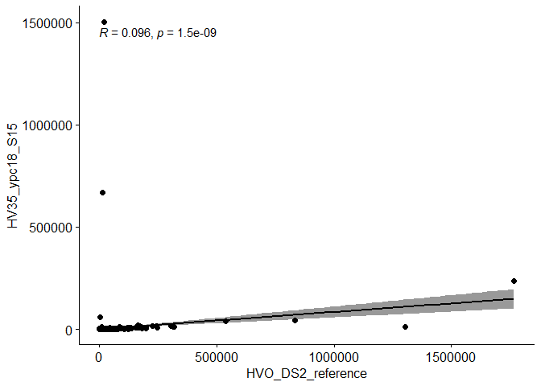<!-- -->

``` r
# all genes that are highly abundant in 2019 ref are 16S and 23S rRNA. remove.
rrna <- c("HVO_RS13025", "HVO_RS13015", "HVO_RS18910", "HVO_RS18920")
counts_data <- counts_data[!(counts_data$Geneid %in% rrna),]

ggscatter(counts_data, x = "HVO_DS2_reference", y = "HV35_ypc18_S15", add = "reg.line", conf.int = TRUE, cor.coef = TRUE, cor.method = "pearson") 
```

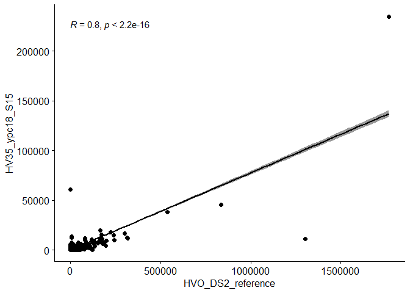<!-- -->

``` r
ggplot(counts_data, aes(x=log10(HVO_DS2_reference+1), y=log10(HV35_ypc18_S15+1))) +
  geom_point() +
  geom_smooth(method=lm)
```

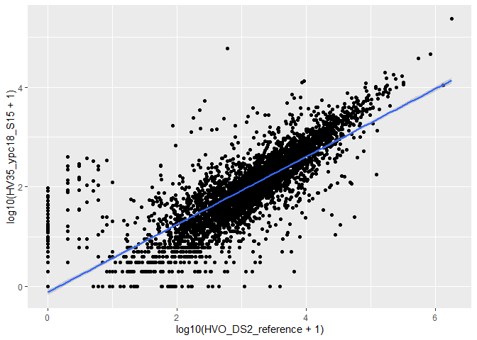<!-- -->

``` r
counts_mat <- as.matrix(counts_data[-c(1:6)])
rownames(counts_mat) <- counts_data$Geneid
dim(counts_mat)
```

    ## [1] 3978   49

``` r
#remove reference samples
counts_mat <- counts_mat[,-c(1, 49)]
counts_cols <- counts_cols[-c(1, 49),]
```

``` r
dds.mydata <- DESeqDataSetFromMatrix(countData = counts_mat, colData = counts_cols, design = ~batch+glucose+genotype+glucose:genotype)
```

    ## converting counts to integer mode

    ## Warning in DESeqDataSet(se, design = design, ignoreRank): some variables in
    ## design formula are characters, converting to factors

``` r
# Assign baselines for the comparisons
dds.mydata$glucose <- relevel(dds.mydata$glucose, ref = "pGlu")
dds.mydata$genotype <- relevel(dds.mydata$genotype, ref = "WT")

# Estimate size factors error
rs <- rowSums(counts(dds.mydata) == 0 )
table(rs)
```

    ## rs
    ##    0    1    2    3    4    5    7   14   15   33   44   45   46   47 
    ## 3924   30    9    4    1    1    1    1    1    1    1    1    1    2

``` r
# Estimate Size Factors to inspect the raw count data which is generated from various lanes and bio reps. 
dds.mydata <- estimateSizeFactors(dds.mydata)
sizeFactors(dds.mydata)
```

    ##   deltadelta_a_glu_S16 deltadelta_a_noglu_S35   deltadelta_b_glu_S53 
    ##              1.4826891              1.4506218              1.3852771 
    ## deltadelta_b_noglu_S36   deltadelta_c_glu_S43   deltadelta_d_glu_S44 
    ##              1.2761709              1.0043200              1.1333428 
    ##  deltadelta_d_noglu_S5         tbsP_a_glu_S33       tbsP_a_noglu_S24 
    ##              1.2141650              1.1507419              1.4941092 
    ##          tbsP_b_glu_S2       tbsP_b_noglu_S30         tbsP_c_glu_S51 
    ##              1.1789921              1.5646412              1.4764339 
    ##       tbsP_c_noglu_S15         tbsP_d_glu_S52       tbsP_d_noglu_S31 
    ##              1.3438585              1.3699732              1.4615793 
    ##          trmB_a_glu_S4       tbsP_e_noglu_S50          tbsP_e_glu_S3 
    ##              1.1261767              1.5987568              1.4121062 
    ##       trmB_a_noglu_S32       trmB_b_noglu_S25         trmB_c_glu_S34 
    ##              1.1798234              1.6143424              1.3814115 
    ##        trmB_c_noglu_S1           WT_a_glu_S39         WT_a_noglu_S37 
    ##              1.3349243              1.5620597              1.5563074 
    ##           WT_b_glu_S13         WT_b_noglu_S17           WT_c_glu_S18 
    ##              1.9419387              1.5528078              1.3639931 
    ##          WT_c_noglu_S6           WT_d_glu_S19         WT_d_noglu_s38 
    ##              1.1468924              2.5032270              1.3151483 
    ##      dpyrE2_4hmfe_2_S5      dpyrE2_4hmfe_4_S9     dpyrE2_4hmfe_5_S18 
    ##              0.5616226              0.1769261              0.6704620 
    ##      dpyrE2_4hpfe_2_S2     dpyrE2_4hpfe_4_S16     dpyrE2_4hpfe_5_S12 
    ##              0.5483575              0.5745723              0.6744506 
    ##      dtbsP_4hpfe_2_S38      dtbsP_4hpfe_5_S43      dtbsP_4hpfe_6_S49 
    ##              0.6394961              0.6401387              0.8704695 
    ##      dtrmB_4hmfe_1_S24      dtrmB_4hmfe_5_S30      dtrmB_4hmfe_6_S36 
    ##              0.7858258              0.6294053              0.5411092 
    ##      dtrmB_4hpfe_1_S21      dtrmB_4hpfe_5_S27      dtrmB_4hpfe_6_S33 
    ##              0.8211836              0.9071458              0.7424109 
    ## dtrmBdtbsP_4hmfe_5_S66 dtrmBdtbsP_4hmfe_6_S72 
    ##              0.1291068              0.5975876

``` r
mydf <- sizeFactors(dds.mydata) %>%
  as.data.frame %>%
  rownames_to_column
colnames(mydf)[2] <- "sizefac"
ggplot(mydf, aes(rowname, sizefac)) + geom_point() + theme(axis.text.x = element_text(face="bold", color="blue", angle=90, hjust = 1))
```

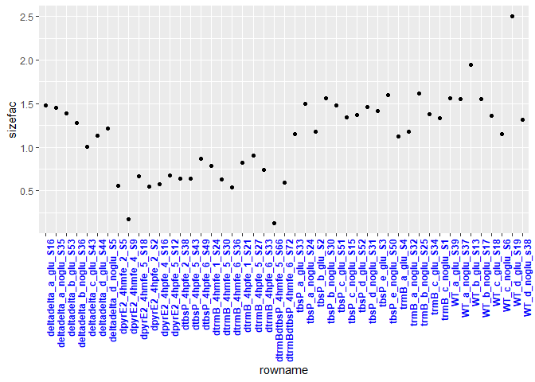<!-- -->

### Differential Expression Analysis

``` r
ddsDE <- DESeq(dds.mydata)
```

    ## using pre-existing size factors

    ## estimating dispersions

    ## gene-wise dispersion estimates

    ## mean-dispersion relationship

    ## final dispersion estimates

    ## fitting model and testing

``` r
#Estimate of sample quality; a plot of per-gene dispersion estimates together with the fitted mean-dispersion relationship
plotDispEsts(ddsDE)
```

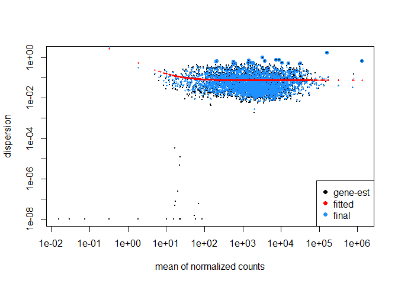<!-- -->

``` r
# Total number of raw counts per sample
colSums(counts(ddsDE)) %>%
  as.data.frame %>%
  rownames_to_column -> mydf.raw.count

colnames(mydf.raw.count)[2] <- "whole.gene.count"

# Normalizing counts by size factor
colSums(counts(ddsDE, normalized = T))  %>%
  as.data.frame %>%
  rownames_to_column -> mydf.norm.count

colnames(mydf.norm.count)[2] <- "whole.gene.norm.count"

ggplot(mydf.norm.count, aes(rowname, whole.gene.norm.count)) + geom_point() + theme(axis.text.x = element_text(face="bold", color="blue", angle=90, hjust = 1))
```

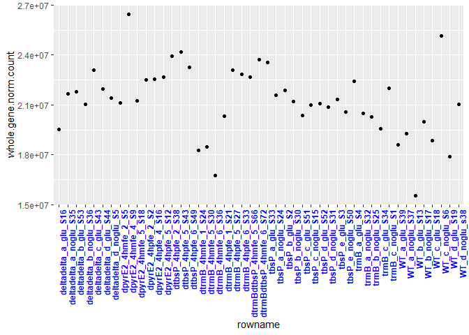<!-- -->

### Clustering: variance stabilizing transformation and batch-effect correction

``` r
vsd=vst(ddsDE)
assay(vsd)=limma::removeBatchEffect(assay(vsd),vsd$batch)

sampleDists <- dist(t(assay(vsd)))
sampleDistMatrix <- as.matrix(sampleDists)
colnames(sampleDistMatrix) <- paste(vsd$genotype, vsd$glucose, sep="-")
colors <- colorRampPalette(rev(brewer.pal(9, "Blues")) )(150)

#Heatmap
pheatmap(sampleDistMatrix,clustering_distance_rows=sampleDists,clustering_distance_cols=sampleDists,col=colors)
```

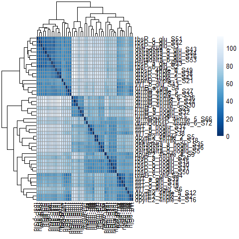<!-- -->

``` r
#Principal Components Analysis
plotPCA(vsd, intgroup = c("genotype", "glucose"), )
```

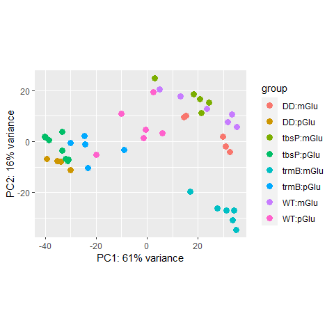<!-- -->

Check that genotype matches label

``` r
# TbsP
d <- plotCounts(ddsDE, gene="HVO_RS18535",  intgroup=c("genotype", "glucose"), 
                returnData = T, transform = F, normalized = F)
d %>%
  arrange(genotype, glucose)
```

    ##                        count genotype glucose
    ## WT_a_glu_S39            8224       WT    pGlu
    ## WT_b_glu_S13           10330       WT    pGlu
    ## WT_c_glu_S18            7509       WT    pGlu
    ## WT_d_glu_S19           11592       WT    pGlu
    ## dpyrE2_4hpfe_2_S2       4287       WT    pGlu
    ## dpyrE2_4hpfe_4_S16      4616       WT    pGlu
    ## dpyrE2_4hpfe_5_S12      4580       WT    pGlu
    ## WT_a_noglu_S37         15786       WT    mGlu
    ## WT_b_noglu_S17         15946       WT    mGlu
    ## WT_c_noglu_S6           9501       WT    mGlu
    ## WT_d_noglu_s38         10054       WT    mGlu
    ## dpyrE2_4hmfe_2_S5         16       WT    mGlu
    ## dpyrE2_4hmfe_4_S9       2129       WT    mGlu
    ## dpyrE2_4hmfe_5_S18        12       WT    mGlu
    ## deltadelta_a_glu_S16       3       DD    pGlu
    ## deltadelta_b_glu_S53       2       DD    pGlu
    ## deltadelta_c_glu_S43       4       DD    pGlu
    ## deltadelta_d_glu_S44       3       DD    pGlu
    ## deltadelta_a_noglu_S35     3       DD    mGlu
    ## deltadelta_b_noglu_S36     3       DD    mGlu
    ## deltadelta_d_noglu_S5      5       DD    mGlu
    ## dtrmBdtbsP_4hmfe_5_S66     2       DD    mGlu
    ## dtrmBdtbsP_4hmfe_6_S72    64       DD    mGlu
    ## tbsP_a_glu_S33             1     tbsP    pGlu
    ## tbsP_b_glu_S2              4     tbsP    pGlu
    ## tbsP_c_glu_S51             4     tbsP    pGlu
    ## tbsP_d_glu_S52             0     tbsP    pGlu
    ## tbsP_e_glu_S3              0     tbsP    pGlu
    ## dtbsP_4hpfe_2_S38          5     tbsP    pGlu
    ## dtbsP_4hpfe_5_S43          6     tbsP    pGlu
    ## dtbsP_4hpfe_6_S49          5     tbsP    pGlu
    ## tbsP_a_noglu_S24           7     tbsP    mGlu
    ## tbsP_b_noglu_S30           1     tbsP    mGlu
    ## tbsP_c_noglu_S15           4     tbsP    mGlu
    ## tbsP_d_noglu_S31           1     tbsP    mGlu
    ## tbsP_e_noglu_S50           0     tbsP    mGlu
    ## trmB_a_glu_S4           7495     trmB    pGlu
    ## trmB_c_glu_S34          6876     trmB    pGlu
    ## dtrmB_4hpfe_1_S21       7698     trmB    pGlu
    ## dtrmB_4hpfe_5_S27       6682     trmB    pGlu
    ## dtrmB_4hpfe_6_S33       5494     trmB    pGlu
    ## trmB_a_noglu_S32        4715     trmB    mGlu
    ## trmB_b_noglu_S25        7317     trmB    mGlu
    ## trmB_c_noglu_S1         5934     trmB    mGlu
    ## dtrmB_4hmfe_1_S24       3382     trmB    mGlu
    ## dtrmB_4hmfe_5_S30       2512     trmB    mGlu
    ## dtrmB_4hmfe_6_S36       2267     trmB    mGlu

``` r
# TrmB
d <- plotCounts(ddsDE, gene="HVO_RS17680",  intgroup=c("genotype", "glucose"), 
                returnData = T, transform = F, normalized = F)
d %>%
  arrange(genotype, glucose)
```

    ##                        count genotype glucose
    ## WT_a_glu_S39            4209       WT    pGlu
    ## WT_b_glu_S13            3438       WT    pGlu
    ## WT_c_glu_S18            3232       WT    pGlu
    ## WT_d_glu_S19            5440       WT    pGlu
    ## dpyrE2_4hpfe_2_S2       1714       WT    pGlu
    ## dpyrE2_4hpfe_4_S16      1733       WT    pGlu
    ## dpyrE2_4hpfe_5_S12      8214       WT    pGlu
    ## WT_a_noglu_S37           885       WT    mGlu
    ## WT_b_noglu_S17           932       WT    mGlu
    ## WT_c_noglu_S6           1983       WT    mGlu
    ## WT_d_noglu_s38          1056       WT    mGlu
    ## dpyrE2_4hmfe_2_S5        301       WT    mGlu
    ## dpyrE2_4hmfe_4_S9        907       WT    mGlu
    ## dpyrE2_4hmfe_5_S18       338       WT    mGlu
    ## deltadelta_a_glu_S16       5       DD    pGlu
    ## deltadelta_b_glu_S53       6       DD    pGlu
    ## deltadelta_c_glu_S43       7       DD    pGlu
    ## deltadelta_d_glu_S44       2       DD    pGlu
    ## deltadelta_a_noglu_S35     5       DD    mGlu
    ## deltadelta_b_noglu_S36     2       DD    mGlu
    ## deltadelta_d_noglu_S5      8       DD    mGlu
    ## dtrmBdtbsP_4hmfe_5_S66     3       DD    mGlu
    ## dtrmBdtbsP_4hmfe_6_S72    23       DD    mGlu
    ## tbsP_a_glu_S33          8344     tbsP    pGlu
    ## tbsP_b_glu_S2           7422     tbsP    pGlu
    ## tbsP_c_glu_S51          8005     tbsP    pGlu
    ## tbsP_d_glu_S52          7255     tbsP    pGlu
    ## tbsP_e_glu_S3           7567     tbsP    pGlu
    ## dtbsP_4hpfe_2_S38       5660     tbsP    pGlu
    ## dtbsP_4hpfe_5_S43       5479     tbsP    pGlu
    ## dtbsP_4hpfe_6_S49       7780     tbsP    pGlu
    ## tbsP_a_noglu_S24         892     tbsP    mGlu
    ## tbsP_b_noglu_S30         954     tbsP    mGlu
    ## tbsP_c_noglu_S15         732     tbsP    mGlu
    ## tbsP_d_noglu_S31         582     tbsP    mGlu
    ## tbsP_e_noglu_S50         749     tbsP    mGlu
    ## trmB_a_glu_S4              3     trmB    pGlu
    ## trmB_c_glu_S34             2     trmB    pGlu
    ## dtrmB_4hpfe_1_S21         26     trmB    pGlu
    ## dtrmB_4hpfe_5_S27         26     trmB    pGlu
    ## dtrmB_4hpfe_6_S33         27     trmB    pGlu
    ## trmB_a_noglu_S32           8     trmB    mGlu
    ## trmB_b_noglu_S25           8     trmB    mGlu
    ## trmB_c_noglu_S1            7     trmB    mGlu
    ## dtrmB_4hmfe_1_S24          9     trmB    mGlu
    ## dtrmB_4hmfe_5_S30         19     trmB    mGlu
    ## dtrmB_4hmfe_6_S36         12     trmB    mGlu

``` r
# Convert the raw count to the normalized count
normalized_counts <- as.data.frame(counts(dds.mydata, normalized=TRUE))
normbatch <- as.data.frame(limma::removeBatchEffect(log2(counts(dds.mydata, normalized=TRUE)+1), dds.mydata$SE_PE))
```

look at pairwise correlations of batch corrected counts across all
sample groups:

``` r
library(psych)

filter(counts_cols, counts_cols$genotype == "WT" & counts_cols$glucose == "mGlu") %>%
  rownames() -> name
normbatch %>% select(name) -> WT
```

    ## Warning: Using an external vector in selections was deprecated in tidyselect 1.1.0.
    ## ℹ Please use `all_of()` or `any_of()` instead.
    ##   # Was:
    ##   data %>% select(name)
    ## 
    ##   # Now:
    ##   data %>% select(all_of(name))
    ## 
    ## See <https://tidyselect.r-lib.org/reference/faq-external-vector.html>.
    ## This warning is displayed once every 8 hours.
    ## Call `lifecycle::last_lifecycle_warnings()` to see where this warning was
    ## generated.

``` r
pairs.panels(WT,
             scale = FALSE,      # If TRUE, scales the correlation text font
             method = "pearson", # Correlation method (also "spearman" or "kendall")
             pch = 21,           # pch symbol
             lm = T,             # If TRUE, plots linear fit rather than the LOESS (smoothed) fit
             cor = TRUE,         # If TRUE, reports correlations
             jiggle = FALSE,     # If TRUE, data points are jittered
             hist.col = 4,       # Histograms color
             ci = F)          # If TRUE, adds confidence intervals
```

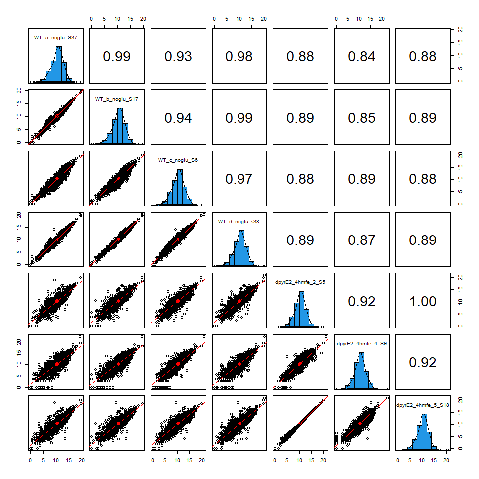<!-- -->

``` r
filter(counts_cols, counts_cols$genotype == "WT" & counts_cols$glucose == "pGlu") %>%
  rownames() -> name
normbatch %>% select(name) -> WT
pairs.panels(WT,
             scale = FALSE,      # If TRUE, scales the correlation text font
             method = "pearson", # Correlation method (also "spearman" or "kendall")
             pch = 21,           # pch symbol
             lm = T,             # If TRUE, plots linear fit rather than the LOESS (smoothed) fit
             cor = TRUE,         # If TRUE, reports correlations
             jiggle = FALSE,     # If TRUE, data points are jittered
             hist.col = 4,       # Histograms color
             ci = F)          # If TRUE, adds confidence intervals
```

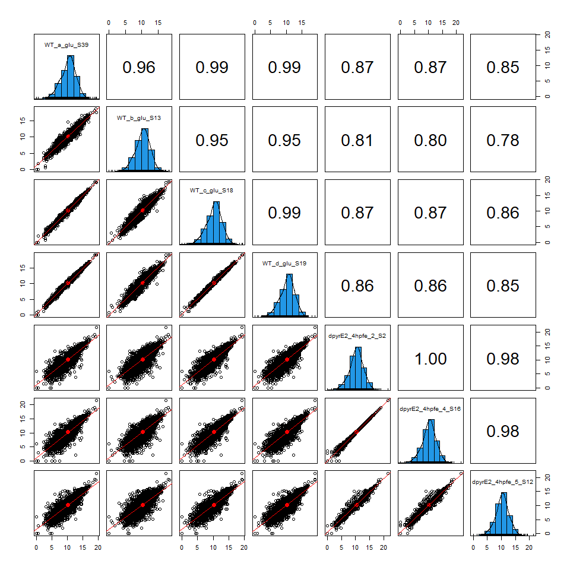<!-- -->

``` r
filter(counts_cols, counts_cols$genotype == "trmB" & counts_cols$glucose == "mGlu") %>%
  rownames() -> name
normbatch %>% select(name) -> trmB
pairs.panels(trmB,
             scale = FALSE,      # If TRUE, scales the correlation text font
             method = "pearson", # Correlation method (also "spearman" or "kendall")
             pch = 21,           # pch symbol
             lm = T,             # If TRUE, plots linear fit rather than the LOESS (smoothed) fit
             cor = TRUE,         # If TRUE, reports correlations
             jiggle = FALSE,     # If TRUE, data points are jittered
             hist.col = 4,       # Histograms color
             ci = F)          # If TRUE, adds confidence intervals
```

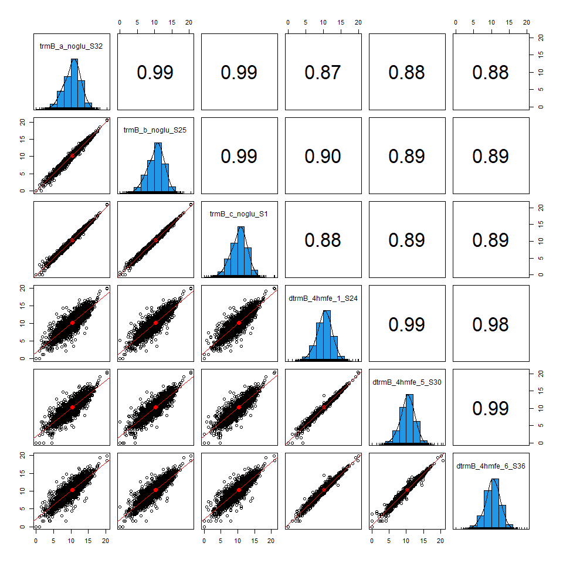<!-- -->

``` r
filter(counts_cols, counts_cols$genotype == "trmB" & counts_cols$glucose == "pGlu") %>%
  rownames() -> name
normbatch %>% select(name) ->trmB
pairs.panels(trmB,
             scale = FALSE,      # If TRUE, scales the correlation text font
             method = "pearson", # Correlation method (also "spearman" or "kendall")
             pch = 21,           # pch symbol
             lm = T,             # If TRUE, plots linear fit rather than the LOESS (smoothed) fit
             cor = TRUE,         # If TRUE, reports correlations
             jiggle = FALSE,     # If TRUE, data points are jittered
             hist.col = 4,       # Histograms color
             ci = F)          # If TRUE, adds confidence intervals
```

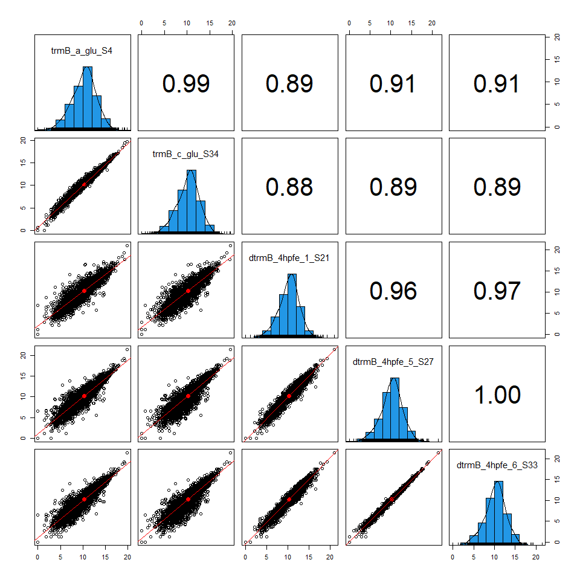<!-- -->

``` r
filter(counts_cols, counts_cols$genotype == "tbsP" & counts_cols$glucose == "mGlu") %>%
  rownames() -> name
normalized_counts %>% select(name) -> tbsP
pairs.panels(tbsP,
             scale = FALSE,      # If TRUE, scales the correlation text font
             method = "pearson", # Correlation method (also "spearman" or "kendall")
             pch = 21,           # pch symbol
             lm = T,             # If TRUE, plots linear fit rather than the LOESS (smoothed) fit
             cor = TRUE,         # If TRUE, reports correlations
             jiggle = FALSE,     # If TRUE, data points are jittered
             hist.col = 4,       # Histograms color
             ci = F)          # If TRUE, adds confidence intervals
```

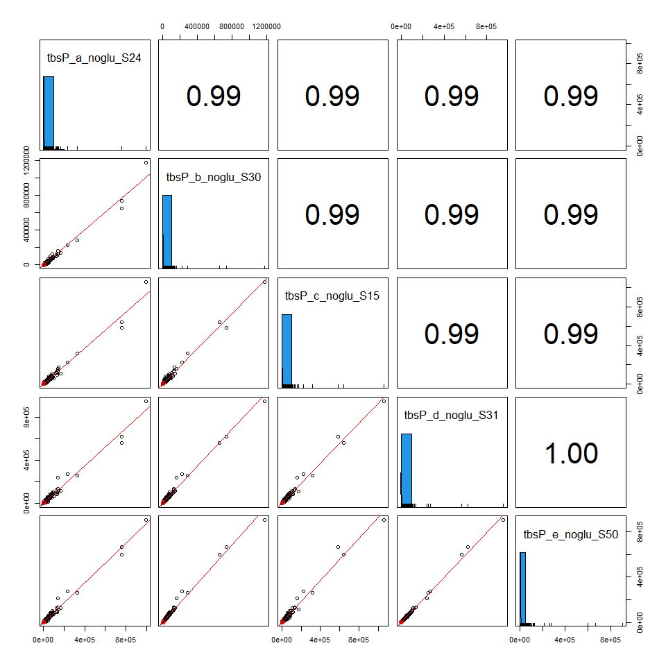<!-- -->

``` r
filter(counts_cols, counts_cols$genotype == "tbsP" & counts_cols$glucose == "pGlu") %>%
  rownames() -> name
normbatch %>% select(name) ->tbsP
pairs.panels(tbsP,
             scale = FALSE,      # If TRUE, scales the correlation text font
             method = "pearson", # Correlation method (also "spearman" or "kendall")
             pch = 21,           # pch symbol
             lm = T,             # If TRUE, plots linear fit rather than the LOESS (smoothed) fit
             cor = TRUE,         # If TRUE, reports correlations
             jiggle = FALSE,     # If TRUE, data points are jittered
             hist.col = 4,       # Histograms color
             ci = F)          # If TRUE, adds confidence intervals
```

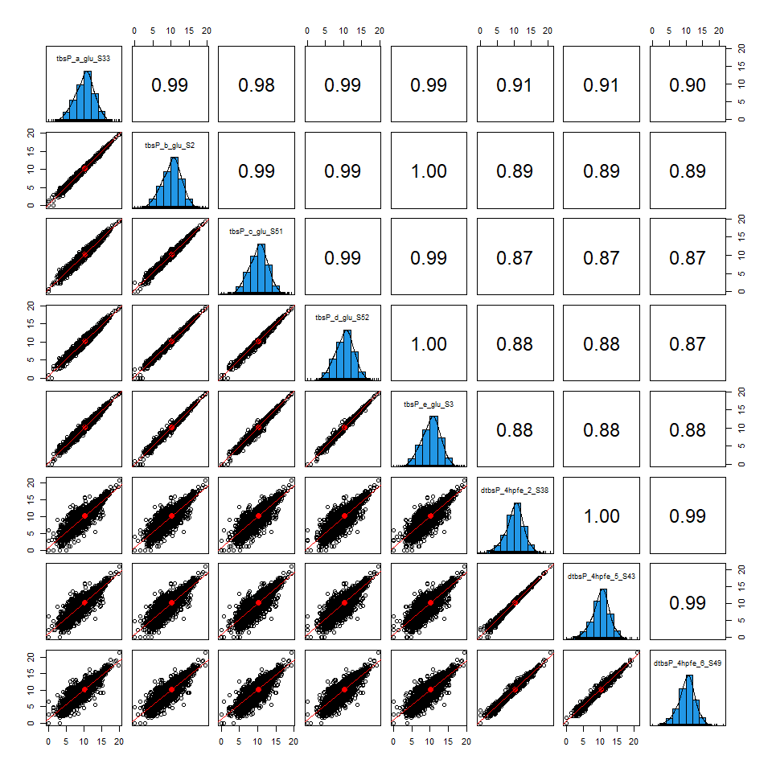<!-- -->

``` r
filter(counts_cols, counts_cols$genotype == "DD" & counts_cols$glucose == "mGlu") %>%
  rownames() -> name
normbatch %>% select(name) -> DD
pairs.panels(DD,
             scale = FALSE,      # If TRUE, scales the correlation text font
             method = "pearson", # Correlation method (also "spearman" or "kendall")
             pch = 21,           # pch symbol
             lm = T,             # If TRUE, plots linear fit rather than the LOESS (smoothed) fit
             cor = TRUE,         # If TRUE, reports correlations
             jiggle = FALSE,     # If TRUE, data points are jittered
             hist.col = 4,       # Histograms color
             ci = F)          # If TRUE, adds confidence intervals
```

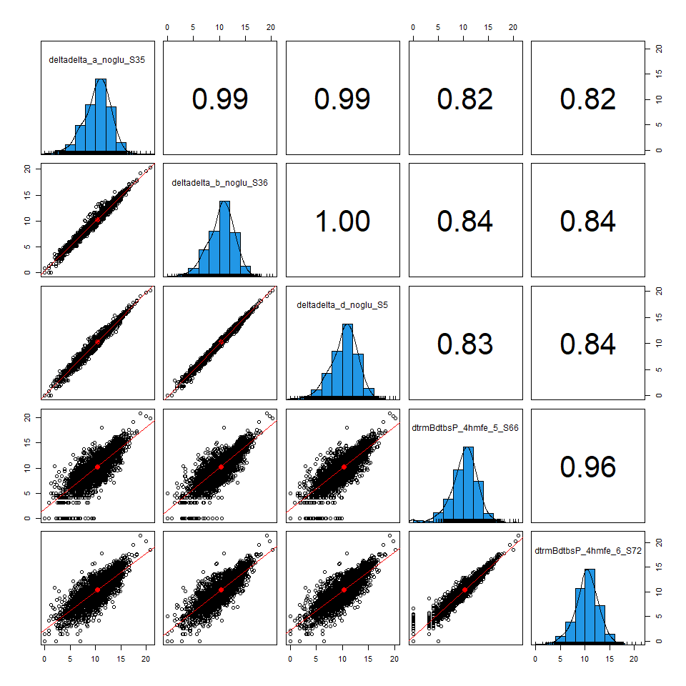<!-- -->

``` r
filter(counts_cols, counts_cols$genotype == "DD" & counts_cols$glucose == "pGlu") %>%
  rownames() -> name
normalized_counts %>% select(name)-> DD
pairs.panels(DD,
             scale = FALSE,      # If TRUE, scales the correlation text font
             method = "pearson", # Correlation method (also "spearman" or "kendall")
             pch = 21,           # pch symbol
             lm = T,             # If TRUE, plots linear fit rather than the LOESS (smoothed) fit
             cor = TRUE,         # If TRUE, reports correlations
             jiggle = FALSE,     # If TRUE, data points are jittered
             hist.col = 4,       # Histograms color
             ci = F)          # If TRUE, adds confidence intervals
```

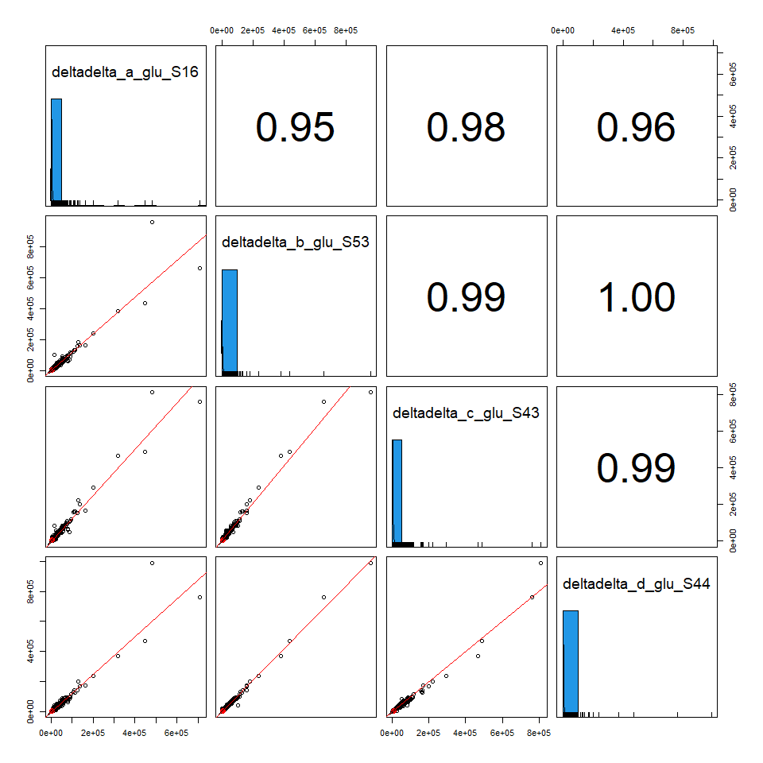<!-- -->

``` r
counts_cols
```

    ##                        genotype glucose      batch paired
    ## deltadelta_a_glu_S16         DD    pGlu RH_S1_2021     PE
    ## deltadelta_a_noglu_S35       DD    mGlu RH_S1_2021     PE
    ## deltadelta_b_glu_S53         DD    pGlu RH_S1_2021     PE
    ## deltadelta_b_noglu_S36       DD    mGlu RH_S1_2021     PE
    ## deltadelta_c_glu_S43         DD    pGlu RH_S1_2021     PE
    ## deltadelta_d_glu_S44         DD    pGlu RH_S1_2021     PE
    ## deltadelta_d_noglu_S5        DD    mGlu RH_S1_2021     PE
    ## tbsP_a_glu_S33             tbsP    pGlu RH_S1_2021     PE
    ## tbsP_a_noglu_S24           tbsP    mGlu RH_SP_2021     PE
    ## tbsP_b_glu_S2              tbsP    pGlu RH_S1_2021     PE
    ## tbsP_b_noglu_S30           tbsP    mGlu RH_S1_2021     PE
    ## tbsP_c_glu_S51             tbsP    pGlu RH_S1_2021     PE
    ## tbsP_c_noglu_S15           tbsP    mGlu RH_S1_2021     PE
    ## tbsP_d_glu_S52             tbsP    pGlu RH_S1_2021     PE
    ## tbsP_d_noglu_S31           tbsP    mGlu RH_S1_2021     PE
    ## trmB_a_glu_S4              trmB    pGlu RH_S1_2021     PE
    ## tbsP_e_noglu_S50           tbsP    mGlu RH_S1_2021     PE
    ## tbsP_e_glu_S3              tbsP    pGlu RH_S1_2021     PE
    ## trmB_a_noglu_S32           trmB    mGlu RH_S1_2021     PE
    ## trmB_b_noglu_S25           trmB    mGlu RH_SP_2021     PE
    ## trmB_c_glu_S34             trmB    pGlu RH_S1_2021     PE
    ## trmB_c_noglu_S1            trmB    mGlu RH_S1_2021     PE
    ## WT_a_glu_S39                 WT    pGlu RH_S1_2021     PE
    ## WT_a_noglu_S37               WT    mGlu RH_S1_2021     PE
    ## WT_b_glu_S13                 WT    pGlu RH_SP_2021     PE
    ## WT_b_noglu_S17               WT    mGlu RH_S1_2021     PE
    ## WT_c_glu_S18                 WT    pGlu RH_S1_2021     PE
    ## WT_c_noglu_S6                WT    mGlu RH_S1_2021     PE
    ## WT_d_glu_S19                 WT    pGlu RH_S1_2021     PE
    ## WT_d_noglu_s38               WT    mGlu RH_S1_2021     PE
    ## dpyrE2_4hmfe_2_S5            WT    mGlu   MMP_2019     SE
    ## dpyrE2_4hmfe_4_S9            WT    mGlu   MMP_2019     SE
    ## dpyrE2_4hmfe_5_S18           WT    mGlu   MMP_2019     SE
    ## dpyrE2_4hpfe_2_S2            WT    pGlu   MMP_2019     SE
    ## dpyrE2_4hpfe_4_S16           WT    pGlu   MMP_2019     SE
    ## dpyrE2_4hpfe_5_S12           WT    pGlu   MMP_2019     SE
    ## dtbsP_4hpfe_2_S38          tbsP    pGlu   MMP_2019     SE
    ## dtbsP_4hpfe_5_S43          tbsP    pGlu   MMP_2019     SE
    ## dtbsP_4hpfe_6_S49          tbsP    pGlu   MMP_2019     SE
    ## dtrmB_4hmfe_1_S24          trmB    mGlu   MMP_2019     SE
    ## dtrmB_4hmfe_5_S30          trmB    mGlu   MMP_2019     SE
    ## dtrmB_4hmfe_6_S36          trmB    mGlu   MMP_2019     SE
    ## dtrmB_4hpfe_1_S21          trmB    pGlu   MMP_2019     SE
    ## dtrmB_4hpfe_5_S27          trmB    pGlu   MMP_2019     SE
    ## dtrmB_4hpfe_6_S33          trmB    pGlu   MMP_2019     SE
    ## dtrmBdtbsP_4hmfe_5_S66       DD    mGlu   MMP_2019     SE
    ## dtrmBdtbsP_4hmfe_6_S72       DD    mGlu   MMP_2019     SE

remove outliers

``` r
counts_mat2 <- as.matrix(counts_data[-1]) 
rownames(counts_mat2) <- counts_data$rowname
```

    ## Warning: Unknown or uninitialised column: `rowname`.

``` r
counts_mat2 <- counts_mat[,-c(31:33,36,46,47)]
counts_cols2 <- counts_cols[-c(31:33,36,46,47),] %>% as.matrix()

dds.mydata <- DESeqDataSetFromMatrix(countData = counts_mat2, colData = counts_cols2, design = ~ batch+glucose+genotype+glucose:genotype)
```

    ## converting counts to integer mode

    ## Warning in DESeqDataSet(se, design = design, ignoreRank): some variables in
    ## design formula are characters, converting to factors

``` r
dim(counts_mat2)
```

    ## [1] 3978   41

``` r
# Assign baselines for the comparisons
dds.mydata$glucose <- relevel(dds.mydata$glucose, ref = "pGlu")
dds.mydata$genotype <- relevel(dds.mydata$genotype, ref = "WT")

# Estimate Size Factors to inspect the raw count data which is generated from various lanes and bio reps. 
dds.mydata <- estimateSizeFactors(dds.mydata)
sizeFactors(dds.mydata)
```

    ##   deltadelta_a_glu_S16 deltadelta_a_noglu_S35   deltadelta_b_glu_S53 
    ##              1.3002320              1.2519240              1.2062792 
    ## deltadelta_b_noglu_S36   deltadelta_c_glu_S43   deltadelta_d_glu_S44 
    ##              1.1048805              0.8777994              0.9878950 
    ##  deltadelta_d_noglu_S5         tbsP_a_glu_S33       tbsP_a_noglu_S24 
    ##              1.0522683              1.0069983              1.2739583 
    ##          tbsP_b_glu_S2       tbsP_b_noglu_S30         tbsP_c_glu_S51 
    ##              1.0311115              1.3418539              1.2878070 
    ##       tbsP_c_noglu_S15         tbsP_d_glu_S52       tbsP_d_noglu_S31 
    ##              1.1542579              1.1978219              1.2459839 
    ##          trmB_a_glu_S4       tbsP_e_noglu_S50          tbsP_e_glu_S3 
    ##              0.9840993              1.3706444              1.2328672 
    ##       trmB_a_noglu_S32       trmB_b_noglu_S25         trmB_c_glu_S34 
    ##              1.0365533              1.4032986              1.2009328 
    ##        trmB_c_noglu_S1           WT_a_glu_S39         WT_a_noglu_S37 
    ##              1.1747604              1.3570840              1.3459145 
    ##           WT_b_glu_S13         WT_b_noglu_S17           WT_c_glu_S18 
    ##              1.6926645              1.3335973              1.1822893 
    ##          WT_c_noglu_S6           WT_d_glu_S19         WT_d_noglu_s38 
    ##              0.9910989              2.1736369              1.1224014 
    ##      dpyrE2_4hpfe_2_S2     dpyrE2_4hpfe_4_S16      dtbsP_4hpfe_2_S38 
    ##              0.4791643              0.4983216              0.5524381 
    ##      dtbsP_4hpfe_5_S43      dtbsP_4hpfe_6_S49      dtrmB_4hmfe_1_S24 
    ##              0.5545605              0.7543109              0.6877995 
    ##      dtrmB_4hmfe_5_S30      dtrmB_4hmfe_6_S36      dtrmB_4hpfe_1_S21 
    ##              0.5498883              0.4738657              0.7053163 
    ##      dtrmB_4hpfe_5_S27      dtrmB_4hpfe_6_S33 
    ##              0.7835003              0.6383378

``` r
ddsDE <- DESeq(dds.mydata)
```

    ## using pre-existing size factors

    ## estimating dispersions

    ## gene-wise dispersion estimates

    ## mean-dispersion relationship

    ## final dispersion estimates

    ## fitting model and testing

``` r
#Estimate of sample quality; a plot of per-gene dispersion estimates together with the fitted mean-dispersion relationship
plotDispEsts(ddsDE)
```

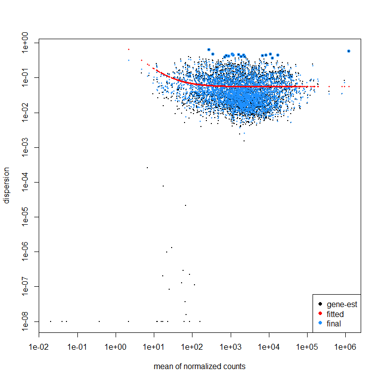<!-- -->

``` r
vsd=vst(ddsDE)
assay(vsd)=limma::removeBatchEffect(assay(vsd),vsd$SE_PE)

sampleDists <- dist(t(assay(vsd)))
sampleDistMatrix <- as.matrix(sampleDists)
colnames(sampleDistMatrix) <- paste(vsd$genotype, vsd$glucose, sep="-")
colors <- colorRampPalette( rev(brewer.pal(9, "Blues")) )(255)

pheatmap(sampleDistMatrix,clustering_distance_rows=sampleDists,clustering_distance_cols=sampleDists,col=colors)
```

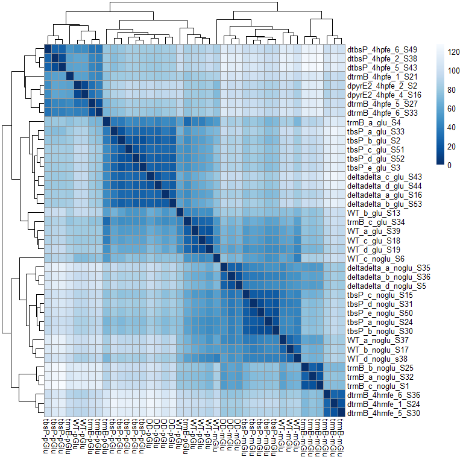<!-- -->

``` r
#Principal Components Analysis
plotPCA(vsd, intgroup = c("genotype", "glucose"), )
```

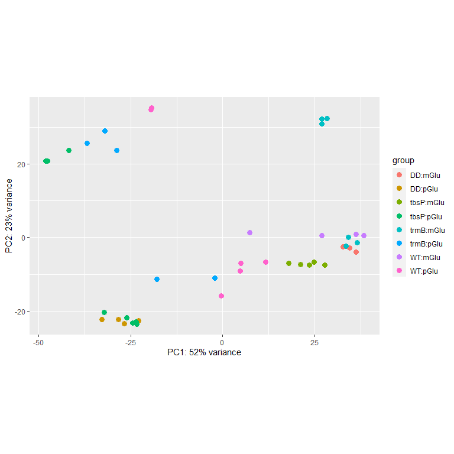<!-- -->

``` r
plotPCA(vsd, intgroup = "batch")
```

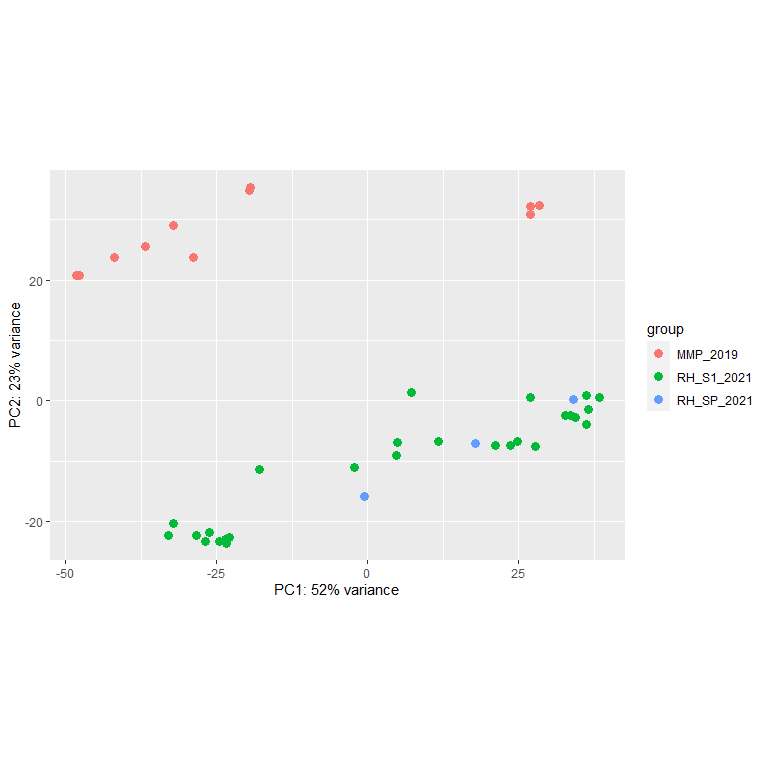<!-- -->

get normalized counts for tbsP for all samples:

``` r
d <- plotCounts(ddsDE, gene="HVO_RS18535",  intgroup=c("genotype", "glucose", "batch"), 
                returnData = T, transform = T, normalized = T)
d %>%
  ggplot(., aes(x=glucose, y=count, fill=genotype)) +
  geom_boxplot(alpha =0.8)+geom_point(position = position_dodge(width=0.75), size = 2) +
  labs(title = "HVO_RS18535, tbsP", y = "normalized counts") +
  theme_classic() + 
  theme(axis.text.x = element_text(angle = 45, hjust = 1, vjust = 1))
```

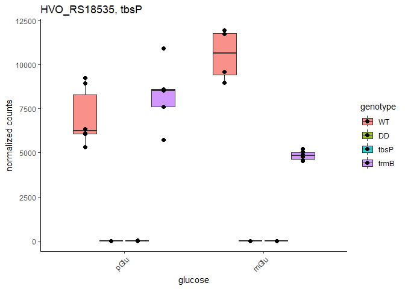<!-- -->

``` r
d %>% arrange(genotype, batch, glucose)
```

    ##                               count genotype glucose      batch
    ## dpyrE2_4hpfe_2_S2       8947.327714       WT    pGlu   MMP_2019
    ## dpyrE2_4hpfe_4_S16      9263.594682       WT    pGlu   MMP_2019
    ## WT_a_glu_S39            6060.552481       WT    pGlu RH_S1_2021
    ## WT_c_glu_S18            6351.737325       WT    pGlu RH_S1_2021
    ## WT_d_glu_S19            5333.497363       WT    pGlu RH_S1_2021
    ## WT_a_noglu_S37         11729.328627       WT    mGlu RH_S1_2021
    ## WT_b_noglu_S17         11957.632800       WT    mGlu RH_S1_2021
    ## WT_c_noglu_S6           9586.828660       WT    mGlu RH_S1_2021
    ## WT_d_noglu_s38          8958.079603       WT    mGlu RH_S1_2021
    ## WT_b_glu_S13            6103.304167       WT    pGlu RH_SP_2021
    ## deltadelta_a_glu_S16       2.807281       DD    pGlu RH_S1_2021
    ## deltadelta_b_glu_S53       2.157991       DD    pGlu RH_S1_2021
    ## deltadelta_c_glu_S43       5.056850       DD    pGlu RH_S1_2021
    ## deltadelta_d_glu_S44       3.536760       DD    pGlu RH_S1_2021
    ## deltadelta_a_noglu_S35     2.896312       DD    mGlu RH_S1_2021
    ## deltadelta_b_noglu_S36     3.215226       DD    mGlu RH_S1_2021
    ## deltadelta_d_noglu_S5      5.251640       DD    mGlu RH_S1_2021
    ## dtbsP_4hpfe_2_S38          9.550787     tbsP    pGlu   MMP_2019
    ## dtbsP_4hpfe_5_S43         11.319378     tbsP    pGlu   MMP_2019
    ## dtbsP_4hpfe_6_S49          7.128567     tbsP    pGlu   MMP_2019
    ## tbsP_a_glu_S33             1.493050     tbsP    pGlu RH_S1_2021
    ## tbsP_b_glu_S2              4.379309     tbsP    pGlu RH_S1_2021
    ## tbsP_c_glu_S51             3.606055     tbsP    pGlu RH_S1_2021
    ## tbsP_d_glu_S52             0.500000     tbsP    pGlu RH_S1_2021
    ## tbsP_e_glu_S3              0.500000     tbsP    pGlu RH_S1_2021
    ## tbsP_b_noglu_S30           1.245238     tbsP    mGlu RH_S1_2021
    ## tbsP_c_noglu_S15           3.965430     tbsP    mGlu RH_S1_2021
    ## tbsP_d_noglu_S31           1.302579     tbsP    mGlu RH_S1_2021
    ## tbsP_e_noglu_S50           0.500000     tbsP    mGlu RH_S1_2021
    ## tbsP_a_noglu_S24           5.994685     tbsP    mGlu RH_SP_2021
    ## dtrmB_4hpfe_1_S21      10914.752977     trmB    pGlu   MMP_2019
    ## dtrmB_4hpfe_5_S27       8528.895128     trmB    pGlu   MMP_2019
    ## dtrmB_4hpfe_6_S33       8607.227929     trmB    pGlu   MMP_2019
    ## dtrmB_4hmfe_1_S24       4917.630816     trmB    mGlu   MMP_2019
    ## dtrmB_4hmfe_5_S30       4568.700871     trmB    mGlu   MMP_2019
    ## dtrmB_4hmfe_6_S36       4784.555772     trmB    mGlu   MMP_2019
    ## trmB_a_glu_S4           7616.601053     trmB    pGlu RH_S1_2021
    ## trmB_c_glu_S34          5726.049219     trmB    pGlu RH_S1_2021
    ## trmB_a_noglu_S32        4549.229042     trmB    mGlu RH_S1_2021
    ## trmB_c_noglu_S1         5051.742867     trmB    mGlu RH_S1_2021
    ## trmB_b_noglu_S25        5214.643285     trmB    mGlu RH_SP_2021

``` r
results(ddsDE, contrast=list("glucosemGlu.genotypetrmB"), cooksCutoff = FALSE, independentFiltering = FALSE, lfcThreshold = 1, alpha = 0.01) %>%
  data.frame() %>% rownames_to_column(var="locus_tag") %>% as_tibble() -> tmp
tmp[tmp$locus_tag == "HVO_RS18535",] %>% na.omit()
```

    ## # A tibble: 1 × 7
    ##   locus_tag   baseMean log2FoldChange lfcSE  stat pvalue  padj
    ##   <chr>          <dbl>          <dbl> <dbl> <dbl>  <dbl> <dbl>
    ## 1 HVO_RS18535    3776.          -1.63 0.368 -1.71 0.0871 0.629

get normalized counts for trmB for all samples:

``` r
d <- plotCounts(ddsDE, gene="HVO_RS17680",  intgroup=c("genotype", "glucose", "batch"), 
                returnData = T, transform = T, normalized = T)
d %>%
  ggplot(., aes(x=glucose, y=count, fill=genotype)) +
  geom_boxplot(alpha =0.8)+geom_point(position = position_dodge(width=0.75), size = 2) + 
  #geom_point(position=position_jitter(w=0.25,h=0), size = 3) + 
  labs(title = "HVO_RS17680, trmB", y = "normalized counts") +
  theme_classic() + 
  theme(axis.text.x = element_text(angle = 45, hjust = 1, vjust = 1))
```

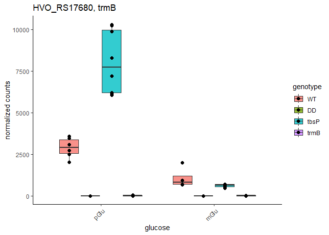<!-- -->

``` r
results(ddsDE, contrast=list("glucosemGlu.genotypetrmB"), cooksCutoff = FALSE, independentFiltering = FALSE, lfcThreshold = 1, alpha = 0.01) %>%
  data.frame() %>% rownames_to_column(var="locus_tag") %>% as_tibble() -> tmp
tmp[tmp$locus_tag == "HVO_RS17680",] %>% na.omit()
```

    ## # A tibble: 1 × 7
    ##   locus_tag   baseMean log2FoldChange lfcSE  stat pvalue  padj
    ##   <chr>          <dbl>          <dbl> <dbl> <dbl>  <dbl> <dbl>
    ## 1 HVO_RS17680    2179.          0.697 0.556     0      1     1

remove outliers

``` r
normalized_counts <- as.data.frame(counts(dds.mydata, normalized=TRUE))
write.csv(normalized_counts, "01_deseq2_output/normalised_counts.csv", row.names = T, col.names = T)
```

    ## Warning in write.csv(normalized_counts,
    ## "01_deseq2_output/normalised_counts.csv", : attempt to set 'col.names' ignored

``` r
normbatch <- as.data.frame(limma::removeBatchEffect(log2(counts(dds.mydata, normalized=TRUE)+1), dds.mydata$SE_PE))
write.csv(normbatch, "01_deseq2_output/batch_norm_counts.csv", row.names = T, col.names = T)
```

    ## Warning in write.csv(normbatch, "01_deseq2_output/batch_norm_counts.csv", :
    ## attempt to set 'col.names' ignored

``` r
write.csv(counts_mat2, "00_deseq2_input/00_combined_data_out.csv", row.names = T)
counts_cols2 %>%
  as.data.frame() %>%
  rownames_to_column() -> counts_cols2
write.csv(counts_cols2, "00_deseq2_input/00_combined_meta_out.csv")
```
