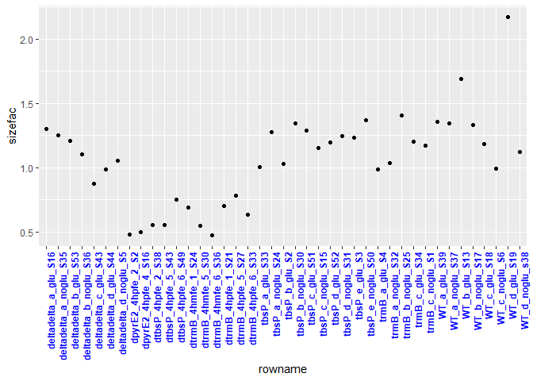
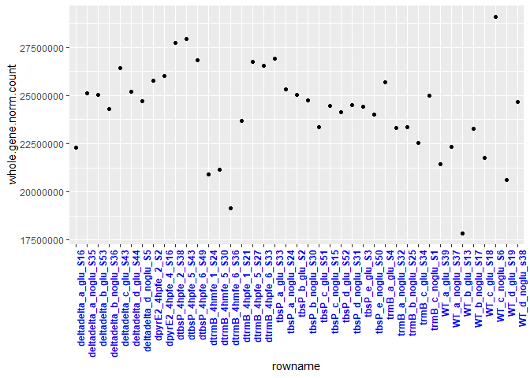
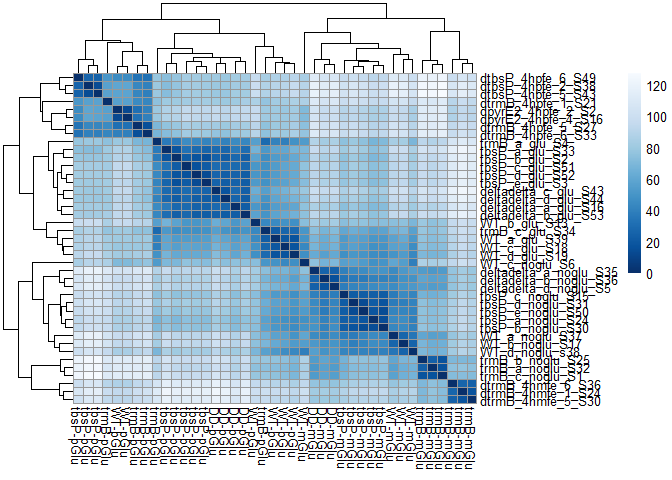
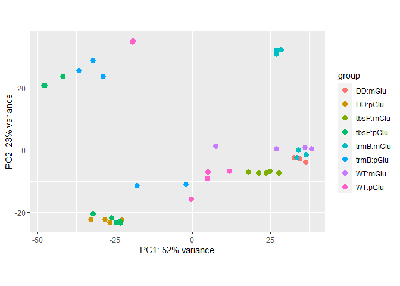

01_Deseq2_outliers_DEGs
================
Rylee Hackley

``` r
library(tidyverse)
library(ggpubr)
library(viridis)
library(pheatmap)
library(rrcov)
library(DESeq2)
library(RColorBrewer)
```

load gff data info for informative gene descriptions

``` r
gff_df <- read_csv("000_20230911_hvo/genomic_gff_key.csv")

counts_data <- read_csv("00_deseq2_input/00_combined_data_out.csv")
counts_mtx <- as.matrix(counts_data[-1])
rownames(counts_mtx) <- counts_data$...1

counts_cols <- read_csv("00_deseq2_input/00_combined_meta_out.csv")
```

### Differential Expression Analysis

``` r
dds.mydata <- DESeqDataSetFromMatrix(countData = counts_mtx, colData = counts_cols[-1], design = ~ batch + glucose + genotype + glucose:genotype)

# Assign baselines for the comparisons
dds.mydata$glucose <- relevel(dds.mydata$glucose, ref = "mGlu")
dds.mydata$genotype <- relevel(dds.mydata$genotype, ref = "WT")

# Estimate Size Factors to inspect the raw count data which is generated from various lanes and bio reps.
dds.mydata <- estimateSizeFactors(dds.mydata)

mydf <- sizeFactors(dds.mydata) %>%
  as.data.frame() %>%
  rownames_to_column()
colnames(mydf)[2] <- "sizefac"
ggplot(mydf, aes(rowname, sizefac)) +
  geom_point() +
  theme(axis.text.x = element_text(face = "bold", color = "blue", angle = 90, hjust = 1))
```

<!-- -->

``` r
ddsDE <- DESeq(dds.mydata)

# Total number of raw counts per sample
colSums(counts(ddsDE)) %>%
  as.data.frame() %>%
  rownames_to_column() -> mydf.raw.count
colnames(mydf.raw.count)[2] <- "whole.gene.count"

# Normalizing counts by size factor
colSums(counts(ddsDE, normalized = T)) %>%
  as.data.frame() %>%
  rownames_to_column() -> mydf.norm.count
colnames(mydf.norm.count)[2] <- "whole.gene.norm.count"

ggplot(mydf.norm.count, aes(rowname, whole.gene.norm.count)) +
  geom_point() +
  theme(axis.text.x = element_text(face = "bold", color = "blue", angle = 90, hjust = 1))
```

<!-- -->

### Clustering: variance stabilizing transformation and batch-effect correction

``` r
vsd <- vst(ddsDE)
assay(vsd) <- limma::removeBatchEffect(assay(vsd), vsd$SE_PE)

sampleDists <- dist(t(assay(vsd)))
sampleDistMatrix <- as.matrix(sampleDists)
colnames(sampleDistMatrix) <- paste(vsd$genotype, vsd$glucose, sep = "-")
colors <- colorRampPalette(rev(brewer.pal(9, "Blues")))(255)

# Heatmap
pheatmap(sampleDistMatrix, clustering_distance_rows = sampleDists, clustering_distance_cols = sampleDists, col = colors)
```

<!-- -->

``` r
# Principal Components Analysis
plotPCA(vsd, intgroup = c("genotype", "glucose"))
```

<!-- -->

``` r
# Convert the raw count to the normalized count
normalized_counts <- counts(dds.mydata, normalized = TRUE)
normbatch <- limma::removeBatchEffect(log2(counts(ddsDE, normalized = TRUE) + 1), ddsDE$SE_PE)

tmp <- counts(dds.mydata, normalized = F)
tmp[rownames(tmp) == "HVO_RS18535", ] # max 15 reads in tbsP del strains
```

    ##   deltadelta_a_glu_S16 deltadelta_a_noglu_S35   deltadelta_b_glu_S53 
    ##                      3                      3                      2 
    ## deltadelta_b_noglu_S36   deltadelta_c_glu_S43   deltadelta_d_glu_S44 
    ##                      3                      4                      3 
    ##  deltadelta_d_noglu_S5         tbsP_a_glu_S33       tbsP_a_noglu_S24 
    ##                      5                      1                      7 
    ##          tbsP_b_glu_S2       tbsP_b_noglu_S30         tbsP_c_glu_S51 
    ##                      4                      1                      4 
    ##       tbsP_c_noglu_S15         tbsP_d_glu_S52       tbsP_d_noglu_S31 
    ##                      4                      0                      1 
    ##          trmB_a_glu_S4       tbsP_e_noglu_S50          tbsP_e_glu_S3 
    ##                   7495                      0                      0 
    ##       trmB_a_noglu_S32       trmB_b_noglu_S25         trmB_c_glu_S34 
    ##                   4715                   7317                   6876 
    ##        trmB_c_noglu_S1           WT_a_glu_S39         WT_a_noglu_S37 
    ##                   5934                   8224                  15786 
    ##           WT_b_glu_S13         WT_b_noglu_S17           WT_c_glu_S18 
    ##                  10330                  15946                   7509 
    ##          WT_c_noglu_S6           WT_d_glu_S19         WT_d_noglu_s38 
    ##                   9501                  11592                  10054 
    ##      dpyrE2_4hpfe_2_S2     dpyrE2_4hpfe_4_S16      dtbsP_4hpfe_2_S38 
    ##                   4287                   4616                      5 
    ##      dtbsP_4hpfe_5_S43      dtbsP_4hpfe_6_S49      dtrmB_4hmfe_1_S24 
    ##                      6                      5                   3382 
    ##      dtrmB_4hmfe_5_S30      dtrmB_4hmfe_6_S36      dtrmB_4hpfe_1_S21 
    ##                   2512                   2267                   7698 
    ##      dtrmB_4hpfe_5_S27      dtrmB_4hpfe_6_S33 
    ##                   6682                   5494

``` r
tmp[rownames(tmp) == "HVO_RS17680", ] # not detected
```

    ##   deltadelta_a_glu_S16 deltadelta_a_noglu_S35   deltadelta_b_glu_S53 
    ##                      5                      5                      6 
    ## deltadelta_b_noglu_S36   deltadelta_c_glu_S43   deltadelta_d_glu_S44 
    ##                      2                      7                      2 
    ##  deltadelta_d_noglu_S5         tbsP_a_glu_S33       tbsP_a_noglu_S24 
    ##                      8                   8344                    892 
    ##          tbsP_b_glu_S2       tbsP_b_noglu_S30         tbsP_c_glu_S51 
    ##                   7422                    954                   8005 
    ##       tbsP_c_noglu_S15         tbsP_d_glu_S52       tbsP_d_noglu_S31 
    ##                    732                   7255                    582 
    ##          trmB_a_glu_S4       tbsP_e_noglu_S50          tbsP_e_glu_S3 
    ##                      3                    749                   7567 
    ##       trmB_a_noglu_S32       trmB_b_noglu_S25         trmB_c_glu_S34 
    ##                      8                      8                      2 
    ##        trmB_c_noglu_S1           WT_a_glu_S39         WT_a_noglu_S37 
    ##                      7                   4209                    885 
    ##           WT_b_glu_S13         WT_b_noglu_S17           WT_c_glu_S18 
    ##                   3438                    932                   3232 
    ##          WT_c_noglu_S6           WT_d_glu_S19         WT_d_noglu_s38 
    ##                   1983                   5440                   1056 
    ##      dpyrE2_4hpfe_2_S2     dpyrE2_4hpfe_4_S16      dtbsP_4hpfe_2_S38 
    ##                   1714                   1733                   5660 
    ##      dtbsP_4hpfe_5_S43      dtbsP_4hpfe_6_S49      dtrmB_4hmfe_1_S24 
    ##                   5479                   7780                      9 
    ##      dtrmB_4hmfe_5_S30      dtrmB_4hmfe_6_S36      dtrmB_4hpfe_1_S21 
    ##                     19                     12                     26 
    ##      dtrmB_4hpfe_5_S27      dtrmB_4hpfe_6_S33 
    ##                     26                     27

### The effect of Glucose on the Genotype effect (combinatorial differential expression)

``` r
Res_mGlu_trmB <- results(ddsDE, contrast = list("glucosepGlu.genotypetrmB"), cooksCutoff = FALSE, independentFiltering = FALSE, lfcThreshold = 1, alpha = 0.01)

table_mGlu_trmB <- Res_mGlu_trmB %>% # Make a result table
  data.frame() %>%
  rownames_to_column(var = "locus_tag") %>%
  as_tibble()

# Apply significance threshold, view and export table
table_mGlu_trmB_sig <- table_mGlu_trmB %>%
  filter(padj < 0.01) %>%
  filter(abs(log2FoldChange) >= 1)

# Merge with gff information (get NCBI annotations and locus names)
gff_df[gff_df$locus_tag %in% table_mGlu_trmB_sig$locus_tag, ][c(2, 3, 4, 10)] -> tmp
left_join(table_mGlu_trmB_sig, tmp, by = "locus_tag") -> table_mGlu_trmB_sig

# how many are up and down regulated?
filter(table_mGlu_trmB_sig, log2FoldChange >= 1)
```

    ## # A tibble: 120 × 10
    ##    locus_tag   baseMean log2FoldChange lfcSE  stat   pvalue     padj acc        
    ##    <chr>          <dbl>          <dbl> <dbl> <dbl>    <dbl>    <dbl> <chr>      
    ##  1 HVO_RS04755    3920.           4.53 0.565  6.24 4.27e-10 4.85e- 8 WP_0040449…
    ##  2 HVO_RS04975    2489.           3.44 0.288  8.46 2.72e-17 1.20e-14 WP_0040450…
    ##  3 HVO_RS04980   11571.           3.47 0.312  7.93 2.16e-15 6.61e-13 WP_0040450…
    ##  4 HVO_RS04985    9717.           3.28 0.307  7.42 1.17e-13 2.45e-11 WP_0040450…
    ##  5 HVO_RS04990   14572.           3.15 0.298  7.22 5.20e-13 8.99e-11 WP_0040450…
    ##  6 HVO_RS04995   10819.           2.99 0.252  7.91 2.50e-15 7.09e-13 WP_0040450…
    ##  7 HVO_RS05000  121294.           2.43 0.376  3.79 1.48e- 4 2.82e- 3 WP_0040450…
    ##  8 HVO_RS05415    3080.           1.54 0.136  3.98 6.81e- 5 1.45e- 3 WP_0040452…
    ##  9 HVO_RS05590    1174.           1.70 0.184  3.78 1.58e- 4 2.97e- 3 WP_0040452…
    ## 10 HVO_RS05595     368.           1.81 0.208  3.91 9.40e- 5 1.90e- 3 WP_0040452…
    ## # ℹ 110 more rows
    ## # ℹ 2 more variables: old_locus_tag <chr>, annotation <chr>

``` r
filter(table_mGlu_trmB_sig, log2FoldChange <= -1)
```

    ## # A tibble: 135 × 10
    ##    locus_tag   baseMean log2FoldChange lfcSE  stat        pvalue      padj acc  
    ##    <chr>          <dbl>          <dbl> <dbl> <dbl>         <dbl>     <dbl> <chr>
    ##  1 HVO_RS06105   21793.          -2.35 0.330 -4.11 0.0000399       9.31e-4 WP_0…
    ##  2 HVO_RS06110   35410.          -2.23 0.342 -3.60 0.000313        5.33e-3 WP_0…
    ##  3 HVO_RS06270    8517.          -2.20 0.272 -4.41 0.0000105       3.01e-4 WP_0…
    ##  4 HVO_RS06275    7096.          -2.13 0.296 -3.81 0.000142        2.71e-3 WP_0…
    ##  5 HVO_RS06430    6156.          -1.54 0.149 -3.65 0.000267        4.66e-3 WP_0…
    ##  6 HVO_RS07030   36854.          -2.17 0.261 -4.47 0.00000799      2.41e-4 WP_0…
    ##  7 HVO_RS07260   22501.          -3.89 0.489 -5.90 0.00000000357   3.30e-7 WP_0…
    ##  8 HVO_RS07265    6098.          -3.14 0.457 -4.68 0.00000292      1.04e-4 WP_0…
    ##  9 HVO_RS07600     983.          -2.88 0.360 -5.21 0.000000191     9.71e-6 WP_0…
    ## 10 HVO_RS07605    1304.          -3.32 0.438 -5.30 0.000000119     6.75e-6 WP_0…
    ## # ℹ 125 more rows
    ## # ℹ 2 more variables: old_locus_tag <chr>, annotation <chr>

``` r
# Volcano plot:
mGlu_trmB_vol <- table_mGlu_trmB %>%
  mutate(threshold_sig = padj < 0.01)

ggplot(mGlu_trmB_vol) +
  geom_point(aes(x = log2FoldChange, y = -log10(padj), colour = threshold_sig)) +
  ggtitle("Interaction of TrmB and glucose") +
  xlab("log2 fold change") +
  ylab("-log10 adjusted p-value") +
  theme(plot.title = element_text(size = rel(1.5), hjust = 0.5), axis.title = element_text(size = rel(1.25)))
```

<!-- -->

``` r
Res_tbsP_glu <- results(ddsDE, contrast = list("glucosepGlu.genotypetbsP"), cooksCutoff = FALSE, independentFiltering = FALSE, lfcThreshold = 1, alpha = 0.01)

table_tbsP_glu <- Res_tbsP_glu %>% # Make a result table
  data.frame() %>%
  rownames_to_column(var = "locus_tag") %>%
  as_tibble()

# Apply significance threshold, view and export table
table_tbsP_sig_glu <- table_tbsP_glu %>%
  filter(padj < 0.01) %>%
  filter(abs(log2FoldChange) >= 1)

# Merge with gff information (get NCBI annotations and locus names)
gff_df[gff_df$locus_tag %in% table_tbsP_sig_glu$locus_tag, ][c(2, 3, 4, 10)] -> tmp
left_join(table_tbsP_sig_glu, tmp, by = "locus_tag") -> table_tbsP_sig_glu

# how many are up and down regulated?
filter(table_tbsP_sig_glu, log2FoldChange >= 1)
```

    ## # A tibble: 5 × 10
    ##   locus_tag   baseMean log2FoldChange lfcSE  stat   pvalue     padj acc         
    ##   <chr>          <dbl>          <dbl> <dbl> <dbl>    <dbl>    <dbl> <chr>       
    ## 1 HVO_RS06315    5943.           2.79 0.400  4.48 7.55e- 6 1.43e- 3 WP_00404458…
    ## 2 HVO_RS07010   32033.           4.22 0.292 11.0  3.18e-28 1.26e-24 WP_01303562…
    ## 3 HVO_RS08595   40407.           2.22 0.241  5.07 3.95e- 7 1.05e- 4 WP_00404412…
    ## 4 HVO_RS11680   27349.           2.04 0.255  4.07 4.69e- 5 5.06e- 3 WP_00404348…
    ## 5 HVO_RS16135   10982.           3.26 0.385  5.86 4.57e- 9 2.60e- 6 WP_00404226…
    ## # ℹ 2 more variables: old_locus_tag <chr>, annotation <chr>

``` r
filter(table_tbsP_sig_glu, log2FoldChange <= -1)
```

    ## # A tibble: 35 × 10
    ##    locus_tag   baseMean log2FoldChange lfcSE  stat      pvalue     padj acc     
    ##    <chr>          <dbl>          <dbl> <dbl> <dbl>       <dbl>    <dbl> <chr>   
    ##  1 HVO_RS04830    1776.          -2.55 0.363 -4.26 0.0000205   0.00291  WP_0040…
    ##  2 HVO_RS07620    6200.          -2.50 0.366 -4.09 0.0000431   0.00498  WP_0040…
    ##  3 HVO_RS07635    2539.          -2.63 0.407 -4.01 0.0000601   0.00629  WP_0040…
    ##  4 HVO_RS07905    1408.          -2.38 0.354 -3.91 0.0000942   0.00936  WP_0040…
    ##  5 HVO_RS07920    4445.          -2.90 0.465 -4.09 0.0000438   0.00498  WP_0040…
    ##  6 HVO_RS07995     590.          -2.48 0.364 -4.07 0.0000471   0.00506  WP_0040…
    ##  7 HVO_RS08000     246.          -2.88 0.372 -5.05 0.000000437 0.000105 WP_0040…
    ##  8 HVO_RS08985   12133.          -3.01 0.471 -4.26 0.0000201   0.00291  WP_0040…
    ##  9 HVO_RS08995    1740.          -2.61 0.368 -4.37 0.0000122   0.00211  WP_0040…
    ## 10 HVO_RS09010     551.          -2.21 0.291 -4.15 0.0000332   0.00426  WP_0040…
    ## # ℹ 25 more rows
    ## # ℹ 2 more variables: old_locus_tag <chr>, annotation <chr>

``` r
Res_DD <- results(ddsDE, contrast = list("glucosepGlu.genotypeDD"), cooksCutoff = FALSE, independentFiltering = FALSE, lfcThreshold = 1, alpha = 0.01)

table_mglu_DD <- Res_DD %>% # Make a result table
  data.frame() %>%
  rownames_to_column(var = "locus_tag") %>%
  as_tibble()

# Apply significance threshold, view and export table
table_mglu_DD_sig <- table_mglu_DD %>%
  filter(padj < 0.01) %>%
  filter(abs(log2FoldChange) >= 1)

# Merge with gff information (get NCBI annotations and locus names)
gff_df[gff_df$locus_tag %in% table_mglu_DD_sig$locus_tag, ][c(2, 3, 4, 10)] -> tmp
left_join(table_mglu_DD_sig, tmp, by = "locus_tag") -> table_mglu_DD_sig

# how many are up and down regulated?
filter(table_mglu_DD_sig, log2FoldChange >= 1)
```

    ## # A tibble: 15 × 10
    ##    locus_tag   baseMean log2FoldChange lfcSE  stat   pvalue     padj acc        
    ##    <chr>          <dbl>          <dbl> <dbl> <dbl>    <dbl>    <dbl> <chr>      
    ##  1 HVO_RS04755    3920.           3.50 0.625  4.00 6.35e- 5 3.04e- 3 WP_0040449…
    ##  2 HVO_RS06310    3249.           3.11 0.506  4.16 3.17e- 5 1.64e- 3 WP_0040445…
    ##  3 HVO_RS06315    5943.           4.47 0.458  7.57 3.67e-14 8.59e-12 WP_0040445…
    ##  4 HVO_RS07010   32033.           5.75 0.333 14.3  3.85e-46 7.66e-43 WP_0130356…
    ##  5 HVO_RS07135     610.           2.82 0.393  4.65 3.39e- 6 2.21e- 4 <NA>       
    ##  6 HVO_RS07815    8552.           3.04 0.422  4.84 1.32e- 6 9.87e- 5 WP_0040442…
    ##  7 HVO_RS08595   40407.           2.09 0.275  3.98 6.95e- 5 3.29e- 3 WP_0040441…
    ##  8 HVO_RS09905    8547.           2.74 0.433  4.02 5.78e- 5 2.80e- 3 WP_0040438…
    ##  9 HVO_RS09915    1009.           2.84 0.351  5.24 1.59e- 7 1.29e- 5 WP_0040438…
    ## 10 HVO_RS20925    2037.           2.82 0.485  3.75 1.74e- 4 7.67e- 3 WP_1616066…
    ## 11 HVO_RS11680   27349.           3.48 0.290  8.54 1.30e-17 3.44e-15 WP_0040434…
    ## 12 HVO_RS15250    8027.           3.20 0.404  5.45 4.90e- 8 4.53e- 6 WP_0040420…
    ## 13 HVO_RS15510    8399.           2.47 0.372  3.96 7.55e- 5 3.53e- 3 WP_0040421…
    ## 14 HVO_RS21430   34805.           5.73 0.463 10.2  1.46e-24 7.26e-22 WP_0040422…
    ## 15 HVO_RS18555   13373.           2.81 0.314  5.76 8.25e- 9 8.41e- 7 WP_0040446…
    ## # ℹ 2 more variables: old_locus_tag <chr>, annotation <chr>

``` r
filter(table_mglu_DD_sig, log2FoldChange <= -1)
```

    ## # A tibble: 80 × 10
    ##    locus_tag   baseMean log2FoldChange lfcSE   stat   pvalue     padj acc       
    ##    <chr>          <dbl>          <dbl> <dbl>  <dbl>    <dbl>    <dbl> <chr>     
    ##  1 HVO_RS06275    7096.          -2.46 0.327  -4.46 8.33e- 6 4.94e- 4 WP_004044…
    ##  2 HVO_RS06295    4839.          -1.94 0.254  -3.68 2.30e- 4 9.61e- 3 WP_004044…
    ##  3 HVO_RS07260   22501.          -7.83 0.541 -12.6  1.56e-36 1.24e-33 WP_004044…
    ##  4 HVO_RS07265    6098.          -7.66 0.505 -13.2  1.17e-39 1.16e-36 WP_004044…
    ##  5 HVO_RS07270    4283.          -6.98 0.491 -12.2  3.25e-34 1.85e-31 WP_004044…
    ##  6 HVO_RS07275    6554.          -6.92 0.472 -12.5  4.84e-36 3.21e-33 WP_004044…
    ##  7 HVO_RS07620    6200.          -3.50 0.417  -6.00 1.95e- 9 2.16e- 7 WP_004044…
    ##  8 HVO_RS07635    2539.          -3.49 0.462  -5.39 7.20e- 8 6.51e- 6 WP_004044…
    ##  9 HVO_RS07640    8984.          -3.74 0.521  -5.26 1.46e- 7 1.21e- 5 WP_004044…
    ## 10 HVO_RS08685    3446.          -2.95 0.409  -4.77 1.84e- 6 1.31e- 4 WP_004044…
    ## # ℹ 70 more rows
    ## # ℹ 2 more variables: old_locus_tag <chr>, annotation <chr>

### Genotype alone

``` r
dds.mydata2 <- DESeqDataSetFromMatrix(countData = counts_mtx, colData = counts_cols[-1], design = ~ batch + genotype)
```

    ## converting counts to integer mode

``` r
dds.mydata2$genotype <- relevel(dds.mydata2$genotype, ref = "WT")
dds.mydata2 <- estimateSizeFactors(dds.mydata2)
ddsDE2 <- DESeq(dds.mydata2)
```

    ## using pre-existing size factors

    ## estimating dispersions

    ## gene-wise dispersion estimates

    ## mean-dispersion relationship

    ## final dispersion estimates

    ## fitting model and testing

``` r
Res_tbsP <- results(ddsDE2, contrast = list("genotype_tbsP_vs_WT"), cooksCutoff = FALSE, independentFiltering = FALSE, lfcThreshold = 1, alpha = 0.01)

table_tbsP <- Res_tbsP %>% # Make a result table
  data.frame() %>%
  rownames_to_column(var = "locus_tag") %>%
  as_tibble()

# Apply significance threshold, view and export table
table_tbsP_sig <- table_tbsP %>%
  filter(padj < 0.01) %>%
  filter(abs(log2FoldChange) >= 1)

# Merge with gff information (get NCBI annotations and locus names)
gff_df[gff_df$locus_tag %in% table_tbsP_sig$locus_tag, ][c(2, 3, 4, 10)] -> tmp
(left_join(table_tbsP_sig, tmp, by = "locus_tag") -> table_tbsP_sig)
```

    ## # A tibble: 35 × 10
    ##    locus_tag   baseMean log2FoldChange lfcSE  stat   pvalue     padj acc        
    ##    <chr>          <dbl>          <dbl> <dbl> <dbl>    <dbl>    <dbl> <chr>      
    ##  1 HVO_RS04865    4272.           2.67 0.195  8.58 9.28e-18 2.31e-15 WP_0040450…
    ##  2 HVO_RS04900   15323.           3.51 0.280  8.97 3.10e-19 8.80e-17 WP_0040450…
    ##  3 HVO_RS04905   21025.           3.56 0.266  9.65 5.05e-22 1.54e-19 WP_0040450…
    ##  4 HVO_RS04910   26072.           3.56 0.260  9.85 6.54e-23 2.60e-20 WP_0040450…
    ##  5 HVO_RS04915   23762.           3.55 0.249 10.2  1.54e-24 6.79e-22 WP_0040450…
    ##  6 HVO_RS04920   48225.           3.51 0.231 10.9  1.22e-27 6.94e-25 WP_0040450…
    ##  7 HVO_RS04925   53935.           3.48 0.193 12.8  9.02e-38 8.97e-35 WP_0040450…
    ##  8 HVO_RS04930   10042.           3.04 0.236  8.62 6.82e-18 1.81e-15 WP_0040450…
    ##  9 HVO_RS06840   10894.           2.43 0.297  4.82 1.43e- 6 1.96e- 4 WP_0040444…
    ## 10 HVO_RS06845   11249.           2.50 0.315  4.76 1.91e- 6 2.54e- 4 WP_0040444…
    ## # ℹ 25 more rows
    ## # ℹ 2 more variables: old_locus_tag <chr>, annotation <chr>

``` r
Res_DD <- results(ddsDE2, contrast = list("genotype_DD_vs_WT"), cooksCutoff = FALSE, independentFiltering = FALSE, lfcThreshold = 1, alpha = 0.01)

table_DD <- Res_DD %>% # Make a result table
  data.frame() %>%
  rownames_to_column(var = "locus_tag") %>%
  as_tibble()

# Apply significance threshold, view and export table
table_DD_sig <- table_DD %>%
  filter(padj < 0.01) %>%
  filter(abs(log2FoldChange) >= 1)

# Merge with gff information (get NCBI annotations and locus names)
gff_df[gff_df$locus_tag %in% table_DD_sig$locus_tag, ][c(2, 3, 4, 10)] -> tmp
(left_join(table_DD_sig, tmp, by = "locus_tag") -> table_DD_sig)
```

    ## # A tibble: 28 × 10
    ##    locus_tag   baseMean log2FoldChange lfcSE  stat   pvalue     padj acc        
    ##    <chr>          <dbl>          <dbl> <dbl> <dbl>    <dbl>    <dbl> <chr>      
    ##  1 HVO_RS04865    4272.           2.94 0.234  8.32 8.43e-17 2.79e-14 WP_0040450…
    ##  2 HVO_RS04900   15323.           3.46 0.336  7.33 2.38e-13 5.25e-11 WP_0040450…
    ##  3 HVO_RS04905   21025.           3.53 0.319  7.92 2.36e-15 5.85e-13 WP_0040450…
    ##  4 HVO_RS04910   26072.           3.52 0.312  8.07 6.79e-16 1.80e-13 WP_0040450…
    ##  5 HVO_RS04915   23762.           3.48 0.299  8.29 1.18e-16 3.60e-14 WP_0040450…
    ##  6 HVO_RS04920   48225.           3.56 0.277  9.23 2.61e-20 1.15e-17 WP_0040450…
    ##  7 HVO_RS04925   53935.           3.54 0.232 11.0  5.47e-28 3.62e-25 WP_0040450…
    ##  8 HVO_RS04930   10042.           3.17 0.284  7.64 2.11e-14 4.93e-12 WP_0040450…
    ##  9 HVO_RS06635   18621.           3.11 0.402  5.25 1.55e- 7 2.68e- 5 WP_0040445…
    ## 10 HVO_RS06640   12505.           2.41 0.243  5.79 7.20e- 9 1.36e- 6 WP_0040445…
    ## # ℹ 18 more rows
    ## # ℹ 2 more variables: old_locus_tag <chr>, annotation <chr>

## save files

``` r
gff_df[gff_df$locus_tag %in% table_mGlu_trmB$locus_tag, ][c(2, 3, 4, 10)] -> tmp
left_join(table_mGlu_trmB, tmp, by = "locus_tag") -> table_mGlu_trmB2

gff_df[gff_df$locus_tag %in% table_tbsP_glu$locus_tag, ][c(2, 3, 4, 10)] -> tmp
left_join(table_tbsP_glu, tmp, by = "locus_tag") -> table_mGlu_tbsP2

gff_df[gff_df$locus_tag %in% table_tbsP$locus_tag, ][c(2, 3, 4, 10)] -> tmp
left_join(table_tbsP, tmp, by = "locus_tag") -> table_tbsP2

gff_df[gff_df$locus_tag %in% table_DD$locus_tag, ][c(2, 3, 4, 10)] -> tmp
left_join(table_DD, tmp, by = "locus_tag") -> table_DD2

gff_df[gff_df$locus_tag %in% table_mglu_DD$locus_tag, ][c(2, 3, 4, 10)] -> tmp
left_join(table_mglu_DD, tmp, by = "locus_tag") -> table_mGlu_DD2

gff_df[gff_df$locus_tag %in% table_DD$locus_tag, ][c(2, 3, 4, 10)] -> tmp
left_join(table_DD, tmp, by = "locus_tag") -> table_DD2

write_csv(table_mGlu_trmB2, "01_deseq2_output/trmB_interaction_all.csv")
write_csv(table_mGlu_tbsP2, "01_deseq2_output/tbsP_interaction_all.csv")
write_csv(table_tbsP2, "01_deseq2_output/tbsP_genotype_all.csv")
write_csv(table_mGlu_DD2, "01_deseq2_output/DD_interaction_all.csv")
write_csv(table_DD2, "01_deseq2_output/DD_genotype_all.csv")
```

### Whats the overlap of these three results?

``` r
library(PerformanceAnalytics)
library(eulerr)
source("000_graph scripts/Eulerr_scripts_20072018.R")
```

``` r
group.colors <- c(WT = "magenta4", trmB = "#35B779", DD = "#A6A560", tbsP = "#E79A51")

set.seed(123)
trmb <- table_mGlu_trmB_sig$locus_tag %>% unique()
tbsp <- c(table_tbsP_sig_glu$locus_tag, table_tbsP_sig$locus_tag) %>% unique()
dd <- c(table_mglu_DD_sig$locus_tag) %>% unique()

# all glucose dependence
pdf("01_deseq2_output/venn3.pdf", width = 4, height = 3)
tri.venn(three.list.overlap(trmb, tbsp, dd),
  labs = c("TrmB interaction", "TbsP combined", "double interaction"),
  colors = c("#35B779", "#E79A51", "#A6A560")
)
dev.off()
```

    ## png 
    ##   2

``` r
print(three.list.overlap(trmb, tbsp, dd))
```

    ## $`uniqueone&two&three`
    ## [1] "HVO_RS06315" "HVO_RS07010" "HVO_RS08595" "HVO_RS11680" "HVO_RS14465"
    ## [6] "HVO_RS14470" "HVO_RS14475" "HVO_RS14480" "HVO_RS01000"
    ## 
    ## $`uniqueone&two`
    ## [1] "HVO_RS16135" "HVO_RS02765" "HVO_RS02770"
    ## 
    ## $`uniqueone&three`
    ##  [1] "HVO_RS04755" "HVO_RS06275" "HVO_RS06310" "HVO_RS07260" "HVO_RS07265"
    ##  [6] "HVO_RS07815" "HVO_RS09250" "HVO_RS09900" "HVO_RS09905" "HVO_RS09915"
    ## [11] "HVO_RS11885" "HVO_RS15250" "HVO_RS15510" "HVO_RS21430" "HVO_RS18555"
    ## [16] "HVO_RS19545" "HVO_RS01105" "HVO_RS01535" "HVO_RS19875" "HVO_RS03100"
    ## 
    ## $`uniquetwo&three`
    ##  [1] "HVO_RS07620" "HVO_RS07635" "HVO_RS08985" "HVO_RS00515" "HVO_RS00520"
    ##  [6] "HVO_RS00990" "HVO_RS01010" "HVO_RS01025" "HVO_RS01030" "HVO_RS01035"
    ## [11] "HVO_RS01040" "HVO_RS01050" "HVO_RS01055" "HVO_RS01070" "HVO_RS01590"
    ## [16] "HVO_RS03105"
    ## 
    ## $uniqueone
    ##   [1] "HVO_RS04975" "HVO_RS04980" "HVO_RS04985" "HVO_RS04990" "HVO_RS04995"
    ##   [6] "HVO_RS05000" "HVO_RS05415" "HVO_RS05590" "HVO_RS05595" "HVO_RS05875"
    ##  [11] "HVO_RS06105" "HVO_RS06110" "HVO_RS06215" "HVO_RS06220" "HVO_RS06225"
    ##  [16] "HVO_RS06230" "HVO_RS06235" "HVO_RS06270" "HVO_RS06430" "HVO_RS06690"
    ##  [21] "HVO_RS06695" "HVO_RS07030" "HVO_RS07600" "HVO_RS07605" "HVO_RS07615"
    ##  [26] "HVO_RS07625" "HVO_RS07630" "HVO_RS07645" "HVO_RS07690" "HVO_RS08070"
    ##  [31] "HVO_RS08530" "HVO_RS08775" "HVO_RS08815" "HVO_RS08820" "HVO_RS08825"
    ##  [36] "HVO_RS09230" "HVO_RS09310" "HVO_RS09375" "HVO_RS09380" "HVO_RS09410"
    ##  [41] "HVO_RS09415" "HVO_RS09420" "HVO_RS09425" "HVO_RS09430" "HVO_RS09725"
    ##  [46] "HVO_RS09910" "HVO_RS10145" "HVO_RS10600" "HVO_RS10665" "HVO_RS10820"
    ##  [51] "HVO_RS11455" "HVO_RS11725" "HVO_RS11985" "HVO_RS12050" "HVO_RS12180"
    ##  [56] "HVO_RS12345" "HVO_RS12530" "HVO_RS12665" "HVO_RS12825" "HVO_RS12970"
    ##  [61] "HVO_RS13625" "HVO_RS13655" "HVO_RS13660" "HVO_RS13800" "HVO_RS13805"
    ##  [66] "HVO_RS13810" "HVO_RS14205" "HVO_RS14445" "HVO_RS20230" "HVO_RS14640"
    ##  [71] "HVO_RS14740" "HVO_RS14745" "HVO_RS14800" "HVO_RS14815" "HVO_RS14820"
    ##  [76] "HVO_RS14825" "HVO_RS14845" "HVO_RS14850" "HVO_RS14865" "HVO_RS14880"
    ##  [81] "HVO_RS14980" "HVO_RS15225" "HVO_RS15230" "HVO_RS15505" "HVO_RS16265"
    ##  [86] "HVO_RS16270" "HVO_RS16275" "HVO_RS16385" "HVO_RS16635" "HVO_RS16820"
    ##  [91] "HVO_RS16985" "HVO_RS16990" "HVO_RS16995" "HVO_RS17000" "HVO_RS17005"
    ##  [96] "HVO_RS17010" "HVO_RS17015" "HVO_RS17020" "HVO_RS17025" "HVO_RS17030"
    ## [101] "HVO_RS17035" "HVO_RS17055" "HVO_RS17060" "HVO_RS17065" "HVO_RS17070"
    ## [106] "HVO_RS17075" "HVO_RS17145" "HVO_RS17160" "HVO_RS17165" "HVO_RS17370"
    ## [111] "HVO_RS17375" "HVO_RS17380" "HVO_RS17850" "HVO_RS17925" "HVO_RS18285"
    ## [116] "HVO_RS18290" "HVO_RS18885" "HVO_RS18945" "HVO_RS19125" "HVO_RS19215"
    ## [121] "HVO_RS19330" "HVO_RS19460" "HVO_RS19475" "HVO_RS20405" "HVO_RS19590"
    ## [126] "HVO_RS19595" "HVO_RS00115" "HVO_RS00120" "HVO_RS00125" "HVO_RS00130"
    ## [131] "HVO_RS00140" "HVO_RS00150" "HVO_RS00405" "HVO_RS00415" "HVO_RS00455"
    ## [136] "HVO_RS00460" "HVO_RS00465" "HVO_RS00470" "HVO_RS00485" "HVO_RS00495"
    ## [141] "HVO_RS00500" "HVO_RS00505" "HVO_RS00535" "HVO_RS00605" "HVO_RS00850"
    ## [146] "HVO_RS00860" "HVO_RS00875" "HVO_RS00885" "HVO_RS00985" "HVO_RS00995"
    ## [151] "HVO_RS01100" "HVO_RS01110" "HVO_RS01140" "HVO_RS01145" "HVO_RS01195"
    ## [156] "HVO_RS01200" "HVO_RS01230" "HVO_RS01280" "HVO_RS01440" "HVO_RS01495"
    ## [161] "HVO_RS01500" "HVO_RS01515" "HVO_RS01525" "HVO_RS01540" "HVO_RS01550"
    ## [166] "HVO_RS01555" "HVO_RS01560" "HVO_RS01565" "HVO_RS01600" "HVO_RS01605"
    ## [171] "HVO_RS01635" "HVO_RS01640" "HVO_RS01645" "HVO_RS01660" "HVO_RS01665"
    ## [176] "HVO_RS01670" "HVO_RS01675" "HVO_RS01680" "HVO_RS01685" "HVO_RS01715"
    ## [181] "HVO_RS01720" "HVO_RS01910" "HVO_RS01915" "HVO_RS01920" "HVO_RS02270"
    ## [186] "HVO_RS02275" "HVO_RS02280" "HVO_RS02295" "HVO_RS02315" "HVO_RS02320"
    ## [191] "HVO_RS19630" "HVO_RS03020" "HVO_RS03025" "HVO_RS03090" "HVO_RS03130"
    ## [196] "HVO_RS03135" "HVO_RS03145" "HVO_RS03150" "HVO_RS03165" "HVO_RS03170"
    ## [201] "HVO_RS03175" "HVO_RS03180" "HVO_RS03185" "HVO_RS03190" "HVO_RS03200"
    ## [206] "HVO_RS03205" "HVO_RS03210" "HVO_RS03215" "HVO_RS03220" "HVO_RS03325"
    ## [211] "HVO_RS03330" "HVO_RS03375" "HVO_RS03380" "HVO_RS03645" "HVO_RS03775"
    ## [216] "HVO_RS03780" "HVO_RS04135" "HVO_RS04140" "HVO_RS04245" "HVO_RS04405"
    ## [221] "HVO_RS04410" "HVO_RS04415" "HVO_RS04465"
    ## 
    ## $uniquetwo
    ##  [1] "HVO_RS04830" "HVO_RS07905" "HVO_RS07920" "HVO_RS07995" "HVO_RS08000"
    ##  [6] "HVO_RS08995" "HVO_RS09010" "HVO_RS11320" "HVO_RS12325" "HVO_RS13870"
    ## [11] "HVO_RS21040" "HVO_RS16610" "HVO_RS19100" "HVO_RS00385" "HVO_RS00390"
    ## [16] "HVO_RS00395" "HVO_RS00525" "HVO_RS04865" "HVO_RS04900" "HVO_RS04905"
    ## [21] "HVO_RS04910" "HVO_RS04915" "HVO_RS04920" "HVO_RS04925" "HVO_RS04930"
    ## [26] "HVO_RS06840" "HVO_RS06845" "HVO_RS06850" "HVO_RS08990" "HVO_RS09500"
    ## [31] "HVO_RS10425" "HVO_RS15235" "HVO_RS16065" "HVO_RS16800" "HVO_RS17385"
    ## [36] "HVO_RS17390" "HVO_RS18535" "HVO_RS18640" "HVO_RS01345" "HVO_RS02630"
    ## [41] "HVO_RS02735" "HVO_RS02755" "HVO_RS02760" "HVO_RS02775" "HVO_RS02855"
    ## [46] "HVO_RS19950"
    ## 
    ## $uniquethree
    ##  [1] "HVO_RS06295" "HVO_RS07135" "HVO_RS07270" "HVO_RS07275" "HVO_RS07640"
    ##  [6] "HVO_RS08685" "HVO_RS08690" "HVO_RS08700" "HVO_RS08705" "HVO_RS08980"
    ## [11] "HVO_RS20925" "HVO_RS11350" "HVO_RS11385" "HVO_RS13900" "HVO_RS14855"
    ## [16] "HVO_RS15330" "HVO_RS17775" "HVO_RS17780" "HVO_RS18950" "HVO_RS19115"
    ## [21] "HVO_RS00085" "HVO_RS00155" "HVO_RS00190" "HVO_RS00530" "HVO_RS00540"
    ## [26] "HVO_RS00545" "HVO_RS00550" "HVO_RS00560" "HVO_RS01065" "HVO_RS01085"
    ## [31] "HVO_RS01090" "HVO_RS01115" "HVO_RS01120" "HVO_RS01125" "HVO_RS01595"
    ## [36] "HVO_RS02260" "HVO_RS03035" "HVO_RS03040" "HVO_RS03045" "HVO_RS03070"
    ## [41] "HVO_RS03095" "HVO_RS03110" "HVO_RS03115" "HVO_RS03120" "HVO_RS03125"
    ## [46] "HVO_RS04110" "HVO_RS04160" "HVO_RS04175" "HVO_RS04180" "HVO_RS04195"

``` r
# "HVO_RS07010" "HVO_RS07265" "HVO_RS08595" "HVO_RS11680" "HVO_RS14465-HVO_RS14480" "HVO_RS01000", "HVO_RS02765" "HVO_RS02770": gapII, sugar ABC transporter permease, ppsA, class I fba,   ABC transporter, FAD-binding and (Fe-S)-binding domain-containing protein
# uniqueone&two`: "HVO_RS16135" (PstS family phosphate ABC transporter substrate-binding protein)
# uniqueone&three: "HVO_RS06275" (3,4-dihydroxy-2-butanone-4-phosphate synthase) "HVO_RS06315" "HVO_RS07260" (ABC transporter substrate-binding protein) "HVO_RS07815" (GMP synthase subunit A) "HVO_RS09250" (HVO_0950) "HVO_RS09900" (HVO_1083) "HVO_RS09915" (heptaprenylglyceryl phosphate synthase) "HVO_RS11885" (HVO_1488) "HVO_RS15250" (phosphoribosylaminoimidazolesuccinocarboxamide synthase) "HVO_RS21430" "HVO_RS18555" (bifunctional methylenetetrahydrofolate dehydrogenase/methenyltetrahydrofolate cyclohydrolase FolD) "HVO_RS19545" "HVO_RS01105" "HVO_RS19875" (class II aldolase/adducin family protein)

# all glucose dependence
pdf("01_deseq2_output/venn2.pdf", width = 4, height = 3)
bi.venn(two.list.overlap(trmb, tbsp),
  labs = c("TrmB interaction", "TbsP combined"),
  colors = c("#35B779", "#E79A51")
)
dev.off()
```

    ## png 
    ##   2

``` r
gff_df[gff_df$locus_tag %in% two.list.overlap(trmb, tbsp)$`uniqueone&two`, ]
```

    ## # A tibble: 12 × 10
    ##    chr        acc   locus_tag old_locus_tag length_nt  start    end strand type 
    ##    <chr>      <chr> <chr>     <chr>             <dbl>  <dbl>  <dbl> <chr>  <chr>
    ##  1 NC_013966… WP_0… HVO_RS02… HVO_A0207          1023 2.11e5 2.12e5 +      prot…
    ##  2 NC_013966… WP_0… HVO_RS02… HVO_A0208           798 2.12e5 2.13e5 +      prot…
    ##  3 NC_013964… WP_0… HVO_RS01… HVO_B0203          3027 2.35e5 2.38e5 +      prot…
    ##  4 NC_013967… WP_0… HVO_RS06… HVO_0335           1413 3.03e5 3.05e5 +      prot…
    ##  5 NC_013967… WP_0… HVO_RS07… HVO_0478           1068 4.27e5 4.28e5 +      prot…
    ##  6 NC_013967… WP_0… HVO_RS08… HVO_0812           2286 7.32e5 7.34e5 -      prot…
    ##  7 NC_013967… WP_0… HVO_RS11… HVO_1446            894 1.32e6 1.32e6 +      prot…
    ##  8 NC_013967… WP_0… HVO_RS14… HVO_2031           1212 1.88e6 1.88e6 +      prot…
    ##  9 NC_013967… WP_0… HVO_RS14… HVO_2032           1569 1.88e6 1.88e6 +      prot…
    ## 10 NC_013967… WP_0… HVO_RS14… HVO_2033           1131 1.88e6 1.88e6 +      prot…
    ## 11 NC_013967… WP_0… HVO_RS14… HVO_2034           1056 1.88e6 1.88e6 +      prot…
    ## 12 NC_013967… WP_0… HVO_RS16… HVO_2375           1038 2.24e6 2.24e6 +      prot…
    ## # ℹ 1 more variable: annotation <chr>

``` r
write_csv(x = data.frame("shared" = two.list.overlap(trmb, tbsp)$`uniqueone&two`), file = "01_deseq2_output/shared.genes.csv")
```

``` r
tmp <- "HVO_RS17680"

d <- plotCounts(ddsDE,
  gene = tmp, intgroup = c("genotype", "glucose"),
  returnData = T, transform = T
)
d %>%
  ggplot(., aes(x = genotype, y = count, fill = genotype)) +
  geom_boxplot(alpha = 0.8) +
  geom_point(position = position_dodge(width = 0.75), size = 2) +
  labs(title = tmp, y = "normalized counts") +
  scale_fill_manual(values = group.colors) +
  facet_wrap(~glucose, scales = "free", ncol = 1) +
  theme(axis.text.x = element_text(angle = 45, hjust = 1, vjust = 1)) -> fig

pdf("01_deseq2_output/trmB_expression.pdf", width = 4, height = 8)
plot(fig)
dev.off()
```

    ## png 
    ##   2

``` r
tmp <- "HVO_RS18535"

d <- plotCounts(ddsDE,
  gene = tmp, intgroup = c("genotype", "glucose"),
  returnData = T, transform = T
)
d %>%
  ggplot(., aes(x = genotype, y = count, fill = genotype)) +
  geom_boxplot(alpha = 0.8) +
  geom_point(position = position_dodge(width = 0.75), size = 2) +
  labs(title = tmp, y = "normalized counts") +
  scale_fill_manual(values = group.colors) +
  facet_wrap(~glucose, ncol = 2) +
  theme(
    axis.text.x = element_text(angle = 45, hjust = 1, vjust = 1),
    legend.position = "none"
  ) -> fig

pdf("01_deseq2_output/tbsP_expression.pdf", width = 5.5, height = 3)
plot(fig)
dev.off()
```

    ## png 
    ##   2
