03_kmeans_clustering
================
Rylee Hackley

``` r
library(tidyverse)
library(viridis)
library(pheatmap)
library(factoextra)
library(reshape2)
library(BBmisc)

save_pheatmap_pdf <- function(x, filename, width = 6, height = 10) {
  stopifnot(!missing(x))
  stopifnot(!missing(filename))
  pdf(filename, width = width, height = height)
  grid::grid.newpage()
  grid::grid.draw(x$gtable)
  dev.off()
}
```

``` r
# Normalized counts csv file generated by DeSeq2.
Expression <- read_csv("01_deseq2_output/batch_norm_counts.csv")
Genelist <- Expression[[1]]
gff_df <- read_csv("000_20230911_hvo/genomic_gff_key.csv")
shared <- read_csv("01_deseq2_output/shared.genes.csv")

trmB_degs <- read_csv("01_deseq2_output/trmB_interaction_all.csv") %>%
  filter(padj <= 0.01)
tbsP <- read_csv("01_deseq2_output/tbsP_genotype_all.csv") %>%
  filter(padj <= 0.01) %>%
  mutate(model = "genotype")
tbsP_degs <- read_csv("01_deseq2_output/tbsP_interaction_all.csv") %>%
  filter(padj <= 0.01) %>%
  mutate(model = "interaction")

tbsP_degs2 <- full_join(tbsP[c(1, 3, 9, 11)], tbsP_degs[c(1, 3, 9, 11)],
  by = c("locus_tag", "old_locus_tag", "model")
) %>%
  filter(!row_number() %in% c(16:19))

mot.tp <- read_csv("02_schiller_overlap/tbsP_overlap.csv")
mot.tb <- read_csv("02_schiller_overlap/trmB_overlap.csv")

mot <- full_join(mot.tp, mot.tb)
```

``` r
listofgenes <- Genelist
l <- length(listofgenes)
allexpr <- as.data.frame(matrix(nrow = l, ncol = 8))

for (i in (1:l)) {
  # Find the gene in the normalized count file
  j <- which(Expression$...1 == listofgenes[i])
  expr <- as.numeric(vector(length = 8))

  # Get avg expression for this gene from bioreps of 4 conditions
  expr[1] <- mean(as.numeric(Expression[j, c(24, 26, 28, 29, 31, 32)])) # WT_glu
  expr[5] <- mean(as.numeric(Expression[j, c(25, 27, 30)])) # WT_noglu

  expr[2] <- mean(as.numeric(Expression[j, c(17, 22, 35, 36, 37)])) # trmB_glu
  expr[6] <- mean(as.numeric(Expression[j, c(20, 21, 23, 36, 38, 39, 40)])) # trmB_noglu

  expr[3] <- mean(as.numeric(Expression[j, c(9, 11, 13, 15, 19, 33, 34)])) # tbsP_glu
  expr[7] <- mean(as.numeric(Expression[j, c(10, 12, 14, 16, 18)])) # tbsP_noglu

  expr[4] <- mean(as.numeric(Expression[j, c(2, 4, 6, 7)])) # DD_glu
  expr[8] <- mean(as.numeric(Expression[j, c(3, 5, 8)])) # DD_no_glu

  # normalization across gene for visualization.
  normexpr <- BBmisc::normalize(expr, method = "standardize")
  allexpr[i, ] <- normexpr
}

# allexpr= BBmisc::normalize(allexpr,method="standardize")
rownames(allexpr) <- listofgenes
colnames(allexpr) <- c("WT_glu", "trmB_glu", "tbsP_glu", "DD_glu", "WT_noglu", "trmB_noglu", "tbsP_noglu", "DD_noglu")
```

``` r
motil <- allexpr[rownames(allexpr) %in% mot$locus_tag, ]
clustexpr <- motil
clustexpr$locus_tag <- rownames(motil)
clustexpr <- left_join(clustexpr, gff_df[c(3:4)], by = "locus_tag")
clustexpr2 <- clustexpr
rownames(clustexpr2) <- clustexpr$old_locus_tag

anno1 <- left_join(clustexpr2[10], mot.tb[c(2:3)]) %>% distinct()
```

    ## Joining with `by = join_by(old_locus_tag)`

``` r
anno2 <- left_join(clustexpr2[10], mot.tp[c(2:4)])
```

    ## Joining with `by = join_by(old_locus_tag)`

``` r
anno <- full_join(anno1, anno2)
```

    ## Joining with `by = join_by(old_locus_tag)`

``` r
rownames(anno) <- anno$old_locus_tag
anno <- anno[-1]

tbsP.plot <- pheatmap(clustexpr2[, c(1:8)],
  cluster_cols = F, cluster_rows = T, cutree_rows = 6,
  annotation_row = anno,
  show_rownames = T, fontsize = 9, border_color = NA, angle_col = 45
)
```

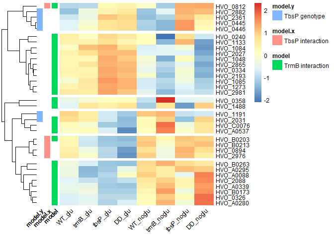<!-- -->

``` r
save_pheatmap_pdf(tbsP.plot, "03_clustered_DEGs/motility_heatmap.pdf", width = 6, height = 6)
```

    ## png 
    ##   2

``` r
sha <- allexpr[rownames(allexpr) %in% shared$shared, ]
clustexpr <- sha
clustexpr$locus_tag <- rownames(sha)
clustexpr <- left_join(clustexpr, gff_df[c(3:4)], by = "locus_tag")
clustexpr2 <- clustexpr
rownames(clustexpr2) <- clustexpr$old_locus_tag

tbsP.plot <- pheatmap(clustexpr2[, c(1:8)],
  cluster_cols = F, cluster_rows = T, cutree_rows = 4,
  show_rownames = T, fontsize = 9, border_color = NA, angle_col = 45
)
```

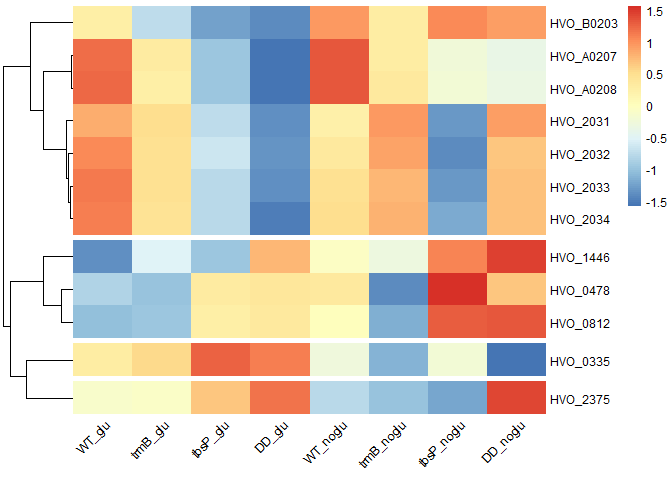<!-- -->

``` r
save_pheatmap_pdf(tbsP.plot, "03_clustered_DEGs/shared_heatmap.pdf", width = 6, height = 4)
```

    ## png 
    ##   2

``` r
tbsP <- allexpr[rownames(allexpr) %in% c(tbsP_degs2$locus_tag), ]

clustexpr <- tbsP
clustexpr$locus_tag <- rownames(tbsP)
clustexpr2 <- left_join(clustexpr, tbsP_degs2, by = "locus_tag")
rownames(clustexpr2) <- clustexpr2$old_locus_tag
tmp <- clustexpr2[12]
tmp$model <- as.factor(tmp$model)
nclust <- 6

tbsP.plot <- pheatmap(clustexpr2[, c(1:8)],
  cluster_cols = FALSE, cluster_rows = T, cutree_rows = nclust,
  show_rownames = T, annotation_row = tmp,
  annotation_colors = list(model = c(interaction = "grey30", genotype = "grey80")),
  fontsize = 9, border_color = NA, angle_col = 45
)
```

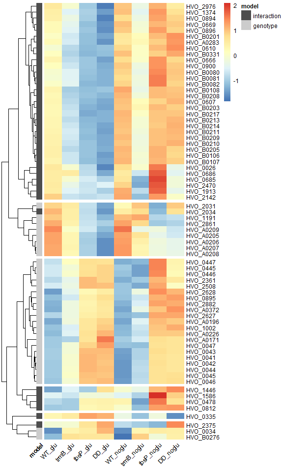<!-- -->

``` r
save_pheatmap_pdf(tbsP.plot, "03_clustered_DEGs/tbsP_heatmap.pdf", width = 6, height = 10)
```

    ## png 
    ##   2

``` r
clustexpr2 <- cbind(clustexpr2, "cluster" = cutree(tbsP.plot$tree_row, k = nclust))
clustexpr2 %>% write_csv(., "03_clustered_DEGs/03_tbsP_DEG_clustered.csv")
```

``` r
trmB <- allexpr[rownames(allexpr) %in% trmB_degs$locus_tag, ]

clustexpr <- trmB
clustexpr$locus_tag <- rownames(trmB)
clustexpr2 <- left_join(clustexpr, trmB_degs[c(1, 3, 9)], by = "locus_tag")
rownames(clustexpr2) <- clustexpr2$old_locus_tag
nclust <- 8

trmb.plot <- pheatmap(clustexpr2[, c(1, 2, 5, 6)],
  cluster_cols = FALSE, cluster_rows = T, cutree_rows = nclust,
  show_rownames = T, clustering_method = "complete",
  fontsize = 8, border_color = NA, angle_col = 45
)
```

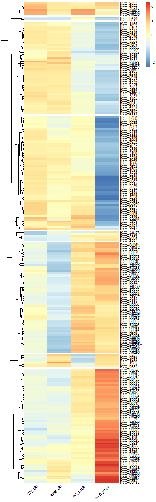<!-- -->

``` r
save_pheatmap_pdf(trmb.plot, "03_clustered_DEGs/trmB_heatmap.pdf", width = 5, height = 18)
```

    ## png 
    ##   2

``` r
clustexpr2 <- cbind(clustexpr2, "cluster" = cutree(trmb.plot$tree_row, k = nclust))
clustexpr2 %>% write_csv(., "03_clustered_DEGs/03_trmB_DEG_clustered.csv")
```

``` r
# Line plots for each cluster.
for (i in (1:nclust)) {
  clustexpr3 <- clustexpr2[clustexpr2$cluster == i, ]
  clustexpr3 <- clustexpr3[, c(1, 2, 5, 6, 11)]
  clustexpr3 <- melt(clustexpr3, id.vars = "old_locus_tag")
  k <- nrow(clustexpr3) / 4
  print(paste("cluster:", i, "genes:", k))
  plt <- ggplot(clustexpr3, aes(x = fct_inorder(variable), y = value)) +
    geom_line(aes(group = old_locus_tag), alpha = 0.2, linewidth = 1, color = "grey40") +
    geom_boxplot(aes(fill = variable), outlier.shape = NA, alpha = 0.8) +
    geom_point(size = 1) +
    labs(y = "normalized counts") +
    theme_bw() +
    theme(
      axis.title.x = element_blank(), legend.title = element_blank(),
      axis.title.y = element_text(size = 10), legend.text = element_text(size = 10),
      axis.text.x = element_text(size = 10, angle = 45, hjust = 1), legend.position = "none"
    )
  print(plt)

  pdf(paste("03_clustered_DEGs/trmB_cluster", i, "_line.pdf", sep = ""), height = 2, width = 3)
  print(plt)
  dev.off()
}
```

    ## [1] "cluster: 1 genes: 50"

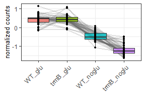<!-- -->

    ## [1] "cluster: 2 genes: 62"

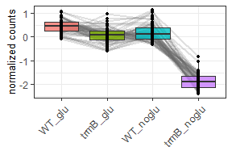<!-- -->

    ## [1] "cluster: 3 genes: 62"

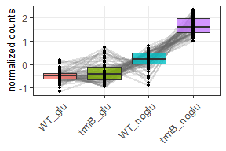<!-- -->

    ## [1] "cluster: 4 genes: 2"

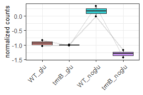<!-- -->

    ## [1] "cluster: 5 genes: 7"

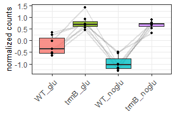<!-- -->

    ## [1] "cluster: 6 genes: 60"

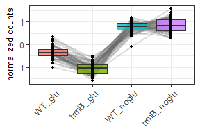<!-- -->

    ## [1] "cluster: 7 genes: 5"

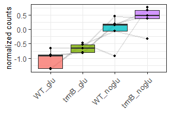<!-- -->

    ## [1] "cluster: 8 genes: 7"

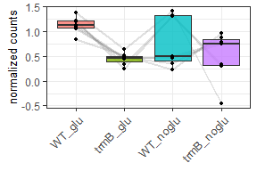<!-- -->
