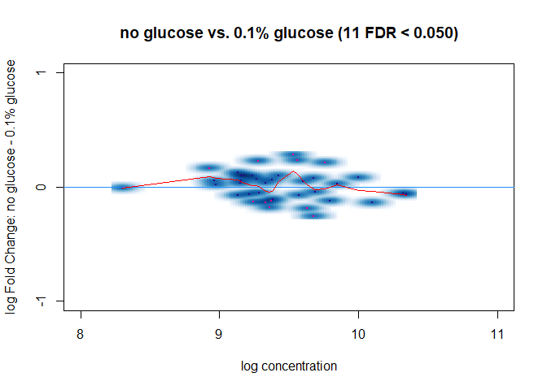

DiffBind TbsP
================
Rylee Hackley

``` r
# if using windows and getting an rJava error when intalling xlsx package, need to make sure that your java matches r installations (32 or 64-bit) #Sys.setenv(JAVA_HOME="C:\\Program Files/Java/jre1.8.0_241/")
# library(rJava)
# BiocManager::install(c("DiffBind", "edgeR"))
library(tidyverse)
```

    ## Warning: package 'ggplot2' was built under R version 4.3.1

    ## Warning: package 'purrr' was built under R version 4.3.1

``` r
library(openxlsx)
library(rtracklayer)
library(DiffBind)
```

    ## Warning: package 'matrixStats' was built under R version 4.3.1

``` r
package.version("DiffBind")
```

    ## [1] "3.10.0"

fragment sizes calculated by CHIPQC. using initial peaks called with
default settings, since PCA had better replicate agreement and %RIP was
higher IP_tbsPHA_1 213 IP_tbsPHA_2 236 IP_tbsPHA_3 214 IP_tbsPHA_4 233
IP_tbsPHA_glc_1 243 (very low RIP, might remove as outlier)
IP_tbsPHA_glc_2 231 IP_tbsPHA_glc_3 221 IP_tbsPHA_glc_4 223 IP_WT_glc_2
201

``` r
# load all samples
meta <- read_csv("01b_ChIPQC/HVO_chipqc_meta_initial.csv")[c(2:9),]
config <- list(minQCth = 30, fragmentSize = c(243, 231, 221, 223, 213, 236, 214, 233), bCorPlot = T, th = 0.05)

grey <- import.bed("01a_mosaics/peaks/HVO_WT_glc_2.bed")
```

Create initial DBA object

``` r
tbsP <- dba(sampleSheet = meta, peakFormat = "bed", minOverlap = 0.75, config = config)
```

    ## Warning: Unknown or uninitialised column: `Treatment`.

    ## Warning: Unknown or uninitialised column: `PeakFormat`.

    ## Warning: Unknown or uninitialised column: `ScoreCol`.

    ## Warning: Unknown or uninitialised column: `LowerBetter`.

    ## Warning: Unknown or uninitialised column: `Filter`.

    ## Warning: Unknown or uninitialised column: `Counts`.

    ## Warning: Unknown or uninitialised column: `Spikein`.

    ## Warning: Unknown or uninitialised column: `PeakFormat`.

    ## Warning: Unknown or uninitialised column: `ScoreCol`.

    ## Warning: Unknown or uninitialised column: `LowerBetter`.

    ## Warning: Unknown or uninitialised column: `Filter`.

    ## Warning: Unknown or uninitialised column: `Counts`.

    ## Warning: Unknown or uninitialised column: `Spikein`.

    ## Warning: Unknown or uninitialised column: `PeakFormat`.

    ## Warning: Unknown or uninitialised column: `ScoreCol`.

    ## Warning: Unknown or uninitialised column: `LowerBetter`.

    ## Warning: Unknown or uninitialised column: `Filter`.

    ## Warning: Unknown or uninitialised column: `Counts`.

    ## Warning: Unknown or uninitialised column: `Spikein`.

    ## Warning: Unknown or uninitialised column: `PeakFormat`.

    ## Warning: Unknown or uninitialised column: `ScoreCol`.

    ## Warning: Unknown or uninitialised column: `LowerBetter`.

    ## Warning: Unknown or uninitialised column: `Filter`.

    ## Warning: Unknown or uninitialised column: `Counts`.

    ## Warning: Unknown or uninitialised column: `Spikein`.

    ## Warning: Unknown or uninitialised column: `PeakFormat`.

    ## Warning: Unknown or uninitialised column: `ScoreCol`.

    ## Warning: Unknown or uninitialised column: `LowerBetter`.

    ## Warning: Unknown or uninitialised column: `Filter`.

    ## Warning: Unknown or uninitialised column: `Counts`.

    ## Warning: Unknown or uninitialised column: `Spikein`.

    ## Warning: Unknown or uninitialised column: `PeakFormat`.

    ## Warning: Unknown or uninitialised column: `ScoreCol`.

    ## Warning: Unknown or uninitialised column: `LowerBetter`.

    ## Warning: Unknown or uninitialised column: `Filter`.

    ## Warning: Unknown or uninitialised column: `Counts`.

    ## Warning: Unknown or uninitialised column: `Spikein`.

    ## Warning: Unknown or uninitialised column: `PeakFormat`.

    ## Warning: Unknown or uninitialised column: `ScoreCol`.

    ## Warning: Unknown or uninitialised column: `LowerBetter`.

    ## Warning: Unknown or uninitialised column: `Filter`.

    ## Warning: Unknown or uninitialised column: `Counts`.

    ## Warning: Unknown or uninitialised column: `Spikein`.

    ## Warning: Unknown or uninitialised column: `PeakFormat`.

    ## Warning: Unknown or uninitialised column: `ScoreCol`.

    ## Warning: Unknown or uninitialised column: `LowerBetter`.

    ## Warning: Unknown or uninitialised column: `Filter`.

    ## Warning: Unknown or uninitialised column: `Counts`.

    ## Warning: Unknown or uninitialised column: `Spikein`.

<!-- -->

``` r
tbsP
```

    ## 8 Samples, 40 sites in matrix (184 total):
    ##                ID Tissue Factor    Condition Replicate Intervals
    ## 1 IP_tbsPHA_glc_1    HVO   tbsP 0.1% glucose         1        27
    ## 2 IP_tbsPHA_glc_2    HVO   tbsP 0.1% glucose         2        63
    ## 3 IP_tbsPHA_glc_3    HVO   tbsP 0.1% glucose         3       119
    ## 4 IP_tbsPHA_glc_4    HVO   tbsP 0.1% glucose         4        81
    ## 5     IP_tbsPHA_1    HVO   tbsP   no glucose         1        47
    ## 6     IP_tbsPHA_2    HVO   tbsP   no glucose         2        52
    ## 7     IP_tbsPHA_3    HVO   tbsP   no glucose         3        75
    ## 8     IP_tbsPHA_4    HVO   tbsP   no glucose         4        63

``` r
plot(tbsP)
```

<!-- -->

``` r
# number of overlapping peaks in samples
dba.overlap(tbsP, mode = DBA_OLAP_RATE)
```

    ## [1] 184  81  67  57  49  40  27  12

``` r
dba.overlap(tbsP, tbsP$masks$`0.1% glucose`, mode = DBA_OLAP_RATE)
```

<!-- -->

    ## [1] 150  70  47  18

``` r
dba.overlap(tbsP, tbsP$masks$`no glucose`, mode = DBA_OLAP_RATE)
```

<!-- -->

    ## [1] 114  54  42  27

Mask peaks identified in WT control samples

``` r
tbsP <- dba.blacklist(tbsP, blacklist = FALSE, greylist = grey)
```

    ## Master greylist: 31 ranges, 9400 bases

    ## Removed: 20 of 527 intervals.

    ## Removed: 2 merged (of 184) and -41 (of 40) consensus.

<!-- -->

``` r
dba.overlap(tbsP, mode = DBA_OLAP_RATE)
```

    ## [1] 182  81  66  55  47  38  25  12

``` r
dba.overlap(tbsP, tbsP$masks$`0.1% glucose`, mode = DBA_OLAP_RATE)
```

<!-- -->

    ## [1] 148  68  45  16

``` r
dba.overlap(tbsP, tbsP$masks$`no glucose`, mode = DBA_OLAP_RATE)
```

<!-- -->

    ## [1] 108  53  42  27

``` r
tbsP <- dba.count(tbsP, summits = 150, minOverlap = 0.75) # DBA_SCORE_SUMMIT_ADJ: summit height (maximum read pileup value), normalized to relative library size
```

    ## Computing summits...

    ## Warning: Fewer fragment sizes than libraries -- using mean fragment size for
    ## missing values

    ## Sample: 00_sorted_bams/tbsPHA_1_glc_IP_S79_S85_sorted.bam243

    ## Sample: 00_sorted_bams/tbsPHA_2_glc_IP_S45_S51_sorted.bam243

    ## Sample: 00_sorted_bams/tbsPHA_3_glc_IP_S72_S78_sorted.bam243

    ## Sample: 00_sorted_bams/tbsPHA_4_glc_IP_S78_S84_sorted.bam243

    ## Sample: 00_sorted_bams/tbsPHA_1_IP_S41_S47_sorted.bam243

    ## Sample: 00_sorted_bams/tbsPHA_2_IP_S88_S94_sorted.bam243

    ## Sample: 00_sorted_bams/tbsPHA_3_IP_S67_S73_sorted.bam243

    ## Sample: 00_sorted_bams/tbsPHA_4_IP_S94_S100_sorted.bam243

    ## Sample: 00_sorted_bams/tbsPHA_1_glc_WCE_S48_S54_sorted.bam243

    ## Sample: 00_sorted_bams/tbsPHA_2_glc_WCE_S54_S60_sorted.bam243

    ## Sample: 00_sorted_bams/tbsPHA_3_glc_WCE_S66_S72_sorted.bam243

    ## Sample: 00_sorted_bams/tbsPHA_4_glc_WCE_S71_S77_sorted.bam243

    ## Sample: 00_sorted_bams/tbsPHA_1_WCE_S47_S53_sorted.bam243

    ## Sample: 00_sorted_bams/tbsPHA_2_WCE_S56_S62_sorted.bam243

    ## Sample: 00_sorted_bams/tbsPHA_3_WCE_S55_S61_sorted.bam243

    ## Sample: 00_sorted_bams/tbsPHA_4_WCE_S76_S82_sorted.bam243

    ## Re-centering peaks...

    ## Sample: 00_sorted_bams/tbsPHA_1_glc_IP_S79_S85_sorted.bam243

    ## Reads will be counted as Paired-end.

    ## Sample: 00_sorted_bams/tbsPHA_2_glc_IP_S45_S51_sorted.bam243

    ## Reads will be counted as Paired-end.

    ## Sample: 00_sorted_bams/tbsPHA_3_glc_IP_S72_S78_sorted.bam243

    ## Reads will be counted as Paired-end.

    ## Sample: 00_sorted_bams/tbsPHA_4_glc_IP_S78_S84_sorted.bam243

    ## Reads will be counted as Paired-end.

    ## Sample: 00_sorted_bams/tbsPHA_1_IP_S41_S47_sorted.bam243

    ## Reads will be counted as Paired-end.

    ## Sample: 00_sorted_bams/tbsPHA_2_IP_S88_S94_sorted.bam243

    ## Reads will be counted as Paired-end.

    ## Sample: 00_sorted_bams/tbsPHA_3_IP_S67_S73_sorted.bam243

    ## Reads will be counted as Paired-end.

    ## Sample: 00_sorted_bams/tbsPHA_4_IP_S94_S100_sorted.bam243

    ## Reads will be counted as Paired-end.

    ## Sample: 00_sorted_bams/tbsPHA_1_glc_WCE_S48_S54_sorted.bam243

    ## Reads will be counted as Paired-end.

    ## Sample: 00_sorted_bams/tbsPHA_2_glc_WCE_S54_S60_sorted.bam243

    ## Reads will be counted as Paired-end.

    ## Sample: 00_sorted_bams/tbsPHA_3_glc_WCE_S66_S72_sorted.bam243

    ## Reads will be counted as Paired-end.

    ## Sample: 00_sorted_bams/tbsPHA_4_glc_WCE_S71_S77_sorted.bam243

    ## Reads will be counted as Paired-end.

    ## Sample: 00_sorted_bams/tbsPHA_1_WCE_S47_S53_sorted.bam243

    ## Reads will be counted as Paired-end.

    ## Sample: 00_sorted_bams/tbsPHA_2_WCE_S56_S62_sorted.bam243

    ## Reads will be counted as Paired-end.

    ## Sample: 00_sorted_bams/tbsPHA_3_WCE_S55_S61_sorted.bam243

    ## Reads will be counted as Paired-end.

    ## Sample: 00_sorted_bams/tbsPHA_4_WCE_S76_S82_sorted.bam243

    ## Reads will be counted as Paired-end.

<!-- -->

``` r
tbsP
```

    ## 8 Samples, 38 sites in matrix:
    ##                ID Tissue Factor    Condition Replicate   Reads FRiP
    ## 1 IP_tbsPHA_glc_1    HVO   tbsP 0.1% glucose         1 3449936 0.01
    ## 2 IP_tbsPHA_glc_2    HVO   tbsP 0.1% glucose         2 3515513 0.01
    ## 3 IP_tbsPHA_glc_3    HVO   tbsP 0.1% glucose         3 4184463 0.01
    ## 4 IP_tbsPHA_glc_4    HVO   tbsP 0.1% glucose         4 3396991 0.01
    ## 5     IP_tbsPHA_1    HVO   tbsP   no glucose         1 3194255 0.01
    ## 6     IP_tbsPHA_2    HVO   tbsP   no glucose         2 4076466 0.01
    ## 7     IP_tbsPHA_3    HVO   tbsP   no glucose         3 2907709 0.01
    ## 8     IP_tbsPHA_4    HVO   tbsP   no glucose         4 3911524 0.01

compare normalization:

``` r
tbsP2 <- dba.normalize(tbsP, normalize = DBA_NORM_LIB)
tbsP2 <- dba.contrast(tbsP2, reorderMeta = list(Condition = "0.1% glucose"), minMembers = 3)
```

    ## Computing results names...

    ##   Note: levels of factors in the design contain characters other than
    ##   letters, numbers, '_' and '.'. It is recommended (but not required) to use
    ##   only letters, numbers, and delimiters '_' or '.', as these are safe characters
    ##   for column names in R. [This is a message, not a warning or an error]
    ##   Note: levels of factors in the design contain characters other than
    ##   letters, numbers, '_' and '.'. It is recommended (but not required) to use
    ##   only letters, numbers, and delimiters '_' or '.', as these are safe characters
    ##   for column names in R. [This is a message, not a warning or an error]

``` r
tbsP2 <- dba.analyze(tbsP2)
```

    ## Applying Blacklist/Greylists...

    ## No genome detected.

    ## Analyzing...

    ##   Note: levels of factors in the design contain characters other than
    ##   letters, numbers, '_' and '.'. It is recommended (but not required) to use
    ##   only letters, numbers, and delimiters '_' or '.', as these are safe characters
    ##   for column names in R. [This is a message, not a warning or an error]

    ## gene-wise dispersion estimates

    ## mean-dispersion relationship

    ##   Note: levels of factors in the design contain characters other than
    ##   letters, numbers, '_' and '.'. It is recommended (but not required) to use
    ##   only letters, numbers, and delimiters '_' or '.', as these are safe characters
    ##   for column names in R. [This is a message, not a warning or an error]

    ## final dispersion estimates

<!-- -->

``` r
dba.plotMA(tbsP2, method = DBA_DESEQ2)
```

<!-- -->

``` r
tbsP4 <- dba.normalize(tbsP, normalize = DBA_NORM_LIB, library = DBA_LIBSIZE_PEAKREADS)
tbsP4 <- dba.contrast(tbsP4, reorderMeta = list(Condition = "0.1% glucose"), minMembers = 3)
```

    ## Computing results names...

    ##   Note: levels of factors in the design contain characters other than
    ##   letters, numbers, '_' and '.'. It is recommended (but not required) to use
    ##   only letters, numbers, and delimiters '_' or '.', as these are safe characters
    ##   for column names in R. [This is a message, not a warning or an error]
    ##   Note: levels of factors in the design contain characters other than
    ##   letters, numbers, '_' and '.'. It is recommended (but not required) to use
    ##   only letters, numbers, and delimiters '_' or '.', as these are safe characters
    ##   for column names in R. [This is a message, not a warning or an error]

``` r
tbsP4 <- dba.analyze(tbsP4)
```

    ## Applying Blacklist/Greylists...

    ## No genome detected.

    ## Analyzing...

    ##   Note: levels of factors in the design contain characters other than
    ##   letters, numbers, '_' and '.'. It is recommended (but not required) to use
    ##   only letters, numbers, and delimiters '_' or '.', as these are safe characters
    ##   for column names in R. [This is a message, not a warning or an error]

    ## gene-wise dispersion estimates

    ## mean-dispersion relationship

    ##   Note: levels of factors in the design contain characters other than
    ##   letters, numbers, '_' and '.'. It is recommended (but not required) to use
    ##   only letters, numbers, and delimiters '_' or '.', as these are safe characters
    ##   for column names in R. [This is a message, not a warning or an error]

    ## final dispersion estimates

<!-- -->

``` r
dba.plotMA(tbsP4, method = DBA_DESEQ2)
```

<!-- -->

``` r
tbsP3 <- dba.normalize(tbsP, normalize = DBA_NORM_RLE, library = DBA_LIBSIZE_PEAKREADS)
tbsP3 <- dba.contrast(tbsP3, reorderMeta = list(Condition = "0.1% glucose"), minMembers = 3)
```

    ## Computing results names...

    ##   Note: levels of factors in the design contain characters other than
    ##   letters, numbers, '_' and '.'. It is recommended (but not required) to use
    ##   only letters, numbers, and delimiters '_' or '.', as these are safe characters
    ##   for column names in R. [This is a message, not a warning or an error]
    ##   Note: levels of factors in the design contain characters other than
    ##   letters, numbers, '_' and '.'. It is recommended (but not required) to use
    ##   only letters, numbers, and delimiters '_' or '.', as these are safe characters
    ##   for column names in R. [This is a message, not a warning or an error]

``` r
tbsP3 <- dba.analyze(tbsP3)
```

    ## Applying Blacklist/Greylists...

    ## No genome detected.

    ## Analyzing...

    ##   Note: levels of factors in the design contain characters other than
    ##   letters, numbers, '_' and '.'. It is recommended (but not required) to use
    ##   only letters, numbers, and delimiters '_' or '.', as these are safe characters
    ##   for column names in R. [This is a message, not a warning or an error]

    ## gene-wise dispersion estimates

    ## mean-dispersion relationship

    ##   Note: levels of factors in the design contain characters other than
    ##   letters, numbers, '_' and '.'. It is recommended (but not required) to use
    ##   only letters, numbers, and delimiters '_' or '.', as these are safe characters
    ##   for column names in R. [This is a message, not a warning or an error]

    ## final dispersion estimates

<!-- -->

``` r
dba.plotMA(tbsP3, method = DBA_DESEQ2)
```

<!-- -->
DBA norm RLE is the only normalization that results in correct
clustering: 12 DB peaks.

normalize, set up contrasts, and execute differential binding analysis

``` r
tbsP <- dba.normalize(tbsP, normalize = DBA_NORM_LIB, library = DBA_LIBSIZE_FULL)
tbsP <- dba.contrast(tbsP, reorderMeta = list(Condition = "0.1% glucose"), minMembers = 3)
```

    ## Computing results names...

    ##   Note: levels of factors in the design contain characters other than
    ##   letters, numbers, '_' and '.'. It is recommended (but not required) to use
    ##   only letters, numbers, and delimiters '_' or '.', as these are safe characters
    ##   for column names in R. [This is a message, not a warning or an error]
    ##   Note: levels of factors in the design contain characters other than
    ##   letters, numbers, '_' and '.'. It is recommended (but not required) to use
    ##   only letters, numbers, and delimiters '_' or '.', as these are safe characters
    ##   for column names in R. [This is a message, not a warning or an error]

``` r
tbsP <- dba.analyze(tbsP)
```

    ## Applying Blacklist/Greylists...

    ## No genome detected.

    ## Analyzing...

    ##   Note: levels of factors in the design contain characters other than
    ##   letters, numbers, '_' and '.'. It is recommended (but not required) to use
    ##   only letters, numbers, and delimiters '_' or '.', as these are safe characters
    ##   for column names in R. [This is a message, not a warning or an error]

    ## gene-wise dispersion estimates

    ## mean-dispersion relationship

    ##   Note: levels of factors in the design contain characters other than
    ##   letters, numbers, '_' and '.'. It is recommended (but not required) to use
    ##   only letters, numbers, and delimiters '_' or '.', as these are safe characters
    ##   for column names in R. [This is a message, not a warning or an error]

    ## final dispersion estimates

<!-- -->

``` r
dba.plotMA(tbsP, method = DBA_DESEQ2)
```

<!-- -->

``` r
dba.show(tbsP, bContrasts = TRUE)
```

    ##      Factor      Group Samples       Group2 Samples2 DB.DESeq2
    ## 1 Condition no glucose       4 0.1% glucose        4         2

Visualize DBA results

``` r
dba.plotHeatmap(tbsP3, contrast = 1)
```

<!-- -->

``` r
# PCA for all sites in affinity matrix
dba.plotPCA(tbsP3, DBA_CONDITION, label = DBA_CONDITION)
```

<!-- -->

``` r
# PCA plot using affinity data for only differential bound sites
dba.plotPCA(tbsP3, contrast = 1, label = DBA_CONDITION)
```

<!-- -->

``` r
# Binding affinity heatmap showing affinities for differentially bound sites
hmap <- colorRampPalette(c("red", "black", "green"))(n = 13)
dba.plotHeatmap(tbsP3,
  contrast = 1,
  correlations = FALSE, scale = "row", colScheme = hmap
)
```

<!-- -->

view report, compile score, and export

``` r
(tbsP.DB <- dba.report(tbsP3, bFlip = T, bCalled = T, bCounts = T, bNormalized = F))
```

    ## GRanges object with 11 ranges and 16 metadata columns:
    ##         seqnames          ranges strand |      Conc Conc_0.1% glucose
    ##            <Rle>       <IRanges>  <Rle> | <numeric>         <numeric>
    ##   13 NC_013967.1     33114-33414      * |   9.54061           9.44398
    ##    1 NC_013964.1     16028-16328      * |   9.28714           9.23362
    ##   22 NC_013967.1 1307278-1307578      * |   9.71167           9.93332
    ##   27 NC_013967.1 1700696-1700996      * |   9.38613           9.55507
    ##   10 NC_013966.1   462546-462846      * |   9.57790           9.49536
    ##    6 NC_013966.1     49327-49627      * |   9.77396           9.70606
    ##   26 NC_013967.1 1595890-1596190      * |   9.66200           9.85759
    ##   12 NC_013966.1   635399-635699      * |   9.36386           9.51471
    ##    4 NC_013964.1   233605-233905      * |   8.93811           8.90689
    ##   33 NC_013967.1 2102258-2102558      * |   9.26620           9.41151
    ##   29 NC_013967.1 1756216-1756516      * |   9.39580           9.53528
    ##      Conc_no glucose       Fold     p-value         FDR IP_tbsPHA_glc_1
    ##            <numeric>  <numeric>   <numeric>   <numeric>       <numeric>
    ##   13         9.63118 -0.1871975 1.74298e-06 5.07119e-05             568
    ##    1         9.33874 -0.1051167 2.66905e-06 5.07119e-05             496
    ##   22         9.44966  0.4836573 5.23594e-05 6.63219e-04             850
    ##   27         9.19476  0.3603115 1.47048e-04 1.39696e-03             603
    ##   10         9.65598 -0.1606225 3.42745e-04 2.60486e-03             513
    ##    6         9.83881 -0.1327457 6.24205e-04 3.95330e-03             690
    ##   26         9.43567  0.4219220 2.16529e-03 1.17545e-02             655
    ##   12         9.19537  0.3193418 3.63720e-03 1.72767e-02             507
    ##    4         8.96867 -0.0617762 5.17692e-03 2.18581e-02             395
    ##   33         9.10460  0.3069122 5.76852e-03 2.19204e-02             533
    ##   29         9.24139  0.2938880 9.31276e-03 3.21714e-02             596
    ##      IP_tbsPHA_glc_2 IP_tbsPHA_glc_3 IP_tbsPHA_glc_4 IP_tbsPHA_1 IP_tbsPHA_2
    ##            <numeric>       <numeric>       <numeric>   <numeric>   <numeric>
    ##   13             686             934             598         732         867
    ##    1             577             764             571         595         761
    ##   22             849            1303             909         728         754
    ##   27             709             951             746         602         646
    ##   10             625             923             826         887         840
    ##    6             683            1056             912         930         969
    ##   26             890            1243             923         642         705
    ##   12             693             968             758         564         646
    ##    4             468             568             489         534         544
    ##   33             663             830             698         546         601
    ##   29             725             926             721         581         683
    ##      IP_tbsPHA_3 IP_tbsPHA_4   Called1   Called2
    ##        <numeric>   <numeric> <numeric> <numeric>
    ##   13         716         857         2         4
    ##    1         572         662         3         4
    ##   22         513         802         4         2
    ##   27         473         623         4         4
    ##   10         578         922         3         4
    ##    6         682        1082         4         4
    ##   26         669         754         4         4
    ##   12         482         653         3         3
    ##    4         380         546         2         4
    ##   33         471         584         3         4
    ##   29         501         656         4         3
    ##   -------
    ##   seqinfo: 3 sequences from an unspecified genome; no seqlengths

``` r
tbsP.DB$score <- tbsP.DB$Fold

export.bed(tbsP.DB, "02_DiffBind/02_diffbind_RLE.bed")
write_csv(as.data.frame(tbsP.DB), "02_DiffBind/02_diffbind_RLE.csv")
```
