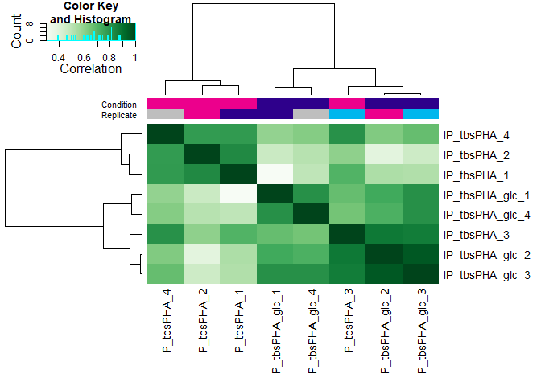

Binding TbsP
================
Rylee Hackley

``` r
# if using windows and getting an rJava error when intalling xlsx package, need to make sure that your java matchs r installations (32 or 64-bit) #Sys.setenv(JAVA_HOME="C:\\Program Files/Java/jre1.8.0_241/")
# library(rJava)

library(tidyverse)
```

    ## Warning: package 'ggplot2' was built under R version 4.3.1

    ## Warning: package 'purrr' was built under R version 4.3.1

``` r
library(openxlsx)
library(rtracklayer)
library(DiffBind)
```

    ## Warning: package 'matrixStats' was built under R version 4.3.1

``` r
package.version("DiffBind")
```

    ## [1] "3.10.0"

fragment sizes calculated by CHIPQC IP_tbsPHA_1 213 IP_tbsPHA_2 236
IP_tbsPHA_3 214 IP_tbsPHA_4 233 IP_tbsPHA_glc_1 243 IP_tbsPHA_glc_2 231
IP_tbsPHA_glc_3 221 IP_tbsPHA_glc_4 223 IP_WT_glc_2 201

``` r
(meta <- read_csv("01b_ChIPQC/HVO_chipqc_meta_final.csv")[c(2:9), ])
```

    ## # A tibble: 8 × 10
    ##   SampleID Tissue Factor Condition Replicate bamReads ControlID bamControl Peaks
    ##   <chr>    <chr>  <chr>  <chr>         <dbl> <chr>    <chr>     <chr>      <chr>
    ## 1 IP_tbsP… HVO    tbsP   0.1% glu…         1 00_sort… HVO_tbsP… 00_sorted… 01a_…
    ## 2 IP_tbsP… HVO    tbsP   0.1% glu…         2 00_sort… HVO_tbsP… 00_sorted… 01a_…
    ## 3 IP_tbsP… HVO    tbsP   0.1% glu…         3 00_sort… HVO_tbsP… 00_sorted… 01a_…
    ## 4 IP_tbsP… HVO    tbsP   0.1% glu…         4 00_sort… HVO_tbsP… 00_sorted… 01a_…
    ## 5 IP_tbsP… HVO    tbsP   no gluco…         1 00_sort… HVO_tbsP… 00_sorted… 01a_…
    ## 6 IP_tbsP… HVO    tbsP   no gluco…         2 00_sort… HVO_tbsP… 00_sorted… 01a_…
    ## 7 IP_tbsP… HVO    tbsP   no gluco…         3 00_sort… HVO_tbsP… 00_sorted… 01a_…
    ## 8 IP_tbsP… HVO    tbsP   no gluco…         4 00_sort… HVO_tbsP… 00_sorted… 01a_…
    ## # ℹ 1 more variable: PeakCaller <chr>

``` r
config <- list(minQCth = 30, fragmentSize = c(243, 231, 221, 223, 213, 236, 214, 233), bCorPlot = T, th = 0.05)

grey <- import.bed("01a_mosaics/final_peaks/HVO_WT_glc_2.bed")
```

Create initial DBA object

``` r
tbsP <- dba(sampleSheet = meta, peakFormat = "bed", minOverlap = 0.75, config = config)
```

<!-- -->

``` r
# Mask peaks identified in WT control samples
tbsP2 <- dba.blacklist(tbsP, blacklist = FALSE, greylist = grey)
```

<!-- -->

``` r
plot(dba.overlap(tbsP, mode = DBA_OLAP_RATE), type = "b", ylab = "# peaks", xlab = "Overlap at least this many peaksets")
```

<!-- -->

``` r
# number of overlapping peaks in samples
dba.overlap(tbsP, mode = DBA_OLAP_RATE)
```

    ## [1] 116  66  54  47  35  29  24   9

``` r
dba.plotVenn(tbsP, tbsP$masks$`no glucose`)
```

<!-- -->

``` r
dba.plotVenn(tbsP, tbsP$masks$`0.1% glucose`)
```

<!-- -->

``` r
# consensus peaksets
tbsP_consensus <- dba.peakset(tbsP, consensus = DBA_CONDITION, minOverlap = 0.75)
```

    ## Add consensus: 0.1% glucose

    ## Add consensus: no glucose

<!-- -->

``` r
dba.plotPCA(tbsP_consensus, DBA_CONDITION, label = DBA_ID)
```

<!-- -->

``` r
dba.plotVenn(tbsP_consensus, tbsP_consensus$masks$Consensus) # 32 regions in no_glu (onlyA)
```

<!-- -->

``` r
(tbsP_consensus.OL <- dba.overlap(tbsP_consensus, tbsP_consensus$masks$Consensus))
```

    ## GRangesList object of length 3:
    ## $onlyA
    ## GRanges object with 16 ranges and 3 metadata columns:
    ##         seqnames          ranges strand |     score    scoreA    scoreB
    ##            <Rle>       <IRanges>  <Rle> | <numeric> <numeric> <numeric>
    ##    6 NC_013966.1   232550-233191      * |  0.506688        NA        NA
    ##    8 NC_013966.1   323185-324043      * |  0.407324        NA        NA
    ##   14 NC_013967.1     46128-46859      * |  0.444531        NA        NA
    ##   16 NC_013967.1   174347-175176      * |  0.418124        NA        NA
    ##   18 NC_013967.1   249351-249919      * |  0.393025        NA        NA
    ##   ..         ...             ...    ... .       ...       ...       ...
    ##   41 NC_013967.1 2699987-2700566      * |  0.437785        NA        NA
    ##   42 NC_013967.1 2766443-2772123      * |  0.600057        NA        NA
    ##   43 NC_013968.1     53959-54618      * |  0.637535        NA        NA
    ##   44 NC_013968.1     57367-58219      * |  0.672983        NA        NA
    ##   45 NC_013968.1     84347-84915      * |  0.884692        NA        NA
    ##   -------
    ##   seqinfo: 4 sequences from an unspecified genome; no seqlengths
    ## 
    ## $onlyB
    ## GRanges object with 3 ranges and 3 metadata columns:
    ##         seqnames        ranges strand |     score    scoreA    scoreB
    ##            <Rle>     <IRanges>  <Rle> | <numeric> <numeric> <numeric>
    ##    1 NC_013964.1   15929-16469      * |  0.567195        NA        NA
    ##   13 NC_013967.1   32939-33603      * |  0.691717        NA        NA
    ##   21 NC_013967.1 479263-479807      * |  0.596315        NA        NA
    ##   -------
    ##   seqinfo: 4 sequences from an unspecified genome; no seqlengths
    ## 
    ## $inAll
    ## GRanges object with 26 ranges and 3 metadata columns:
    ##         seqnames          ranges strand |     score    scoreA    scoreB
    ##            <Rle>       <IRanges>  <Rle> | <numeric> <numeric> <numeric>
    ##    2 NC_013964.1     54809-55379      * |  0.486478  0.415929  0.557028
    ##    3 NC_013964.1     76395-76994      * |  0.536541  0.441169  0.631913
    ##    4 NC_013964.1   329119-329806      * |  0.625665  0.556551  0.694779
    ##    5 NC_013966.1     49050-49863      * |  0.655215  0.556668  0.753762
    ##    7 NC_013966.1   258378-259007      * |  0.532137  0.484239  0.580035
    ##   ..         ...             ...    ... .       ...       ...       ...
    ##   34 NC_013967.1 1893143-1893995      * |  0.382403  0.334620  0.430185
    ##   35 NC_013967.1 1894831-1895699      * |  0.431201  0.374306  0.488096
    ##   37 NC_013967.1 2058431-2059057      * |  0.464059  0.425709  0.502409
    ##   39 NC_013967.1 2130764-2131414      * |  0.381708  0.338343  0.425072
    ##   40 NC_013967.1 2477047-2477947      * |  0.867613  0.818857  0.916369
    ##   -------
    ##   seqinfo: 4 sequences from an unspecified genome; no seqlengths

``` r
# get the combined gRanges:
dba.peakset(tbsP_consensus, bRetrieve = T)
```

    ## GRanges object with 66 ranges and 10 metadata columns:
    ##         seqnames          ranges strand | IP_tbsPHA_glc_1 IP_tbsPHA_glc_2
    ##            <Rle>       <IRanges>  <Rle> |       <numeric>       <numeric>
    ##    1 NC_013964.1     15903-16471      * |               0        0.393692
    ##    2 NC_013964.1     45863-46239      * |               0        0.000000
    ##    3 NC_013964.1     54809-55379      * |               0        0.386605
    ##    4 NC_013964.1     76395-76994      * |               0        0.430191
    ##    5 NC_013964.1   117231-117775      * |               0        0.000000
    ##   ..         ...             ...    ... .             ...             ...
    ##   62 NC_013967.1 2847099-2847667      * |               0        0.000000
    ##   63 NC_013968.1     21867-22435      * |               0        0.000000
    ##   64 NC_013968.1     53959-54618      * |               0        0.586464
    ##   65 NC_013968.1     57367-58219      * |               0        0.647059
    ##   66 NC_013968.1     84347-84915      * |               0        0.843728
    ##      IP_tbsPHA_glc_3 IP_tbsPHA_glc_4 IP_tbsPHA_1 IP_tbsPHA_2 IP_tbsPHA_3
    ##            <numeric>       <numeric>   <numeric>   <numeric>   <numeric>
    ##    1        0.376128        0.000000    0.581952    0.706001    0.413631
    ##    2        0.000000        0.000000    0.476190    0.000000    0.000000
    ##    3        0.384772        0.476409    0.605630    0.648008    0.377791
    ##    4        0.395195        0.498121    0.636675    0.714574    0.412848
    ##    5        0.347019        0.000000    0.000000    0.000000    0.000000
    ##   ..             ...             ...         ...         ...         ...
    ##   62        0.334816        0.000000    0.000000           0    0.000000
    ##   63        0.657048        0.733194    0.937122           0    0.645907
    ##   64        0.530317        0.795825    0.837148           1    0.000000
    ##   65        0.615313        0.756576    0.923441           0    0.579318
    ##   66        0.810347        1.000000    0.000000           0    0.655699
    ##      IP_tbsPHA_4 X0.1..glucose no.glucose
    ##        <numeric>     <numeric>  <numeric>
    ##    1    0.000000      0.000000   0.567195
    ##    2    0.525873      0.000000   0.000000
    ##    3    0.596682      0.415929   0.557028
    ##    4    0.763555      0.441169   0.631913
    ##    5    0.573904      0.000000   0.000000
    ##   ..         ...           ...        ...
    ##   62    0.524882      0.000000          0
    ##   63    0.000000      0.000000          0
    ##   64    0.000000      0.637535          0
    ##   65    0.000000      0.672983          0
    ##   66    0.000000      0.884692          0
    ##   -------
    ##   seqinfo: 4 sequences from an unspecified genome; no seqlengths

This doesn’t have any peak information since it is solely looking at
overlaps. In order to trim and recalculate consensus peaks, need to do a
hybrid approach.

\##tbsP no_glu

``` r
meta %>% filter(Condition == "no glucose") -> meta.noglu
config <- list(
  minQCth = 30, fragmentSize = c(213, 236, 214, 233),
  bCorPlot = T, th = 0.05
)
tbsP.noglu <- dba(sampleSheet = meta.noglu, peakFormat = "bed", minOverlap = 0.75, config = config)
```

    ## Warning: Unknown or uninitialised column: `Treatment`.

    ## Warning: Unknown or uninitialised column: `PeakFormat`.

    ## Warning: Unknown or uninitialised column: `ScoreCol`.

    ## Warning: Unknown or uninitialised column: `LowerBetter`.

    ## Warning: Unknown or uninitialised column: `Filter`.

    ## Warning: Unknown or uninitialised column: `Counts`.

    ## IP_tbsPHA_1 HVO tbsP no glucose  1 bed

    ## Warning: Unknown or uninitialised column: `Spikein`.

    ## Warning: Unknown or uninitialised column: `PeakFormat`.

    ## Warning: Unknown or uninitialised column: `ScoreCol`.

    ## Warning: Unknown or uninitialised column: `LowerBetter`.

    ## Warning: Unknown or uninitialised column: `Filter`.

    ## Warning: Unknown or uninitialised column: `Counts`.

    ## IP_tbsPHA_2 HVO tbsP no glucose  2 bed

    ## Warning: Unknown or uninitialised column: `Spikein`.

    ## Warning: Unknown or uninitialised column: `PeakFormat`.

    ## Warning: Unknown or uninitialised column: `ScoreCol`.

    ## Warning: Unknown or uninitialised column: `LowerBetter`.

    ## Warning: Unknown or uninitialised column: `Filter`.

    ## Warning: Unknown or uninitialised column: `Counts`.

    ## IP_tbsPHA_3 HVO tbsP no glucose  3 bed

    ## Warning: Unknown or uninitialised column: `Spikein`.

    ## Warning: Unknown or uninitialised column: `PeakFormat`.

    ## Warning: Unknown or uninitialised column: `ScoreCol`.

    ## Warning: Unknown or uninitialised column: `LowerBetter`.

    ## Warning: Unknown or uninitialised column: `Filter`.

    ## Warning: Unknown or uninitialised column: `Counts`.

    ## IP_tbsPHA_4 HVO tbsP no glucose  4 bed

    ## Warning: Unknown or uninitialised column: `Spikein`.

<!-- -->

``` r
tbsP.noglu <- dba.blacklist(tbsP.noglu, blacklist = FALSE, greylist = grey)
```

    ## Master greylist: 17 ranges, 5934 bases

    ## Removed: 4 of 169 intervals.

    ## Removed: 3 merged (of 76) and -10 (of 29) consensus.

<!-- -->

``` r
count.noglu <- dba.count(tbsP.noglu, summits = 150, minOverlap = 0.75, score = DBA_SCORE_RPKM_MINUS) # 42 peaks across 4 samples
```

    ## Computing summits...

    ## Warning: Fewer fragment sizes than libraries -- using mean fragment size for
    ## missing values

    ## Sample: 00_sorted_bams/tbsPHA_1_IP_S41_S47_sorted.bam213

    ## Sample: 00_sorted_bams/tbsPHA_2_IP_S88_S94_sorted.bam213

    ## Sample: 00_sorted_bams/tbsPHA_3_IP_S67_S73_sorted.bam213

    ## Sample: 00_sorted_bams/tbsPHA_4_IP_S94_S100_sorted.bam213

    ## Sample: 00_sorted_bams/tbsPHA_1_WCE_S47_S53_sorted.bam213

    ## Sample: 00_sorted_bams/tbsPHA_2_WCE_S56_S62_sorted.bam213

    ## Sample: 00_sorted_bams/tbsPHA_3_WCE_S55_S61_sorted.bam213

    ## Sample: 00_sorted_bams/tbsPHA_4_WCE_S76_S82_sorted.bam213

    ## Re-centering peaks...

    ## Sample: 00_sorted_bams/tbsPHA_1_IP_S41_S47_sorted.bam213

    ## Reads will be counted as Paired-end.

    ## Sample: 00_sorted_bams/tbsPHA_2_IP_S88_S94_sorted.bam213

    ## Reads will be counted as Paired-end.

    ## Sample: 00_sorted_bams/tbsPHA_3_IP_S67_S73_sorted.bam213

    ## Reads will be counted as Paired-end.

    ## Sample: 00_sorted_bams/tbsPHA_4_IP_S94_S100_sorted.bam213

    ## Reads will be counted as Paired-end.

    ## Sample: 00_sorted_bams/tbsPHA_1_WCE_S47_S53_sorted.bam213

    ## Reads will be counted as Paired-end.

    ## Sample: 00_sorted_bams/tbsPHA_2_WCE_S56_S62_sorted.bam213

    ## Reads will be counted as Paired-end.

    ## Sample: 00_sorted_bams/tbsPHA_3_WCE_S55_S61_sorted.bam213

    ## Reads will be counted as Paired-end.

    ## Sample: 00_sorted_bams/tbsPHA_4_WCE_S76_S82_sorted.bam213

    ## Reads will be counted as Paired-end.

<!-- -->

``` r
count.noglu <- dba.normalize(count.noglu, normalize = DBA_NORM_RLE, library = DBA_LIBSIZE_FULL)
as.data.frame(peak.noglu <- dba.peakset(count.noglu, bRetrieve = T))
```

    ##       seqnames   start     end width strand IP_tbsPHA_1 IP_tbsPHA_2 IP_tbsPHA_3
    ## 1  NC_013964.1   16038   16338   301      *   186.42040    163.1246    174.9386
    ## 2  NC_013964.1   54871   55171   301      *   238.84587    142.7977    158.4931
    ## 3  NC_013964.1   76665   76965   301      *   201.91982    155.9143    166.5469
    ## 4  NC_013964.1  329318  329618   301      *   411.70963    189.2664    309.9586
    ## 5  NC_013966.1   49326   49626   301      *   508.77170    395.4120    345.8146
    ## 6  NC_013966.1  258532  258832   301      *   238.24683    165.8352    255.2990
    ## 7  NC_013966.1  364461  364761   301      *   176.45247    116.6157    418.1984
    ## 8  NC_013966.1  462545  462845   301      *   558.36686    297.3336    271.7871
    ## 9  NC_013966.1  487247  487547   301      *   467.28555    323.6712   1192.7710
    ## 10 NC_013966.1  635417  635717   301      *   162.90952    121.2290    145.0390
    ## 11 NC_013967.1   33104   33404   301      *   270.27476    186.2390    263.5800
    ## 12 NC_013967.1   49372   49672   301      *   214.80051    131.1258    269.6480
    ## 13 NC_013967.1  236707  237007   301      *   182.82892    146.6547    128.0801
    ## 14 NC_013967.1  426416  426716   301      *   364.90221    206.8848    447.8970
    ## 15 NC_013967.1  479423  479723   301      *   160.95027    106.8796    143.2247
    ## 16 NC_013967.1  813983  814283   301      *   353.67987    276.5597    342.4337
    ## 17 NC_013967.1 1159567 1159867   301      *   217.97707    177.8165    765.0219
    ## 18 NC_013967.1 1391746 1392046   301      *   194.26561    200.4402    189.8642
    ## 19 NC_013967.1 1475446 1475746   301      *   297.59558    282.5026    261.1661
    ## 20 NC_013967.1 1485825 1486125   301      *    86.19277    111.8393    198.8210
    ## 21 NC_013967.1 1595904 1596204   301      *   158.24086    120.9011    273.0412
    ## 22 NC_013967.1 1700689 1700989   301      *   208.23171    158.1011    147.2856
    ## 23 NC_013967.1 1720744 1721044   301      *   204.41766    235.8215    200.7165
    ## 24 NC_013967.1 1756261 1756561   301      *   107.96286    160.6706    191.8671
    ## 25 NC_013967.1 1893357 1893657   301      *   132.41903    150.3158    138.6839
    ## 26 NC_013967.1 1895053 1895353   301      *   265.79711    185.1679    250.0053
    ## 27 NC_013967.1 2058642 2058942   301      *   143.66060    159.1762    124.1603
    ## 28 NC_013967.1 2130925 2131225   301      *   155.71145    183.4244    152.9681
    ## 29 NC_013967.1 2477390 2477690   301      *   705.63548    484.7802   1041.0914
    ##    IP_tbsPHA_4
    ## 1     86.49822
    ## 2    130.35520
    ## 3    253.61802
    ## 4    297.73178
    ## 5    482.43298
    ## 6    229.33564
    ## 7    239.80171
    ## 8    403.76023
    ## 9    485.84161
    ## 10   153.59521
    ## 11   179.36618
    ## 12   176.59502
    ## 13   150.16593
    ## 14   256.46415
    ## 15   169.01281
    ## 16   267.09902
    ## 17   278.43867
    ## 18   202.73776
    ## 19   224.22067
    ## 20   181.34639
    ## 21   219.47337
    ## 22   132.66893
    ## 23   182.77889
    ## 24   136.13008
    ## 25   171.16360
    ## 26   226.24396
    ## 27   185.96440
    ## 28   188.22381
    ## 29   594.95996

``` r
dba.plotVenn(tbsP.noglu, tbsP.noglu$masks$`no glucose`)
```

<!-- -->

\##tbsP glu

``` r
meta %>% filter(Condition == "0.1% glucose") -> meta.glu
config <- list(
  minQCth = 30, fragmentSize = c(243, 231, 221, 223),
  bCorPlot = T, th = 0.05
)
tbsP.glu <- dba(sampleSheet = meta.glu, peakFormat = "bed", minOverlap = 0.75, config = config)
```

    ## Warning: Unknown or uninitialised column: `Treatment`.

    ## Warning: Unknown or uninitialised column: `PeakFormat`.

    ## Warning: Unknown or uninitialised column: `ScoreCol`.

    ## Warning: Unknown or uninitialised column: `LowerBetter`.

    ## Warning: Unknown or uninitialised column: `Filter`.

    ## Warning: Unknown or uninitialised column: `Counts`.

    ## IP_tbsPHA_glc_1 HVO tbsP 0.1% glucose  1 bed

    ## Warning: Unknown or uninitialised column: `Spikein`.

    ## Warning: Unknown or uninitialised column: `PeakFormat`.

    ## Warning: Unknown or uninitialised column: `ScoreCol`.

    ## Warning: Unknown or uninitialised column: `LowerBetter`.

    ## Warning: Unknown or uninitialised column: `Filter`.

    ## Warning: Unknown or uninitialised column: `Counts`.

    ## IP_tbsPHA_glc_2 HVO tbsP 0.1% glucose  2 bed

    ## Warning: Unknown or uninitialised column: `Spikein`.

    ## Warning: Unknown or uninitialised column: `PeakFormat`.

    ## Warning: Unknown or uninitialised column: `ScoreCol`.

    ## Warning: Unknown or uninitialised column: `LowerBetter`.

    ## Warning: Unknown or uninitialised column: `Filter`.

    ## Warning: Unknown or uninitialised column: `Counts`.

    ## IP_tbsPHA_glc_3 HVO tbsP 0.1% glucose  3 bed

    ## Warning: Unknown or uninitialised column: `Spikein`.

    ## Warning: Unknown or uninitialised column: `PeakFormat`.

    ## Warning: Unknown or uninitialised column: `ScoreCol`.

    ## Warning: Unknown or uninitialised column: `LowerBetter`.

    ## Warning: Unknown or uninitialised column: `Filter`.

    ## Warning: Unknown or uninitialised column: `Counts`.

    ## IP_tbsPHA_glc_4 HVO tbsP 0.1% glucose  4 bed

    ## Warning: Unknown or uninitialised column: `Spikein`.

<!-- -->

``` r
tbsP.glu <- dba.blacklist(tbsP.glu, blacklist = FALSE, greylist = grey)
```

    ## Master greylist: 17 ranges, 5934 bases

    ## Removed: 9 of 218 intervals.

    ## Removed: -2 merged (of 102) and -12 (of 42) consensus.

<!-- -->

``` r
count.glu <- dba.count(tbsP.glu, summits = 150, minOverlap = 0.75, score = DBA_SCORE_RPKM_MINUS) # returned 45 peaks across 4 samples
```

    ## Computing summits...

    ## Warning: Fewer fragment sizes than libraries -- using mean fragment size for
    ## missing values

    ## Sample: 00_sorted_bams/tbsPHA_1_glc_IP_S79_S85_sorted.bam243

    ## Sample: 00_sorted_bams/tbsPHA_2_glc_IP_S45_S51_sorted.bam243

    ## Sample: 00_sorted_bams/tbsPHA_3_glc_IP_S72_S78_sorted.bam243

    ## Sample: 00_sorted_bams/tbsPHA_4_glc_IP_S78_S84_sorted.bam243

    ## Sample: 00_sorted_bams/tbsPHA_1_glc_WCE_S48_S54_sorted.bam243

    ## Sample: 00_sorted_bams/tbsPHA_2_glc_WCE_S54_S60_sorted.bam243

    ## Sample: 00_sorted_bams/tbsPHA_3_glc_WCE_S66_S72_sorted.bam243

    ## Sample: 00_sorted_bams/tbsPHA_4_glc_WCE_S71_S77_sorted.bam243

    ## Re-centering peaks...

    ## Sample: 00_sorted_bams/tbsPHA_1_glc_IP_S79_S85_sorted.bam243

    ## Reads will be counted as Paired-end.

    ## Sample: 00_sorted_bams/tbsPHA_2_glc_IP_S45_S51_sorted.bam243

    ## Reads will be counted as Paired-end.

    ## Sample: 00_sorted_bams/tbsPHA_3_glc_IP_S72_S78_sorted.bam243

    ## Reads will be counted as Paired-end.

    ## Sample: 00_sorted_bams/tbsPHA_4_glc_IP_S78_S84_sorted.bam243

    ## Reads will be counted as Paired-end.

    ## Sample: 00_sorted_bams/tbsPHA_1_glc_WCE_S48_S54_sorted.bam243

    ## Reads will be counted as Paired-end.

    ## Sample: 00_sorted_bams/tbsPHA_2_glc_WCE_S54_S60_sorted.bam243

    ## Reads will be counted as Paired-end.

    ## Sample: 00_sorted_bams/tbsPHA_3_glc_WCE_S66_S72_sorted.bam243

    ## Reads will be counted as Paired-end.

    ## Sample: 00_sorted_bams/tbsPHA_4_glc_WCE_S71_S77_sorted.bam243

    ## Reads will be counted as Paired-end.

<!-- -->

``` r
count.glu <- dba.normalize(count.glu, normalize = DBA_NORM_RLE, library = DBA_LIBSIZE_FULL)
count.glu$peaks
```

    ## [[1]]
    ##            Chr   Start     End     Score     RPKM Reads    cRPKM cReads
    ## 1  NC_013964.1   54873   55173  65.43457 462.2360   480 396.8014    413
    ## 2  NC_013964.1   76652   76952  93.67753 552.7572   574 459.0797    477
    ## 3  NC_013964.1  329317  329617  82.25818 554.6832   576 472.4250    491
    ## 4  NC_013966.1   49327   49627 212.50208 664.4642   690 451.9622    470
    ## 5  NC_013966.1  232644  232944 140.83394 634.6115   659 493.7776    513
    ## 6  NC_013966.1  258528  258828 220.44317 570.0911   592 349.6479    364
    ## 7  NC_013966.1  323482  323782 145.09985 503.6446   523 358.5448    373
    ## 8  NC_013966.1  364461  364761 243.35518 567.2021   589 323.8469    337
    ## 9  NC_013966.1  462547  462847 125.61005 493.0517   512 367.4417    382
    ## 10 NC_013966.1  487249  487549 484.32876 974.5476  1012 490.2188    510
    ## 11 NC_013966.1  635405  635705  77.12701 487.2738   506 410.1468    426
    ## 12 NC_013967.1   46383   46683  84.27758 534.4604   555 450.1828    468
    ## 13 NC_013967.1   49376   49676  92.91720 659.6493   685 566.7321    589
    ## 14 NC_013967.1  174588  174888  37.25772 466.0880   484 428.8302    446
    ## 15 NC_013967.1  236677  236977  52.64259 422.7533   439 370.1108    385
    ## 16 NC_013967.1  249532  249832  53.85855 473.7919   492 419.9334    437
    ## 17 NC_013967.1  426418  426718 237.68647 691.4280   718 453.7415    472
    ## 18 NC_013967.1  457968  458268  85.91036 532.5344   553 446.6240    464
    ## 19 NC_013967.1  813979  814279 250.60924 580.6840   603 330.0747    343
    ## 20 NC_013967.1 1159566 1159866 525.90125 912.9161   948 387.0148    402
    ## 21 NC_013967.1 1307263 1307563 223.10074 838.7657   871 615.6650    640
    ## 22 NC_013967.1 1391743 1392043 145.95648 456.4580   474 310.5016    323
    ## 23 NC_013967.1 1475465 1475765 159.67408 624.9816   649 465.3075    484
    ## 24 NC_013967.1 1485850 1486150 110.15906 442.0132   459 331.8541    345
    ## 25 NC_013967.1 1486601 1486901  68.22293 580.6840   603 512.4610    533
    ## 26 NC_013967.1 1595888 1596188 191.17972 629.7965   654 438.6168    456
    ## 27 NC_013967.1 1700692 1700992 167.94144 581.6470   604 413.7055    430
    ## 28 NC_013967.1 1720748 1721048 121.11848 457.4210   475 336.3026    350
    ## 29 NC_013967.1 1756191 1756491 177.65472 580.6840   603 403.0293    419
    ## 30 NC_013967.1 1893350 1893650  69.86002 403.4935   419 333.6335    347
    ## 31 NC_013967.1 1895037 1895337 114.85760 410.2344   426 295.3769    307
    ## 32 NC_013967.1 1947298 1947598 155.50303 476.6809   495 321.1778    334
    ## 33 NC_013967.1 2058614 2058914 126.22665 466.0880   484 339.8613    353
    ## 34 NC_013967.1 2102262 2102562 130.03837 516.1635   536 386.1252    401
    ## 35 NC_013967.1 2130932 2131232 136.79656 417.9384   434 281.1418    292
    ## 36 NC_013967.1 2477389 2477689 553.92143 918.6940   954 364.7726    379
    ## 37 NC_013967.1 2700217 2700517  52.81219 483.4218   502 430.6096    448
    ## 38 NC_013968.1   54258   54558  78.82159 754.9855   784 676.1639    703
    ## 39 NC_013968.1   57715   58015  12.70431 821.4319   853 808.7276    840
    ## 40 NC_013968.1   84564   84864  83.05876 997.6594  1036 914.6006    950
    ## 
    ## [[2]]
    ##            Chr   Start     End     Score      RPKM Reads    cRPKM cReads
    ## 1  NC_013964.1   54873   55173  141.9275  526.3808   557 384.4534    407
    ## 2  NC_013964.1   76652   76952  185.9498  610.4883   646 424.5385    450
    ## 3  NC_013964.1  329317  329617  361.9021  816.5045   864 454.6024    482
    ## 4  NC_013966.1   49327   49627  214.5387  645.4544   683 430.9157    456
    ## 5  NC_013966.1  232644  232944  260.2541  751.2976   795 491.0435    520
    ## 6  NC_013966.1  258528  258828  225.6950  601.0381   636 375.3431    398
    ## 7  NC_013966.1  323482  323782  338.8194  681.3655   721 342.5461    363
    ## 8  NC_013966.1  364461  364761  446.1716  753.1876   797 307.0161    325
    ## 9  NC_013966.1  462547  462847  189.8249  591.5878   626 401.7629    426
    ## 10 NC_013966.1  487249  487549  988.5649 1471.4092  1557 482.8443    511
    ## 11 NC_013966.1  635405  635705  200.2682  653.9596   692 453.6914    481
    ## 12 NC_013967.1   46383   46683  173.2364  636.9491   674 463.7127    491
    ## 13 NC_013967.1   49376   49676  271.2074  827.8449   876 556.6374    590
    ## 14 NC_013967.1  174588  174888  264.2371  634.1141   671 369.8769    392
    ## 15 NC_013967.1  236677  236977  139.6704  539.6112   571 399.9408    424
    ## 16 NC_013967.1  249532  249832  122.3609  539.6112   571 417.2503    442
    ## 17 NC_013967.1  426418  426718  563.9201  962.0389  1018 398.1188    422
    ## 18 NC_013967.1  457968  458268  114.9507  586.8626   621 471.9119    500
    ## 19 NC_013967.1  813979  814279  349.7727  757.9128   802 408.1401    432
    ## 20 NC_013967.1 1159566 1159866 1005.8334 1444.9484  1529 439.1150    465
    ## 21 NC_013967.1 1307263 1307563  120.9830  805.1642   852 684.1812    724
    ## 22 NC_013967.1 1391743 1392043  211.0705  549.0615   581 337.9910    358
    ## 23 NC_013967.1 1475465 1475765  133.8993  657.7398   696 523.8405    555
    ## 24 NC_013967.1 1485850 1486150  111.5576  517.8756   548 406.3180    430
    ## 25 NC_013967.1 1486601 1486901  119.0239  674.7503   714 555.7264    589
    ## 26 NC_013967.1 1595888 1596188  318.1118  840.1302   889 522.0184    553
    ## 27 NC_013967.1 1700692 1700992  207.2915  671.9152   711 464.6237    492
    ## 28 NC_013967.1 1720748 1721048  146.8836  512.2054   542 365.3218    387
    ## 29 NC_013967.1 1756191 1756491  219.6448  686.0906   726 466.4458    494
    ## 30 NC_013967.1 1893350 1893650  151.5337  489.5247   518 337.9910    358
    ## 31 NC_013967.1 1895037 1895337  166.6882  505.5902   535 338.9020    359
    ## 32 NC_013967.1 1947298 1947598  252.6518  590.6427   625 337.9910    358
    ## 33 NC_013967.1 2058614 2058914  167.9192  565.1270   598 397.2077    421
    ## 34 NC_013967.1 2102262 2102562  191.8240  621.8287   658 430.0047    456
    ## 35 NC_013967.1 2130932 2131232  109.9115  421.4827   446 311.5712    330
    ## 36 NC_013967.1 2477389 2477689 1020.4369 1420.3777  1503 399.9408    424
    ## 37 NC_013967.1 2700217 2700517  127.9021  567.0170   600 439.1150    465
    ## 38 NC_013968.1   54258   54558  183.9869  834.4601   883 650.4732    689
    ## 39 NC_013968.1   57715   58015  135.7575  911.9524   965 776.1949    822
    ## 40 NC_013968.1   84564   84864  208.6148 1189.7907  1259 981.1760   1039
    ## 
    ## [[3]]
    ##            Chr   Start     End     Score      RPKM Reads    cRPKM cReads
    ## 1  NC_013964.1   54873   55173  263.0396  643.8944   811 380.8547    434
    ## 2  NC_013964.1   76652   76952  297.0112  729.6411   919 432.6299    493
    ## 3  NC_013964.1  329317  329617  448.5718  898.7527  1132 450.1808    513
    ## 4  NC_013966.1   49327   49627  382.0887  838.4124  1056 456.3237    520
    ## 5  NC_013966.1  232644  232944  343.3511  847.9398  1068 504.5887    575
    ## 6  NC_013966.1  258528  258828  300.4385  697.0891   878 396.6506    452
    ## 7  NC_013966.1  323482  323782  437.0825  799.5088  1007 362.4263    413
    ## 8  NC_013966.1  364461  364761  534.3633  859.0551  1082 324.6918    370
    ## 9  NC_013966.1  462547  462847  380.8376  733.6108   924 352.7733    402
    ## 10 NC_013966.1  487249  487549 1269.6825 1801.4751  2269 531.7926    606
    ## 11 NC_013966.1  635405  635705  314.3105  765.3689   964 451.0584    514
    ## 12 NC_013967.1   46383   46683  210.8037  689.9435   869 479.1398    546
    ## 13 NC_013967.1   49376   49676  368.8392  955.9172  1204 587.0779    669
    ## 14 NC_013967.1  174588  174888  296.7619  665.3310   838 368.5691    420
    ## 15 NC_013967.1  236677  236977  191.2909  600.2271   756 408.9362    466
    ## 16 NC_013967.1  249532  249832  193.2967  597.8452   753 404.5485    461
    ## 17 NC_013967.1  426418  426718  615.4684 1080.5675  1361 465.0991    530
    ## 18 NC_013967.1  457968  458268  213.2691  691.5314   871 478.2623    545
    ## 19 NC_013967.1  813979  814279  454.5486  850.3217  1071 395.7730    451
    ## 20 NC_013967.1 1159566 1159866 1467.2108 1934.0650  2436 466.8542    532
    ## 21 NC_013967.1 1307263 1307563  290.1926 1036.1062  1305 745.9137    850
    ## 22 NC_013967.1 1391743 1392043  288.4888  627.2214   790 338.7326    386
    ## 23 NC_013967.1 1475465 1475765  345.3578  812.2120  1023 466.8542    532
    ## 24 NC_013967.1 1485850 1486150  226.6427  631.1912   795 404.5485    461
    ## 25 NC_013967.1 1486601 1486901  182.5966  699.4709   881 516.8743    589
    ## 26 NC_013967.1 1595888 1596188  489.8561  990.0571  1247 500.2009    570
    ## 27 NC_013967.1 1700692 1700992  341.0132  753.4596   949 412.4464    470
    ## 28 NC_013967.1 1720748 1721048  254.9349  554.1779   698 299.2430    341
    ## 29 NC_013967.1 1756191 1756491  316.9855  739.9625   932 422.9769    482
    ## 30 NC_013967.1 1893350 1893650  216.4905  535.9170   675 319.4266    364
    ## 31 NC_013967.1 1895037 1895337  327.4764  648.6581   817 321.1817    366
    ## 32 NC_013967.1 1947298 1947598  289.1148  662.9492   835 373.8344    426
    ## 33 NC_013967.1 2058614 2058914  341.4744  690.7375   870 349.2631    398
    ## 34 NC_013967.1 2102262 2102562  243.9004  658.9794   830 415.0790    473
    ## 35 NC_013967.1 2130932 2131232  174.4946  493.0437   621 318.5490    363
    ## 36 NC_013967.1 2477389 2477689 1353.4265 1756.2199  2212 402.7934    459
    ## 37 NC_013967.1 2700217 2700517  213.3527  690.7375   870 477.3848    544
    ## 38 NC_013968.1   54258   54558  247.1956  919.3954  1158 672.1999    766
    ## 39 NC_013968.1   57715   58015  355.8389 1137.7320  1433 781.8930    891
    ## 40 NC_013968.1   84564   84864  441.1210 1436.2576  1809 995.1366   1134
    ## 
    ## [[4]]
    ##            Chr   Start     End    Score      RPKM Reads    cRPKM cReads
    ## 1  NC_013964.1   54873   55173 276.6986  633.7445   648 357.0459    366
    ## 2  NC_013964.1   76652   76952 223.0910  681.6665   697 458.5755    469
    ## 3  NC_013964.1  329317  329617 322.1785  807.8286   826 485.6501    497
    ## 4  NC_013966.1   49327   49627 434.2072  891.9367   912 457.7294    469
    ## 5  NC_013966.1  232644  232944 136.5359  648.4145   663 511.8786    524
    ## 6  NC_013966.1  258528  258828 219.3198  647.4365   662 428.1166    438
    ## 7  NC_013966.1  323482  323782 175.5142  535.9444   548 360.4302    369
    ## 8  NC_013966.1  364461  364761 326.6629  659.1725   674 332.5096    340
    ## 9  NC_013966.1  462547  462847 392.6670  809.7846   828 417.1176    427
    ## 10 NC_013966.1  487249  487549 821.7048 1287.0489  1316 465.3442    476
    ## 11 NC_013966.1  635405  635705 292.1333  748.1705   765 456.0373    467
    ## 12 NC_013967.1   46383   46683 122.5116  594.6244   608 472.1128    483
    ## 13 NC_013967.1   49376   49676 292.0291  835.2126   854 543.1836    556
    ## 14 NC_013967.1  174588  174888 187.4733  599.5144   613 412.0411    422
    ## 15 NC_013967.1  236677  236977 165.7480  570.1744   583 404.4264    414
    ## 16 NC_013967.1  249532  249832 133.9699  560.3944   573 426.4245    437
    ## 17 NC_013967.1  426418  426718 489.1389  929.1007   950 439.9618    450
    ## 18 NC_013967.1  457968  458268 190.2347  651.3485   666 461.1138    472
    ## 19 NC_013967.1  813979  814279 464.5659  872.3766   892 407.8107    417
    ## 20 NC_013967.1 1159566 1159866 586.5432 1023.9667  1047 437.4235    448
    ## 21 NC_013967.1 1307263 1307563 271.6507  903.6727   924 632.0220    647
    ## 22 NC_013967.1 1391743 1392043 255.9741  618.0965   632 362.1224    371
    ## 23 NC_013967.1 1475465 1475765 376.1233  875.3106   895 499.1874    511
    ## 24 NC_013967.1 1485850 1486150 182.4514  593.6464   607 411.1950    421
    ## 25 NC_013967.1 1486601 1486901 112.5590  633.7445   648 521.1855    533
    ## 26 NC_013967.1 1595888 1596188 405.0130  907.5847   928 502.5717    514
    ## 27 NC_013967.1 1700692 1700992 315.2730  731.5445   748 416.2715    426
    ## 28 NC_013967.1 1720748 1721048 307.4759  629.8325   644 322.3566    330
    ## 29 NC_013967.1 1756191 1756491 235.4320  704.1605   720 468.7285    480
    ## 30 NC_013967.1 1893350 1893650 162.4362  501.7144   513 339.2782    347
    ## 31 NC_013967.1 1895037 1895337 246.0622  607.3384   621 361.2763    370
    ## 32 NC_013967.1 1947298 1947598 187.3504  567.2404   580 379.8901    389
    ## 33 NC_013967.1 2058614 2058914 211.9779  618.0965   632 406.1185    416
    ## 34 NC_013967.1 2102262 2102562 198.7411  676.7765   692 478.0354    489
    ## 35 NC_013967.1 2130932 2131232 222.9403  561.3724   574 338.4321    347
    ## 36 NC_013967.1 2477389 2477689 821.5907 1223.4789  1251 401.8881    411
    ## 37 NC_013967.1 2700217 2700517 142.3990  578.9764   592 436.5774    447
    ## 38 NC_013968.1   54258   54558 294.5682 1017.1207  1040 722.5526    739
    ## 39 NC_013968.1   57715   58015 133.8854  948.6607   970 814.7753    834
    ## 40 NC_013968.1   84564   84864 270.3332 1257.7089  1286 987.3757   1010

``` r
as.data.frame(peak.glu <- dba.peakset(count.glu, bRetrieve = T))
```

    ##       seqnames   start     end width strand IP_tbsPHA_glc_1 IP_tbsPHA_glc_2
    ## 1  NC_013964.1   54873   55173   301      *        65.43457        141.9275
    ## 2  NC_013964.1   76652   76952   301      *        93.67753        185.9498
    ## 3  NC_013964.1  329317  329617   301      *        82.25818        361.9021
    ## 4  NC_013966.1   49327   49627   301      *       212.50208        214.5387
    ## 5  NC_013966.1  232644  232944   301      *       140.83394        260.2541
    ## 6  NC_013966.1  258528  258828   301      *       220.44317        225.6950
    ## 7  NC_013966.1  323482  323782   301      *       145.09985        338.8194
    ## 8  NC_013966.1  364461  364761   301      *       243.35518        446.1716
    ## 9  NC_013966.1  462547  462847   301      *       125.61005        189.8249
    ## 10 NC_013966.1  487249  487549   301      *       484.32876        988.5649
    ## 11 NC_013966.1  635405  635705   301      *        77.12701        200.2682
    ## 12 NC_013967.1   46383   46683   301      *        84.27758        173.2364
    ## 13 NC_013967.1   49376   49676   301      *        92.91720        271.2074
    ## 14 NC_013967.1  174588  174888   301      *        37.25772        264.2371
    ## 15 NC_013967.1  236677  236977   301      *        52.64259        139.6704
    ## 16 NC_013967.1  249532  249832   301      *        53.85855        122.3609
    ## 17 NC_013967.1  426418  426718   301      *       237.68647        563.9201
    ## 18 NC_013967.1  457968  458268   301      *        85.91036        114.9507
    ## 19 NC_013967.1  813979  814279   301      *       250.60924        349.7727
    ## 20 NC_013967.1 1159566 1159866   301      *       525.90125       1005.8334
    ## 21 NC_013967.1 1307263 1307563   301      *       223.10074        120.9830
    ## 22 NC_013967.1 1391743 1392043   301      *       145.95648        211.0705
    ## 23 NC_013967.1 1475465 1475765   301      *       159.67408        133.8993
    ## 24 NC_013967.1 1485850 1486150   301      *       110.15906        111.5576
    ## 25 NC_013967.1 1486601 1486901   301      *        68.22293        119.0239
    ## 26 NC_013967.1 1595888 1596188   301      *       191.17972        318.1118
    ## 27 NC_013967.1 1700692 1700992   301      *       167.94144        207.2915
    ## 28 NC_013967.1 1720748 1721048   301      *       121.11848        146.8836
    ## 29 NC_013967.1 1756191 1756491   301      *       177.65472        219.6448
    ## 30 NC_013967.1 1893350 1893650   301      *        69.86002        151.5337
    ## 31 NC_013967.1 1895037 1895337   301      *       114.85760        166.6882
    ## 32 NC_013967.1 1947298 1947598   301      *       155.50303        252.6518
    ## 33 NC_013967.1 2058614 2058914   301      *       126.22665        167.9192
    ## 34 NC_013967.1 2102262 2102562   301      *       130.03837        191.8240
    ## 35 NC_013967.1 2130932 2131232   301      *       136.79656        109.9115
    ## 36 NC_013967.1 2477389 2477689   301      *       553.92143       1020.4369
    ## 37 NC_013967.1 2700217 2700517   301      *        52.81219        127.9021
    ## 38 NC_013968.1   54258   54558   301      *        78.82159        183.9869
    ## 39 NC_013968.1   57715   58015   301      *        12.70431        135.7575
    ## 40 NC_013968.1   84564   84864   301      *        83.05876        208.6148
    ##    IP_tbsPHA_glc_3 IP_tbsPHA_glc_4
    ## 1         263.0396        276.6986
    ## 2         297.0112        223.0910
    ## 3         448.5718        322.1785
    ## 4         382.0887        434.2072
    ## 5         343.3511        136.5359
    ## 6         300.4385        219.3198
    ## 7         437.0825        175.5142
    ## 8         534.3633        326.6629
    ## 9         380.8376        392.6670
    ## 10       1269.6825        821.7048
    ## 11        314.3105        292.1333
    ## 12        210.8037        122.5116
    ## 13        368.8392        292.0291
    ## 14        296.7619        187.4733
    ## 15        191.2909        165.7480
    ## 16        193.2967        133.9699
    ## 17        615.4684        489.1389
    ## 18        213.2691        190.2347
    ## 19        454.5486        464.5659
    ## 20       1467.2108        586.5432
    ## 21        290.1926        271.6507
    ## 22        288.4888        255.9741
    ## 23        345.3578        376.1233
    ## 24        226.6427        182.4514
    ## 25        182.5966        112.5590
    ## 26        489.8561        405.0130
    ## 27        341.0132        315.2730
    ## 28        254.9349        307.4759
    ## 29        316.9855        235.4320
    ## 30        216.4905        162.4362
    ## 31        327.4764        246.0622
    ## 32        289.1148        187.3504
    ## 33        341.4744        211.9779
    ## 34        243.9004        198.7411
    ## 35        174.4946        222.9403
    ## 36       1353.4265        821.5907
    ## 37        213.3527        142.3990
    ## 38        247.1956        294.5682
    ## 39        355.8389        133.8854
    ## 40        441.1210        270.3332

``` r
dba.plotVenn(tbsP.glu, tbsP.glu$masks$`0.1% glucose`)
```

<!-- -->

\##shared peaks calculated by ignoring condition differences:

``` r
tbsP <- dba(sampleSheet = meta, peakFormat = "bed", minOverlap = 0.75, config = config)
```

    ## Warning: Unknown or uninitialised column: `Treatment`.

    ## Warning: Unknown or uninitialised column: `PeakFormat`.

    ## Warning: Unknown or uninitialised column: `ScoreCol`.

    ## Warning: Unknown or uninitialised column: `LowerBetter`.

    ## Warning: Unknown or uninitialised column: `Filter`.

    ## Warning: Unknown or uninitialised column: `Counts`.

    ## IP_tbsPHA_glc_1 HVO tbsP 0.1% glucose  1 bed

    ## Warning: Unknown or uninitialised column: `Spikein`.

    ## Warning: Unknown or uninitialised column: `PeakFormat`.

    ## Warning: Unknown or uninitialised column: `ScoreCol`.

    ## Warning: Unknown or uninitialised column: `LowerBetter`.

    ## Warning: Unknown or uninitialised column: `Filter`.

    ## Warning: Unknown or uninitialised column: `Counts`.

    ## IP_tbsPHA_glc_2 HVO tbsP 0.1% glucose  2 bed

    ## Warning: Unknown or uninitialised column: `Spikein`.

    ## Warning: Unknown or uninitialised column: `PeakFormat`.

    ## Warning: Unknown or uninitialised column: `ScoreCol`.

    ## Warning: Unknown or uninitialised column: `LowerBetter`.

    ## Warning: Unknown or uninitialised column: `Filter`.

    ## Warning: Unknown or uninitialised column: `Counts`.

    ## IP_tbsPHA_glc_3 HVO tbsP 0.1% glucose  3 bed

    ## Warning: Unknown or uninitialised column: `Spikein`.

    ## Warning: Unknown or uninitialised column: `PeakFormat`.

    ## Warning: Unknown or uninitialised column: `ScoreCol`.

    ## Warning: Unknown or uninitialised column: `LowerBetter`.

    ## Warning: Unknown or uninitialised column: `Filter`.

    ## Warning: Unknown or uninitialised column: `Counts`.

    ## IP_tbsPHA_glc_4 HVO tbsP 0.1% glucose  4 bed

    ## Warning: Unknown or uninitialised column: `Spikein`.

    ## Warning: Unknown or uninitialised column: `PeakFormat`.

    ## Warning: Unknown or uninitialised column: `ScoreCol`.

    ## Warning: Unknown or uninitialised column: `LowerBetter`.

    ## Warning: Unknown or uninitialised column: `Filter`.

    ## Warning: Unknown or uninitialised column: `Counts`.

    ## IP_tbsPHA_1 HVO tbsP no glucose  1 bed

    ## Warning: Unknown or uninitialised column: `Spikein`.

    ## Warning: Unknown or uninitialised column: `PeakFormat`.

    ## Warning: Unknown or uninitialised column: `ScoreCol`.

    ## Warning: Unknown or uninitialised column: `LowerBetter`.

    ## Warning: Unknown or uninitialised column: `Filter`.

    ## Warning: Unknown or uninitialised column: `Counts`.

    ## IP_tbsPHA_2 HVO tbsP no glucose  2 bed

    ## Warning: Unknown or uninitialised column: `Spikein`.

    ## Warning: Unknown or uninitialised column: `PeakFormat`.

    ## Warning: Unknown or uninitialised column: `ScoreCol`.

    ## Warning: Unknown or uninitialised column: `LowerBetter`.

    ## Warning: Unknown or uninitialised column: `Filter`.

    ## Warning: Unknown or uninitialised column: `Counts`.

    ## IP_tbsPHA_3 HVO tbsP no glucose  3 bed

    ## Warning: Unknown or uninitialised column: `Spikein`.

    ## Warning: Unknown or uninitialised column: `PeakFormat`.

    ## Warning: Unknown or uninitialised column: `ScoreCol`.

    ## Warning: Unknown or uninitialised column: `LowerBetter`.

    ## Warning: Unknown or uninitialised column: `Filter`.

    ## Warning: Unknown or uninitialised column: `Counts`.

    ## IP_tbsPHA_4 HVO tbsP no glucose  4 bed

    ## Warning: Unknown or uninitialised column: `Spikein`.

<!-- -->

``` r
tbsP <- dba.blacklist(tbsP, blacklist = FALSE, greylist = grey)
```

    ## Master greylist: 17 ranges, 5934 bases

    ## Removed: 13 of 387 intervals.

    ## Removed: -2 merged (of 116) and -35 (of 29) consensus.

<!-- -->

``` r
counted <- dba.count(tbsP, summits = 150, minOverlap = 0.75, score = DBA_SCORE_RPKM_MINUS) # returned 45 peaks across 4 samples
```

    ## Computing summits...

    ## Warning: Fewer fragment sizes than libraries -- using mean fragment size for
    ## missing values

    ## Sample: 00_sorted_bams/tbsPHA_1_glc_IP_S79_S85_sorted.bam243

    ## Sample: 00_sorted_bams/tbsPHA_2_glc_IP_S45_S51_sorted.bam243

    ## Sample: 00_sorted_bams/tbsPHA_3_glc_IP_S72_S78_sorted.bam243

    ## Sample: 00_sorted_bams/tbsPHA_4_glc_IP_S78_S84_sorted.bam243

    ## Sample: 00_sorted_bams/tbsPHA_1_IP_S41_S47_sorted.bam243

    ## Sample: 00_sorted_bams/tbsPHA_2_IP_S88_S94_sorted.bam243

    ## Sample: 00_sorted_bams/tbsPHA_3_IP_S67_S73_sorted.bam243

    ## Sample: 00_sorted_bams/tbsPHA_4_IP_S94_S100_sorted.bam243

    ## Sample: 00_sorted_bams/tbsPHA_1_glc_WCE_S48_S54_sorted.bam243

    ## Sample: 00_sorted_bams/tbsPHA_2_glc_WCE_S54_S60_sorted.bam243

    ## Sample: 00_sorted_bams/tbsPHA_3_glc_WCE_S66_S72_sorted.bam243

    ## Sample: 00_sorted_bams/tbsPHA_4_glc_WCE_S71_S77_sorted.bam243

    ## Sample: 00_sorted_bams/tbsPHA_1_WCE_S47_S53_sorted.bam243

    ## Sample: 00_sorted_bams/tbsPHA_2_WCE_S56_S62_sorted.bam243

    ## Sample: 00_sorted_bams/tbsPHA_3_WCE_S55_S61_sorted.bam243

    ## Sample: 00_sorted_bams/tbsPHA_4_WCE_S76_S82_sorted.bam243

    ## Re-centering peaks...

    ## Sample: 00_sorted_bams/tbsPHA_1_glc_IP_S79_S85_sorted.bam243

    ## Reads will be counted as Paired-end.

    ## Sample: 00_sorted_bams/tbsPHA_2_glc_IP_S45_S51_sorted.bam243

    ## Reads will be counted as Paired-end.

    ## Sample: 00_sorted_bams/tbsPHA_3_glc_IP_S72_S78_sorted.bam243

    ## Reads will be counted as Paired-end.

    ## Sample: 00_sorted_bams/tbsPHA_4_glc_IP_S78_S84_sorted.bam243

    ## Reads will be counted as Paired-end.

    ## Sample: 00_sorted_bams/tbsPHA_1_IP_S41_S47_sorted.bam243

    ## Reads will be counted as Paired-end.

    ## Sample: 00_sorted_bams/tbsPHA_2_IP_S88_S94_sorted.bam243

    ## Reads will be counted as Paired-end.

    ## Sample: 00_sorted_bams/tbsPHA_3_IP_S67_S73_sorted.bam243

    ## Reads will be counted as Paired-end.

    ## Sample: 00_sorted_bams/tbsPHA_4_IP_S94_S100_sorted.bam243

    ## Reads will be counted as Paired-end.

    ## Sample: 00_sorted_bams/tbsPHA_1_glc_WCE_S48_S54_sorted.bam243

    ## Reads will be counted as Paired-end.

    ## Sample: 00_sorted_bams/tbsPHA_2_glc_WCE_S54_S60_sorted.bam243

    ## Reads will be counted as Paired-end.

    ## Sample: 00_sorted_bams/tbsPHA_3_glc_WCE_S66_S72_sorted.bam243

    ## Reads will be counted as Paired-end.

    ## Sample: 00_sorted_bams/tbsPHA_4_glc_WCE_S71_S77_sorted.bam243

    ## Reads will be counted as Paired-end.

    ## Sample: 00_sorted_bams/tbsPHA_1_WCE_S47_S53_sorted.bam243

    ## Reads will be counted as Paired-end.

    ## Sample: 00_sorted_bams/tbsPHA_2_WCE_S56_S62_sorted.bam243

    ## Reads will be counted as Paired-end.

    ## Sample: 00_sorted_bams/tbsPHA_3_WCE_S55_S61_sorted.bam243

    ## Reads will be counted as Paired-end.

    ## Sample: 00_sorted_bams/tbsPHA_4_WCE_S76_S82_sorted.bam243

    ## Reads will be counted as Paired-end.

<!-- -->

``` r
count.shared <- dba.normalize(counted, normalize = DBA_NORM_RLE, library = DBA_LIBSIZE_FULL)
count.shared$peaks
```

    ## [[1]]
    ##            Chr   Start     End     Score     RPKM Reads    cRPKM cReads
    ## 1  NC_013964.1   54874   55174  62.54559 459.3470   477 396.8014    413
    ## 2  NC_013964.1   76660   76960  92.49463 548.9052   570 456.4106    474
    ## 3  NC_013964.1  329319  329619  82.18487 553.7202   575 471.5353    490
    ## 4  NC_013966.1   49327   49627 212.50208 664.4642   690 451.9622    470
    ## 5  NC_013966.1  258524  258824 214.81182 566.2391   588 351.4273    365
    ## 6  NC_013966.1  364461  364761 243.35518 567.2021   589 323.8469    337
    ## 7  NC_013966.1  462546  462846 126.57304 494.0147   513 367.4417    382
    ## 8  NC_013966.1  487248  487548 485.21845 974.5476  1012 489.3291    509
    ## 9  NC_013966.1  635397  635697  74.53125 488.2368   507 413.7055    430
    ## 10 NC_013967.1   33114   33414  38.96667 546.9793   568 508.0126    528
    ## 11 NC_013967.1   49374   49674  88.32215 657.7233   683 569.4012    592
    ## 12 NC_013967.1  236678  236978  51.75290 422.7533   439 371.0004    386
    ## 13 NC_013967.1  426417  426717 236.43027 686.6131   713 450.1828    468
    ## 14 NC_013967.1  813981  814281 250.75585 582.6100   605 331.8541    345
    ## 15 NC_013967.1 1159565 1159865 526.79094 912.9161   948 386.1252    401
    ## 16 NC_013967.1 1307278 1307578 218.89232 818.5429   850 599.6506    623
    ## 17 NC_013967.1 1391743 1392043 145.95648 456.4580   474 310.5016    323
    ## 18 NC_013967.1 1475463 1475763 156.85841 623.0556   647 466.1972    485
    ## 19 NC_013967.1 1485851 1486151 110.15906 442.0132   459 331.8541    345
    ## 20 NC_013967.1 1595890 1596190 193.03240 630.7595   655 437.7271    455
    ## 21 NC_013967.1 1700696 1700996 170.53720 580.6840   603 410.1468    426
    ## 22 NC_013967.1 1720743 1721043 120.22879 457.4210   475 337.1922    351
    ## 23 NC_013967.1 1756216 1756516 168.24471 573.9430   596 405.6983    422
    ## 24 NC_013967.1 1893352 1893652  72.74899 406.3825   422 333.6335    347
    ## 25 NC_013967.1 1895046 1895346 121.30533 413.1234   429 291.8181    304
    ## 26 NC_013967.1 2058640 2058940 123.92409 470.9029   489 346.9788    361
    ## 27 NC_013967.1 2130931 2131231 133.83428 414.0864   430 280.2521    292
    ## 28 NC_013967.1 2477389 2477689 553.92143 918.6940   954 364.7726    379
    ## 
    ## [[2]]
    ##            Chr   Start     End     Score      RPKM Reads    cRPKM cReads
    ## 1  NC_013964.1   54874   55174  140.9824  525.4358   556 384.4534    407
    ## 2  NC_013964.1   76660   76960  176.6355  604.8182   640 428.1826    454
    ## 3  NC_013964.1  329319  329619  363.7242  816.5045   864 452.7804    480
    ## 4  NC_013966.1   49327   49627  214.5387  645.4544   683 430.9157    456
    ## 5  NC_013966.1  258524  258824  227.6190  603.8731   639 376.2541    399
    ## 6  NC_013966.1  364461  364761  446.1716  753.1876   797 307.0161    325
    ## 7  NC_013966.1  462546  462846  187.9689  590.6427   625 402.6739    427
    ## 8  NC_013966.1  487248  487548  989.5100 1472.3542  1558 482.8443    511
    ## 9  NC_013966.1  635397  635697  203.9804  655.8497   694 451.8693    479
    ## 10 NC_013967.1   33114   33414  157.2460  648.2895   686 491.0435    520
    ## 11 NC_013967.1   49374   49674  274.8855  828.7899   877 553.9044    587
    ## 12 NC_013967.1  236678  236978  138.7254  538.6662   570 399.9408    424
    ## 13 NC_013967.1  426417  426717  561.1191  960.1488  1016 399.0298    423
    ## 14 NC_013967.1  813981  814281  346.9716  756.0227   800 409.0511    433
    ## 15 NC_013967.1 1159565 1159865 1007.6895 1445.8934  1530 438.2039    464
    ## 16 NC_013967.1 1307278 1307578  132.7243  802.3291   849 669.6048    709
    ## 17 NC_013967.1 1391743 1392043  211.0705  549.0615   581 337.9910    358
    ## 18 NC_013967.1 1475463 1475763  136.7344  660.5748   699 523.8405    555
    ## 19 NC_013967.1 1485851 1486151  109.7355  517.8756   548 408.1401    432
    ## 20 NC_013967.1 1595890 1596190  320.8789  841.0753   890 520.1964    551
    ## 21 NC_013967.1 1700696 1700996  210.8676  670.0251   709 459.1576    486
    ## 22 NC_013967.1 1720743 1721043  145.1636  515.0405   545 369.8769    392
    ## 23 NC_013967.1 1756216 1756516  209.5895  685.1456   725 475.5560    504
    ## 24 NC_013967.1 1893352 1893652  149.7457  490.4697   519 340.7241    361
    ## 25 NC_013967.1 1895046 1895346  167.5652  504.6452   534 337.0800    357
    ## 26 NC_013967.1 2058640 2058940  166.3012  570.7972   604 404.4959    429
    ## 27 NC_013967.1 2130931 2131231  110.8565  422.4277   447 311.5712    330
    ## 28 NC_013967.1 2477389 2477689 1020.4369 1420.3777  1503 399.9408    424
    ## 
    ## [[3]]
    ##            Chr   Start     End     Score      RPKM Reads    cRPKM cReads
    ## 1  NC_013964.1   54874   55174  262.9560  644.6883   812 381.7323    435
    ## 2  NC_013964.1   76660   76960  293.2086  724.0834   912 430.8748    491
    ## 3  NC_013964.1  329319  329619  447.8615  897.1648  1130 449.3033    512
    ## 4  NC_013966.1   49327   49627  382.0887  838.4124  1056 456.3237    520
    ## 5  NC_013966.1  258524  258824  300.5221  696.2951   877 395.7730    451
    ## 6  NC_013966.1  364461  364761  534.3633  859.0551  1082 324.6918    370
    ## 7  NC_013966.1  462546  462846  380.9212  732.8169   923 351.8957    401
    ## 8  NC_013966.1  487248  487548 1268.0110 1800.6812  2268 532.6701    607
    ## 9  NC_013966.1  635397  635697  316.5252  769.3386   969 452.8135    516
    ## 10 NC_013967.1   33114   33414  208.8802  741.5504   934 532.6701    607
    ## 11 NC_013967.1   49374   49674  370.8451  953.5353  1201 582.6902    664
    ## 12 NC_013967.1  236678  236978  191.3744  599.4331   755 408.0587    465
    ## 13 NC_013967.1  426417  426717  616.5131 1078.9796  1359 462.4665    527
    ## 14 NC_013967.1  813981  814281  452.8771  849.5277  1070 396.6506    452
    ## 15 NC_013967.1 1159565 1159865 1465.5393 1933.2710  2435 467.7318    533
    ## 16 NC_013967.1 1307278 1307578  286.8496 1034.5183  1303 747.6688    852
    ## 17 NC_013967.1 1391743 1392043  288.4888  627.2214   790 338.7326    386
    ## 18 NC_013967.1 1475463 1475763  343.9371  809.0362  1019 465.0991    530
    ## 19 NC_013967.1 1485851 1486151  224.8876  631.1912   795 406.3036    463
    ## 20 NC_013967.1 1595890 1596190  486.6803  986.8813  1243 500.2009    570
    ## 21 NC_013967.1 1700696 1700996  342.6011  755.0475   951 412.4464    470
    ## 22 NC_013967.1 1720743 1721043  258.8210  558.9416   704 300.1206    342
    ## 23 NC_013967.1 1756216 1756516  309.5892  735.1987   926 425.6096    485
    ## 24 NC_013967.1 1893352 1893652  218.8723  538.2989   678 319.4266    364
    ## 25 NC_013967.1 1895046 1895346  327.3092  650.2460   819 322.9367    368
    ## 26 NC_013967.1 2058640 2058940  337.7134  693.1193   873 355.4059    405
    ## 27 NC_013967.1 2130931 2131231  173.6171  493.0437   621 319.4266    364
    ## 28 NC_013967.1 2477389 2477689 1353.4265 1756.2199  2212 402.7934    459
    ## 
    ## [[4]]
    ##            Chr   Start     End     Score      RPKM Reads    cRPKM cReads
    ## 1  NC_013964.1   54874   55174 277.54465  633.7445   648 356.1998    365
    ## 2  NC_013964.1   76660   76960 225.89305  683.6225   699 457.7294    469
    ## 3  NC_013964.1  329319  329619 326.80465  810.7626   829 483.9579    495
    ## 4  NC_013966.1   49327   49627 434.20720  891.9367   912 457.7294    469
    ## 5  NC_013966.1  258524  258824 216.51775  645.4805   660 428.9627    439
    ## 6  NC_013966.1  364461  364761 326.66292  659.1725   674 332.5096    340
    ## 7  NC_013966.1  462546  462846 390.71100  807.8286   826 417.1176    427
    ## 8  NC_013966.1  487248  487548 820.14453 1288.0269  1317 467.8824    479
    ## 9  NC_013966.1  635397  635697 276.29877  737.4125   754 461.1138    472
    ## 10 NC_013967.1   33114   33414  50.96775  584.8444   598 533.8767    546
    ## 11 NC_013967.1   49374   49674 290.20497  834.2346   853 544.0296    557
    ## 12 NC_013967.1  236678  236978 164.90195  570.1744   583 405.2725    415
    ## 13 NC_013967.1  426417  426717 489.13892  929.1007   950 439.9618    450
    ## 14 NC_013967.1  813981  814281 464.69785  873.3546   893 408.6568    418
    ## 15 NC_013967.1 1159565 1159865 587.52123 1024.9447  1048 437.4235    448
    ## 16 NC_013967.1 1307278 1307578 264.59538  889.0026   909 624.4073    639
    ## 17 NC_013967.1 1391743 1392043 255.97408  618.0965   632 362.1224    371
    ## 18 NC_013967.1 1475463 1475763 375.99134  874.3326   894 498.3413    510
    ## 19 NC_013967.1 1485851 1486151 182.45140  593.6464   607 411.1950    421
    ## 20 NC_013967.1 1595890 1596190 400.12296  902.6947   923 502.5717    514
    ## 21 NC_013967.1 1700696 1700996 316.70134  729.5885   746 412.8872    423
    ## 22 NC_013967.1 1720743 1721043 309.69570  633.7445   648 324.0488    332
    ## 23 NC_013967.1 1756216 1756516 238.10218  705.1385   721 467.0363    478
    ## 24 NC_013967.1 1893352 1893652 168.30417  507.5824   519 339.2782    347
    ## 25 NC_013967.1 1895046 1895346 237.91975  603.4264   617 365.5067    374
    ## 26 NC_013967.1 2058640 2058940 226.19759  635.7005   650 409.5029    419
    ## 27 NC_013967.1 2130931 2131231 226.58845  563.3284   576 336.7400    345
    ## 28 NC_013967.1 2477389 2477689 821.59075 1223.4789  1251 401.8881    411
    ## 
    ## [[5]]
    ##            Chr   Start     End     Score      RPKM Reads    cRPKM cReads
    ## 1  NC_013964.1   54874   55174 238.45018  619.8837   596 381.4336    367
    ## 2  NC_013964.1   76660   76960 202.69610  645.8856   621 443.1895    427
    ## 3  NC_013964.1  329319  329619 410.80146  897.5833   863 486.7819    469
    ## 4  NC_013966.1   49327   49627 508.63980  967.2683   930 458.6285    441
    ## 5  NC_013966.1  258524  258824 237.60245  649.0058   624 411.4033    396
    ## 6  NC_013966.1  364461  364761 176.45247  503.3955   484 326.9431    315
    ## 7  NC_013966.1  462546  462846 556.55051  922.5451   887 365.9946    352
    ## 8  NC_013966.1  487248  487548 469.36570  922.5451   887 453.1794    436
    ## 9  NC_013966.1  635397  635697 132.11812  583.4812   561 451.3631    434
    ## 10 NC_013967.1   33114   33414 273.64367  761.3337   732 487.6901    469
    ## 11 NC_013967.1   49374   49674 215.84059  728.0514   700 512.2108    493
    ## 12 NC_013967.1  236678  236978 181.37804  563.7198   542 382.3417    368
    ## 13 NC_013967.1  426417  426717 366.71856  786.2955   756 419.5769    404
    ## 14 NC_013967.1  813981  814281 352.77169  755.0933   726 402.3216    387
    ## 15 NC_013967.1 1159565 1159865 219.79342  694.7690   668 474.9756    457
    ## 16 NC_013967.1 1307278 1307578  64.23579  757.1734   728 692.9376    667
    ## 17 NC_013967.1 1391743 1392043 196.08196  522.1168   502 326.0349    314
    ## 18 NC_013967.1 1475463 1475763 308.90449  810.2172   779 501.3127    482
    ## 19 NC_013967.1 1485851 1486151  76.58342  517.9566   498 441.3731    425
    ## 20 NC_013967.1 1595890 1596190 164.59808  667.7271   642 503.1290    484
    ## 21 NC_013967.1 1700696 1700996 208.36361  626.1242   602 417.7606    402
    ## 22 NC_013967.1 1720743 1721043 201.95693  539.7981   519 337.8412    325
    ## 23 NC_013967.1 1756216 1756516 122.94981  604.2826   581 481.3328    463
    ## 24 NC_013967.1 1893352 1893652 134.49917  480.5139   462 346.0147    333
    ## 25 NC_013967.1 1895046 1895346 259.95236  603.2426   580 343.2902    331
    ## 26 NC_013967.1 2058640 2058940 139.89600  580.3610   558 440.4650    424
    ## 27 NC_013967.1 2130931 2131231 157.01532  514.8363   495 357.8210    345
    ## 28 NC_013967.1 2477389 2477689 705.63548 1117.0388  1074 411.4033    396
    ## 
    ## [[6]]
    ##            Chr   Start     End    Score     RPKM Reads    cRPKM cReads
    ## 1  NC_013964.1   54874   55174 141.1677 535.4453   657 394.2776    484
    ## 2  NC_013964.1   76660   76960 150.3339 611.2389   750 460.9050    566
    ## 3  NC_013964.1  329319  329619 189.1730 643.0233   789 453.8503    557
    ## 4  NC_013966.1   49327   49627 396.2270 789.7207   969 393.4937    483
    ## 5  NC_013966.1  258524  258824 165.0825 566.4147   695 401.3322    493
    ## 6  NC_013966.1  364461  364761 116.6157 426.2373   523 309.6215    380
    ## 7  NC_013966.1  462546  462846 297.3647 684.5876   840 387.2229    476
    ## 8  NC_013966.1  487248  487548 324.4239 797.8705   979 473.4466    581
    ## 9  NC_013966.1  635397  635697 114.2366 528.1104   648 413.8739    508
    ## 10 NC_013967.1   33114   33414 191.6014 706.5922   867 514.9908    632
    ## 11 NC_013967.1   49374   49674 122.9760 674.8078   828 551.8318    678
    ## 12 NC_013967.1  236678  236978 133.6772 524.0355   643 390.3583    479
    ## 13 NC_013967.1  426417  426717 208.4525 655.2481   804 446.7956    549
    ## 14 NC_013967.1  813981  814281 282.2024 636.5035   781 354.3011    435
    ## 15 NC_013967.1 1159565 1159865 177.0949 552.5600   678 375.4651    461
    ## 16 NC_013967.1 1307278 1307578 124.5914 614.4989   754 489.9075    602
    ## 17 NC_013967.1 1391743 1392043 200.3779 484.9162   595 284.5383    350
    ## 18 NC_013967.1 1475463 1475763 285.0410 690.2925   847 405.2515    498
    ## 19 NC_013967.1 1485851 1486151 105.5062 463.7266   569 358.2204    440
    ## 20 NC_013967.1 1595890 1596190 119.1466 574.5646   705 455.4180    559
    ## 21 NC_013967.1 1700696 1700996 159.6377 526.4805   646 366.8427    451
    ## 22 NC_013967.1 1720743 1721043 234.1915 549.3000   674 315.1085    387
    ## 23 NC_013967.1 1756216 1756516 156.8704 556.6349   683 399.7645    491
    ## 24 NC_013967.1 1893352 1893652 147.1182 444.9819   546 297.8638    366
    ## 25 NC_013967.1 1895046 1895346 186.7356 497.1410   610 310.4054    381
    ## 26 NC_013967.1 2058640 2058940 161.6523 497.1410   610 335.4887    412
    ## 27 NC_013967.1 2130931 2131231 182.6717 452.3168   555 269.6451    331
    ## 28 NC_013967.1 2477389 2477689 483.2125 871.2192  1069 388.0067    477
    ## 
    ## [[7]]
    ##            Chr   Start     End      Score      RPKM Reads    cRPKM cReads
    ## 1  NC_013964.1   54874   55174  151.73614  573.5698   502 421.8337    370
    ## 2  NC_013964.1   76660   76960  163.31603  635.2685   556 471.9525    414
    ## 3  NC_013964.1  329319  329619  307.77190  784.9451   687 477.1732    418
    ## 4  NC_013966.1   49327   49627  348.00133  779.2323   682 431.2310    378
    ## 5  NC_013966.1  258524  258824  255.59430  639.8388   560 384.2445    337
    ## 6  NC_013966.1  364461  364761  418.19840  733.5295   642 315.3311    276
    ## 7  NC_013966.1  462546  462846  275.11640  660.4051   578 385.2887    338
    ## 8  NC_013966.1  487248  487548 1192.77100 1664.7235  1457 471.9525    414
    ## 9  NC_013966.1  635397  635697  136.09532  549.5758   481 413.4805    362
    ## 10 NC_013967.1   33114   33414  256.33085  818.0796   716 561.7488    492
    ## 11 NC_013967.1   49374   49674  268.30855  823.7925   721 555.4839    487
    ## 12 NC_013967.1  236678  236978  152.29225  507.3008   444 355.0085    311
    ## 13 NC_013967.1  426417  426717  448.94114  884.3487   774 435.4075    382
    ## 14 NC_013967.1  813981  814281  340.44381  667.2605   584 326.8167    287
    ## 15 NC_013967.1 1159565 1159865  761.69263 1157.4227  1013 395.7301    347
    ## 16 NC_013967.1 1307278 1307578   85.99369  586.1381   513 500.1444    438
    ## 17 NC_013967.1 1391743 1392043  187.67745  469.5960   411 281.9185    247
    ## 18 NC_013967.1 1475463 1475763  267.13564  688.9693   603 421.8337    370
    ## 19 NC_013967.1 1485851 1486151  197.38314  570.1421   499 372.7590    327
    ## 20 NC_013967.1 1595890 1596190  283.02908  764.3789   669 481.3498    422
    ## 21 NC_013967.1 1700696 1700996  138.44034  540.4353   473 401.9950    352
    ## 22 NC_013967.1 1720743 1721043  198.62824  511.8711   448 313.2428    275
    ## 23 NC_013967.1 1756216 1756516  154.77014  572.4272   501 417.6571    366
    ## 24 NC_013967.1 1893352 1893652  134.01525  428.4635   375 294.4483    258
    ## 25 NC_013967.1 1895046 1895346  253.23616  551.8610   483 298.6248    262
    ## 26 NC_013967.1 2058640 2058940  120.92942  494.7325   433 373.8031    328
    ## 27 NC_013967.1 2130931 2131231  156.29740  420.4655   368 264.1681    232
    ## 28 NC_013967.1 2477389 2477689 1041.18987 1420.2137  1243 379.0238    332
    ## 
    ## [[8]]
    ##            Chr   Start     End    Score     RPKM Reads    cRPKM cReads
    ## 1  NC_013964.1   54874   55174 131.1408 553.7772   652 422.6364    498
    ## 2  NC_013964.1   76660   76960 246.1332 699.0164   823 452.8831    534
    ## 3  NC_013964.1  329319  329619 297.6999 766.1151   902 468.4152    552
    ## 4  NC_013966.1   49327   49627 484.0998 918.9984  1082 434.8986    513
    ## 5  NC_013966.1  258524  258824 229.3675 622.5747   733 393.2072    463
    ## 6  NC_013966.1  364461  364761 239.8017 552.0785   650 312.2768    368
    ## 7  NC_013966.1  462546  462846 405.4271 783.1022   922 377.6751    445
    ## 8  NC_013966.1  487248  487548 480.8092 940.2322  1107 459.4230    541
    ## 9  NC_013966.1  635397  635697 142.5536 552.9279   651 410.3743    484
    ## 10 NC_013967.1   33114   33414 184.2711 727.8943   857 543.6233    641
    ## 11 NC_013967.1   49374   49674 176.6269 720.2501   848 543.6233    641
    ## 12 NC_013967.1  236678  236978 155.7927 557.1746   656 401.3820    473
    ## 13 NC_013967.1  426417  426717 254.7655 732.9904   863 478.2250    564
    ## 14 NC_013967.1  813981  814281 264.5828 624.2734   735 359.6906    424
    ## 15 NC_013967.1 1159565 1159865 276.7400 665.0423   783 388.3023    458
    ## 16 NC_013967.1 1307278 1307578 151.4539 681.1800   802 529.7261    624
    ## 17 NC_013967.1 1391743 1392043 196.9198 498.5694   587 301.6496    356
    ## 18 NC_013967.1 1475463 1475763 224.3163 705.8112   831 481.4949    567
    ## 19 NC_013967.1 1485851 1486151 193.7998 546.1331   643 352.3333    415
    ## 20 NC_013967.1 1595890 1596190 216.1397 640.4111   754 424.2714    500
    ## 21 NC_013967.1 1700696 1700996 140.0262 529.1460   623 389.1198    459
    ## 22 NC_013967.1 1720743 1721043 183.5326 512.1590   603 328.6264    387
    ## 23 NC_013967.1 1756216 1756516 126.3634 557.1746   656 430.8112    508
    ## 24 NC_013967.1 1893352 1893652 172.7348 485.8291   572 313.0943    369
    ## 25 NC_013967.1 1895046 1895346 231.2445 541.8863   638 310.6419    366
    ## 26 NC_013967.1 2058640 2058940 184.2976 532.5434   627 348.2459    411
    ## 27 NC_013967.1 2130931 2131231 194.0418 465.4447   548 271.4029    320
    ## 28 NC_013967.1 2477389 2477689 594.0787 974.2063  1147 380.1275    448

``` r
as.data.frame(shared <- dba.peakset(count.shared, bRetrieve = T))
```

    ##       seqnames   start     end width strand IP_tbsPHA_glc_1 IP_tbsPHA_glc_2
    ## 1  NC_013964.1   54874   55174   301      *        62.54559        140.9824
    ## 2  NC_013964.1   76660   76960   301      *        92.49463        176.6355
    ## 3  NC_013964.1  329319  329619   301      *        82.18487        363.7242
    ## 4  NC_013966.1   49327   49627   301      *       212.50208        214.5387
    ## 5  NC_013966.1  258524  258824   301      *       214.81182        227.6190
    ## 6  NC_013966.1  364461  364761   301      *       243.35518        446.1716
    ## 7  NC_013966.1  462546  462846   301      *       126.57304        187.9689
    ## 8  NC_013966.1  487248  487548   301      *       485.21845        989.5100
    ## 9  NC_013966.1  635397  635697   301      *        74.53125        203.9804
    ## 10 NC_013967.1   33114   33414   301      *        38.96667        157.2460
    ## 11 NC_013967.1   49374   49674   301      *        88.32215        274.8855
    ## 12 NC_013967.1  236678  236978   301      *        51.75290        138.7254
    ## 13 NC_013967.1  426417  426717   301      *       236.43027        561.1191
    ## 14 NC_013967.1  813981  814281   301      *       250.75585        346.9716
    ## 15 NC_013967.1 1159565 1159865   301      *       526.79094       1007.6895
    ## 16 NC_013967.1 1307278 1307578   301      *       218.89232        132.7243
    ## 17 NC_013967.1 1391743 1392043   301      *       145.95648        211.0705
    ## 18 NC_013967.1 1475463 1475763   301      *       156.85841        136.7344
    ## 19 NC_013967.1 1485851 1486151   301      *       110.15906        109.7355
    ## 20 NC_013967.1 1595890 1596190   301      *       193.03240        320.8789
    ## 21 NC_013967.1 1700696 1700996   301      *       170.53720        210.8676
    ## 22 NC_013967.1 1720743 1721043   301      *       120.22879        145.1636
    ## 23 NC_013967.1 1756216 1756516   301      *       168.24471        209.5895
    ## 24 NC_013967.1 1893352 1893652   301      *        72.74899        149.7457
    ## 25 NC_013967.1 1895046 1895346   301      *       121.30533        167.5652
    ## 26 NC_013967.1 2058640 2058940   301      *       123.92409        166.3012
    ## 27 NC_013967.1 2130931 2131231   301      *       133.83428        110.8565
    ## 28 NC_013967.1 2477389 2477689   301      *       553.92143       1020.4369
    ##    IP_tbsPHA_glc_3 IP_tbsPHA_glc_4 IP_tbsPHA_1 IP_tbsPHA_2 IP_tbsPHA_3
    ## 1         262.9560       277.54465   238.45018    141.1677   151.73614
    ## 2         293.2086       225.89305   202.69610    150.3339   163.31603
    ## 3         447.8615       326.80465   410.80146    189.1730   307.77190
    ## 4         382.0887       434.20720   508.63980    396.2270   348.00133
    ## 5         300.5221       216.51775   237.60245    165.0825   255.59430
    ## 6         534.3633       326.66292   176.45247    116.6157   418.19840
    ## 7         380.9212       390.71100   556.55051    297.3647   275.11640
    ## 8        1268.0110       820.14453   469.36570    324.4239  1192.77100
    ## 9         316.5252       276.29877   132.11812    114.2366   136.09532
    ## 10        208.8802        50.96775   273.64367    191.6014   256.33085
    ## 11        370.8451       290.20497   215.84059    122.9760   268.30855
    ## 12        191.3744       164.90195   181.37804    133.6772   152.29225
    ## 13        616.5131       489.13892   366.71856    208.4525   448.94114
    ## 14        452.8771       464.69785   352.77169    282.2024   340.44381
    ## 15       1465.5393       587.52123   219.79342    177.0949   761.69263
    ## 16        286.8496       264.59538    64.23579    124.5914    85.99369
    ## 17        288.4888       255.97408   196.08196    200.3779   187.67745
    ## 18        343.9371       375.99134   308.90449    285.0410   267.13564
    ## 19        224.8876       182.45140    76.58342    105.5062   197.38314
    ## 20        486.6803       400.12296   164.59808    119.1466   283.02908
    ## 21        342.6011       316.70134   208.36361    159.6377   138.44034
    ## 22        258.8210       309.69570   201.95693    234.1915   198.62824
    ## 23        309.5892       238.10218   122.94981    156.8704   154.77014
    ## 24        218.8723       168.30417   134.49917    147.1182   134.01525
    ## 25        327.3092       237.91975   259.95236    186.7356   253.23616
    ## 26        337.7134       226.19759   139.89600    161.6523   120.92942
    ## 27        173.6171       226.58845   157.01532    182.6717   156.29740
    ## 28       1353.4265       821.59075   705.63548    483.2125  1041.18987
    ##    IP_tbsPHA_4
    ## 1     131.1408
    ## 2     246.1332
    ## 3     297.6999
    ## 4     484.0998
    ## 5     229.3675
    ## 6     239.8017
    ## 7     405.4271
    ## 8     480.8092
    ## 9     142.5536
    ## 10    184.2711
    ## 11    176.6269
    ## 12    155.7927
    ## 13    254.7655
    ## 14    264.5828
    ## 15    276.7400
    ## 16    151.4539
    ## 17    196.9198
    ## 18    224.3163
    ## 19    193.7998
    ## 20    216.1397
    ## 21    140.0262
    ## 22    183.5326
    ## 23    126.3634
    ## 24    172.7348
    ## 25    231.2445
    ## 26    184.2976
    ## 27    194.0418
    ## 28    594.0787

``` r
shared$score <- rowMeans(as.data.frame(mcols(shared)))

dba.plotVenn(tbsP, tbsP$masks$Replicate.1)
```

<!-- -->

``` r
dba.plotVenn(tbsP, tbsP$masks$Replicate.2)
```

<!-- -->

``` r
dba.plotVenn(tbsP, tbsP$masks$Replicate.3)
```

<!-- -->

``` r
dba.plotVenn(tbsP, tbsP$masks$Replicate.4)
```

<!-- -->

Now, remove peaks in “unique” lists that overlap with the shared list.

``` r
# unique no_glu
peak.noglu.unique <- peak.noglu[-queryHits(findOverlaps(peak.noglu, shared, type = "any", minoverlap = 100)), ]
peak.noglu.unique$score <- rowMeans(as.data.frame(mcols(peak.noglu.unique)))
peak.noglu.unique <- sort(peak.noglu.unique, by = ~score, decreasing = T)
names(peak.noglu.unique) <- seq(length(peak.noglu.unique))
peak.noglu.unique <- sort(peak.noglu.unique)
as.data.frame(peak.noglu.unique)
```

    ##      seqnames  start    end width strand IP_tbsPHA_1 IP_tbsPHA_2 IP_tbsPHA_3
    ## 1 NC_013964.1  16038  16338   301      *    186.4204    163.1246    174.9386
    ## 2 NC_013967.1 479423 479723   301      *    160.9503    106.8796    143.2247
    ##   IP_tbsPHA_4    score
    ## 1    86.49822 152.7455
    ## 2   169.01281 145.0168

``` r
# unique glu
peak.glu.unique <- peak.glu[-queryHits(findOverlaps(peak.glu, shared, type = "any", minoverlap = 100)), ]
peak.glu.unique$score <- rowMeans(as.data.frame(mcols(peak.glu.unique)))
peak.nlu.unique <- sort(peak.glu.unique, by = ~score, decreasing = T)
names(peak.glu.unique) <- seq(length(peak.glu.unique))
peak.glu.unique <- sort(peak.glu.unique)
as.data.frame(peak.glu.unique)
```

    ##       seqnames   start     end width strand IP_tbsPHA_glc_1 IP_tbsPHA_glc_2
    ## 1  NC_013966.1  232644  232944   301      *       140.83394        260.2541
    ## 2  NC_013966.1  323482  323782   301      *       145.09985        338.8194
    ## 3  NC_013967.1   46383   46683   301      *        84.27758        173.2364
    ## 4  NC_013967.1  174588  174888   301      *        37.25772        264.2371
    ## 5  NC_013967.1  249532  249832   301      *        53.85855        122.3609
    ## 6  NC_013967.1  457968  458268   301      *        85.91036        114.9507
    ## 7  NC_013967.1 1486601 1486901   301      *        68.22293        119.0239
    ## 8  NC_013967.1 1947298 1947598   301      *       155.50303        252.6518
    ## 9  NC_013967.1 2102262 2102562   301      *       130.03837        191.8240
    ## 10 NC_013967.1 2700217 2700517   301      *        52.81219        127.9021
    ## 11 NC_013968.1   54258   54558   301      *        78.82159        183.9869
    ## 12 NC_013968.1   57715   58015   301      *        12.70431        135.7575
    ## 13 NC_013968.1   84564   84864   301      *        83.05876        208.6148
    ##    IP_tbsPHA_glc_3 IP_tbsPHA_glc_4    score
    ## 1         343.3511        136.5359 220.2438
    ## 2         437.0825        175.5142 274.1290
    ## 3         210.8037        122.5116 147.7073
    ## 4         296.7619        187.4733 196.4325
    ## 5         193.2967        133.9699 125.8715
    ## 6         213.2691        190.2347 151.0912
    ## 7         182.5966        112.5590 120.6006
    ## 8         289.1148        187.3504 221.1550
    ## 9         243.9004        198.7411 191.1260
    ## 10        213.3527        142.3990 134.1165
    ## 11        247.1956        294.5682 201.1430
    ## 12        355.8389        133.8854 159.5465
    ## 13        441.1210        270.3332 250.7819

``` r
# shared
shared <- sort(shared, by = ~score, decreasing = T)
names(shared) <- seq(length(shared))
shared <- sort(shared)
as.data.frame(shared)
```

    ##       seqnames   start     end width strand IP_tbsPHA_glc_1 IP_tbsPHA_glc_2
    ## 21 NC_013964.1   54874   55174   301      *        62.54559        140.9824
    ## 18 NC_013964.1   76660   76960   301      *        92.49463        176.6355
    ## 9  NC_013964.1  329319  329619   301      *        82.18487        363.7242
    ## 5  NC_013966.1   49327   49627   301      *       212.50208        214.5387
    ## 12 NC_013966.1  258524  258824   301      *       214.81182        227.6190
    ## 8  NC_013966.1  364461  364761   301      *       243.35518        446.1716
    ## 7  NC_013966.1  462546  462846   301      *       126.57304        187.9689
    ## 2  NC_013966.1  487248  487548   301      *       485.21845        989.5100
    ## 22 NC_013966.1  635397  635697   301      *        74.53125        203.9804
    ## 23 NC_013967.1   33114   33414   301      *        38.96667        157.2460
    ## 13 NC_013967.1   49374   49674   301      *        88.32215        274.8855
    ## 28 NC_013967.1  236678  236978   301      *        51.75290        138.7254
    ## 4  NC_013967.1  426417  426717   301      *       236.43027        561.1191
    ## 6  NC_013967.1  813981  814281   301      *       250.75585        346.9716
    ## 3  NC_013967.1 1159565 1159865   301      *       526.79094       1007.6895
    ## 25 NC_013967.1 1307278 1307578   301      *       218.89232        132.7243
    ## 16 NC_013967.1 1391743 1392043   301      *       145.95648        211.0705
    ## 11 NC_013967.1 1475463 1475763   301      *       156.85841        136.7344
    ## 26 NC_013967.1 1485851 1486151   301      *       110.15906        109.7355
    ## 10 NC_013967.1 1595890 1596190   301      *       193.03240        320.8789
    ## 15 NC_013967.1 1700696 1700996   301      *       170.53720        210.8676
    ## 17 NC_013967.1 1720743 1721043   301      *       120.22879        145.1636
    ## 19 NC_013967.1 1756216 1756516   301      *       168.24471        209.5895
    ## 27 NC_013967.1 1893352 1893652   301      *        72.74899        149.7457
    ## 14 NC_013967.1 1895046 1895346   301      *       121.30533        167.5652
    ## 20 NC_013967.1 2058640 2058940   301      *       123.92409        166.3012
    ## 24 NC_013967.1 2130931 2131231   301      *       133.83428        110.8565
    ## 1  NC_013967.1 2477389 2477689   301      *       553.92143       1020.4369
    ##    IP_tbsPHA_glc_3 IP_tbsPHA_glc_4 IP_tbsPHA_1 IP_tbsPHA_2 IP_tbsPHA_3
    ## 21        262.9560       277.54465   238.45018    141.1677   151.73614
    ## 18        293.2086       225.89305   202.69610    150.3339   163.31603
    ## 9         447.8615       326.80465   410.80146    189.1730   307.77190
    ## 5         382.0887       434.20720   508.63980    396.2270   348.00133
    ## 12        300.5221       216.51775   237.60245    165.0825   255.59430
    ## 8         534.3633       326.66292   176.45247    116.6157   418.19840
    ## 7         380.9212       390.71100   556.55051    297.3647   275.11640
    ## 2        1268.0110       820.14453   469.36570    324.4239  1192.77100
    ## 22        316.5252       276.29877   132.11812    114.2366   136.09532
    ## 23        208.8802        50.96775   273.64367    191.6014   256.33085
    ## 13        370.8451       290.20497   215.84059    122.9760   268.30855
    ## 28        191.3744       164.90195   181.37804    133.6772   152.29225
    ## 4         616.5131       489.13892   366.71856    208.4525   448.94114
    ## 6         452.8771       464.69785   352.77169    282.2024   340.44381
    ## 3        1465.5393       587.52123   219.79342    177.0949   761.69263
    ## 25        286.8496       264.59538    64.23579    124.5914    85.99369
    ## 16        288.4888       255.97408   196.08196    200.3779   187.67745
    ## 11        343.9371       375.99134   308.90449    285.0410   267.13564
    ## 26        224.8876       182.45140    76.58342    105.5062   197.38314
    ## 10        486.6803       400.12296   164.59808    119.1466   283.02908
    ## 15        342.6011       316.70134   208.36361    159.6377   138.44034
    ## 17        258.8210       309.69570   201.95693    234.1915   198.62824
    ## 19        309.5892       238.10218   122.94981    156.8704   154.77014
    ## 27        218.8723       168.30417   134.49917    147.1182   134.01525
    ## 14        327.3092       237.91975   259.95236    186.7356   253.23616
    ## 20        337.7134       226.19759   139.89600    161.6523   120.92942
    ## 24        173.6171       226.58845   157.01532    182.6717   156.29740
    ## 1        1353.4265       821.59075   705.63548    483.2125  1041.18987
    ##    IP_tbsPHA_4    score
    ## 21    131.1408 175.8154
    ## 18    246.1332 193.8389
    ## 9     297.6999 303.2527
    ## 5     484.0998 372.5381
    ## 12    229.3675 230.8897
    ## 8     239.8017 312.7027
    ## 7     405.4271 327.5791
    ## 2     480.8092 753.7817
    ## 22    142.5536 174.5424
    ## 23    184.2711 170.2385
    ## 13    176.6269 226.0012
    ## 28    155.7927 146.2369
    ## 4     254.7655 397.7599
    ## 6     264.5828 344.4129
    ## 3     276.7400 627.8577
    ## 25    151.4539 166.1670
    ## 16    196.9198 210.3184
    ## 11    224.3163 262.3648
    ## 26    193.7998 150.0633
    ## 10    216.1397 272.9535
    ## 15    140.0262 210.8969
    ## 17    183.5326 206.5273
    ## 19    126.3634 185.8099
    ## 27    172.7348 149.7548
    ## 14    231.2445 223.1585
    ## 20    184.2976 182.6140
    ## 24    194.0418 166.8653
    ## 1     594.0787 821.6865

``` r
# prepare for exporting (bed)
export.bed(peak.glu.unique, "02_DiffBind/glucose_peaks.bed") # includes score
export.bed(peak.noglu.unique, "02_DiffBind/noglucose_peaks.bed") # includes score
export.bed(shared, "02_DiffBind/tbsP_shared_peaks.bed") # includes score
```

Compare with affinity analysis

``` r
DB <- import.bed("02_DiffBind/02_diffbind_RLE.bed")
DB <- DB[, 2]

peak.noglu.unique[queryHits(findOverlaps(peak.noglu.unique, DB, type = "any", minoverlap = 100)), ]
```

    ## GRanges object with 0 ranges and 5 metadata columns:
    ##    seqnames    ranges strand | IP_tbsPHA_1 IP_tbsPHA_2 IP_tbsPHA_3 IP_tbsPHA_4
    ##       <Rle> <IRanges>  <Rle> |   <numeric>   <numeric>   <numeric>   <numeric>
    ##        score
    ##    <numeric>
    ##   -------
    ##   seqinfo: 3 sequences from an unspecified genome; no seqlengths

``` r
peak.glu.unique[queryHits(findOverlaps(peak.glu.unique, DB, type = "any", minoverlap = 100)), ]
```

    ## GRanges object with 0 ranges and 5 metadata columns:
    ##    seqnames    ranges strand | IP_tbsPHA_glc_1 IP_tbsPHA_glc_2 IP_tbsPHA_glc_3
    ##       <Rle> <IRanges>  <Rle> |       <numeric>       <numeric>       <numeric>
    ##    IP_tbsPHA_glc_4     score
    ##          <numeric> <numeric>
    ##   -------
    ##   seqinfo: 4 sequences from an unspecified genome; no seqlengths

``` r
shared[queryHits(findOverlaps(shared, DB, type = "any", minoverlap = 100)), ] # all 11 of DB calls are in the shared dataset
```

    ## GRanges object with 9 ranges and 9 metadata columns:
    ##         seqnames          ranges strand | IP_tbsPHA_glc_1 IP_tbsPHA_glc_2
    ##            <Rle>       <IRanges>  <Rle> |       <numeric>       <numeric>
    ##   21 NC_013964.1     54874-55174      * |         62.5456         140.982
    ##    5 NC_013966.1     49327-49627      * |        212.5021         214.539
    ##    7 NC_013966.1   462546-462846      * |        126.5730         187.969
    ##   23 NC_013967.1     33114-33414      * |         38.9667         157.246
    ##   28 NC_013967.1   236678-236978      * |         51.7529         138.725
    ##    3 NC_013967.1 1159565-1159865      * |        526.7909        1007.690
    ##   25 NC_013967.1 1307278-1307578      * |        218.8923         132.724
    ##   10 NC_013967.1 1595890-1596190      * |        193.0324         320.879
    ##   15 NC_013967.1 1700696-1700996      * |        170.5372         210.868
    ##      IP_tbsPHA_glc_3 IP_tbsPHA_glc_4 IP_tbsPHA_1 IP_tbsPHA_2 IP_tbsPHA_3
    ##            <numeric>       <numeric>   <numeric>   <numeric>   <numeric>
    ##   21         262.956        277.5447    238.4502     141.168    151.7361
    ##    5         382.089        434.2072    508.6398     396.227    348.0013
    ##    7         380.921        390.7110    556.5505     297.365    275.1164
    ##   23         208.880         50.9678    273.6437     191.601    256.3308
    ##   28         191.374        164.9019    181.3780     133.677    152.2923
    ##    3        1465.539        587.5212    219.7934     177.095    761.6926
    ##   25         286.850        264.5954     64.2358     124.591     85.9937
    ##   10         486.680        400.1230    164.5981     119.147    283.0291
    ##   15         342.601        316.7013    208.3636     159.638    138.4403
    ##      IP_tbsPHA_4     score
    ##        <numeric> <numeric>
    ##   21     131.141   175.815
    ##    5     484.100   372.538
    ##    7     405.427   327.579
    ##   23     184.271   170.238
    ##   28     155.793   146.237
    ##    3     276.740   627.858
    ##   25     151.454   166.167
    ##   10     216.140   272.954
    ##   15     140.026   210.897
    ##   -------
    ##   seqinfo: 3 sequences from an unspecified genome; no seqlengths

``` r
DB[queryHits(findOverlaps(DB, shared, type = "any", minoverlap = 100)), ]
```

    ## GRanges object with 9 ranges and 1 metadata column:
    ##          seqnames          ranges strand |      score
    ##             <Rle>       <IRanges>  <Rle> |  <numeric>
    ##   [1] NC_013967.1     33114-33414      * | -0.1871975
    ##   [2] NC_013966.1   462546-462846      * | -0.1606225
    ##   [3] NC_013967.1 1307278-1307578      * |  0.4836573
    ##   [4] NC_013966.1     49327-49627      * | -0.1327457
    ##   [5] NC_013967.1 1595890-1596190      * |  0.4219220
    ##   [6] NC_013967.1 1700696-1700996      * |  0.3603115
    ##   [7] NC_013967.1 1159565-1159865      * |  0.9238712
    ##   [8] NC_013967.1   236678-236978      * |  0.0386237
    ##   [9] NC_013964.1     54874-55174      * |  0.0506467
    ##   -------
    ##   seqinfo: 3 sequences from an unspecified genome; no seqlengths

all 11 of DB peaks are in the shared peak set. Since none of the peaks
are greatly differentially bound (max 0.4 LFC), I am not concerned with
wrangling the data to include the LFC for those peaks in the same sheet.

Add analysis type metadata

``` r
peak.noglu.unique$analysis <- "occupancy"
peak.glu.unique$analysis <- "occupancy"
shared$analysis <- "occupancy"
grey$analysis <- "GreyListChIP"
DB$analysis <- "affinity"
```

Compile Supplemental file:

``` r
variables <- GRangesList(
  "tbsP_shared" = shared, "tbsP_DiffBind" = DB,
  "no_glu_unique" = peak.noglu.unique, "glu_unique" = peak.glu.unique,
  "WT_greylist" = grey
)
wb <- createWorkbook()

for (i in 1:length(variables)) {
  # create dataframe
  df <- as.data.frame(variables[i]) %>% discard(~ all(is.na(.)))
  df <- df[-1]

  # write to excel file, storing results for each .bed as a different sheet
  addWorksheet(wb, names(variables)[i], gridLines = TRUE) # Add a worksheet
  writeData(wb, sheet = i, df, rowNames = FALSE) # write data to worksheet number i
}

saveWorkbook(wb, "02_DiffBind/02_peaklists.xlsx", overwrite = TRUE)
```
