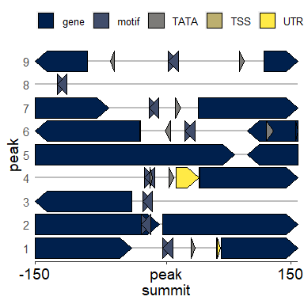

peak composition
================
Rylee Hackley

``` r
library(tidyverse)
library(GenomicFeatures)
library(GGally)

gff <- makeTxDbFromGFF("00_genome_files/genomic.gff",
  format = "gff"
)

gff_df <- read_csv("00_genome_files/genomic_gff_key.csv")
genes.only <- genes(gff, columns = c("GENEID"))
genes.only$type <- rep("gene", length(genes.only))

locations <- read_csv("04c_peak_composition/04c_peakcomp_motif.csv")
locations2 <- read_csv("04c_peak_composition/04c_tata_vs_motif.csv")
```

``` r
library(gggenes)
location3 <- read_csv("04c_peak_composition/04c_tata_vs_motif_trimmed.csv")
```

    ## Rows: 45 Columns: 5
    ## ── Column specification ────────────────────────────────────────────────────────
    ## Delimiter: ","
    ## chr (2): feature, type
    ## dbl (3): peak, start, end
    ## 
    ## ℹ Use `spec()` to retrieve the full column specification for this data.
    ## ℹ Specify the column types or set `show_col_types = FALSE` to quiet this message.

``` r
location3 %>%
  ggplot(aes(xmin = start, xmax = end, y = as.character(peak), fill = type)) +
  geom_gene_arrow(
    arrowhead_height = unit(7, "mm"),
    arrowhead_width = unit(4, "mm"),
    arrow_body_height = unit(7, "mm")
  ) +
  scale_x_continuous(
    name = NULL, limits = c(-150, 150),
    breaks = c(-150, 0, 142),
    labels = c("-150", " peak \nsummit", "150"),
    expand = expansion(mult = c(0, 0))
  ) +
  scale_fill_viridis_d(option = "cividis", direction = 1) +
  labs(y = "peak") +
  theme_genes() +
  theme(
    text = element_text(family = "sans", size = 14, color = "black"),
    axis.text.x = element_text(family = "sans", size = 14, color = "black"),
    legend.title = element_blank(), legend.position = "top",
    legend.text = element_text(family = "sans", size = 10, color = "black"),
    axis.line.y = element_blank(), axis.ticks.y = element_blank()
  ) -> peak.comp

print(peak.comp)
```

<!-- -->

``` r
pdf("04c_peak_composition/consensus_peak_footprint3.pdf", width = 4, height = 4)
print(peak.comp)
dev.off()
```

    ## png 
    ##   2
