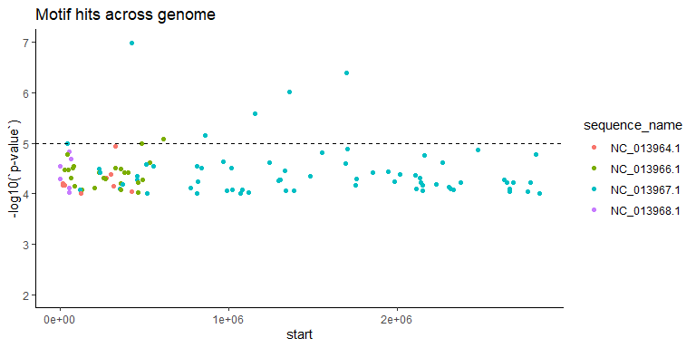
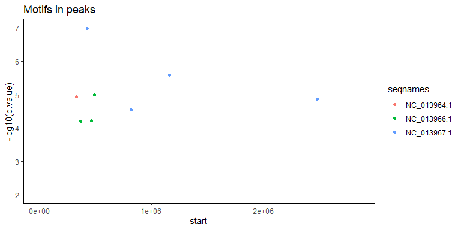

Annontate motif locations
================
Rylee Hackley

``` r
library(tidyverse)
library(readxl)
library(GenomicFeatures)
library(janitor)
```

``` r
motifs <- read_tsv("05a_motif_discovery/fimo.tsv") %>%
  head(., -3)
gr <- makeGRangesFromDataFrame(motifs, seqnames.field = "sequence_name", keep.extra.columns = T)
peaks <- rtracklayer::import("03_plot_peaks/ChIP_consensus.bed", format = "bed")

peaks.anno <- read_xlsx("04a_peak_annotation/04a_genelists.xlsx", sheet = 2)
peaks.anno <- makeGRangesFromDataFrame(peaks.anno, seqnames.field = "chr", start.field = "peak_start", end.field = "peak_end", keep.extra.columns = T)

gff <- makeTxDbFromGFF("00_genome_files/genomic.gff", format = "gff", dataSource = "NCBI", organism = "Haloferax volcanii")
gff.df <- read_csv("00_genome_files/genomic_gff_key.csv")
hvo.cogs <- read.delim("00_genome_files/arcogs-14-18.hvo.txt", sep = "\t")
```

Get GRanges of genes and promoters and intergenic regions

``` r
genes.only <- genes(gff, columns = c("GENEID"))

# get promoter regions
pro250 <- promoters(genes.only, upstream = 250, downstream = 0) ## Warning: this encroaches on nearby CDS
pro250$type <- rep("promoter", length(pro250))

# merge end of chr info with genes
genes.only$type <- rep("gene", length(genes.only))

# non coding regions of the genome
IG <- gaps(reduce(genes.only, ignore.strand = T))
```

overlap promoter region and IG regions to get conservative promoter
ranges (that respect genic regions)

``` r
findOverlaps(pro250, IG) -> pros
pintersect(pro250[queryHits(pros)], IG[subjectHits(pros)]) -> trimmed.pro
trimmed.pro <- trimmed.pro[, 1:2]
names(trimmed.pro) <- NULL
```

regenerate IG ranges to respect promoter regions

``` r
ig.only <- gaps(reduce(c(genes.only, trimmed.pro), ignore.strand = T))
```

How many enriched regions have motifs in them??

``` r
# how many motifs overlap?
length(gr)
```

    ## [1] 107

``` r
length(reduce(gr, ignore.strand = F))
```

    ## [1] 107

``` r
# motifs that overlap with peaks
length(subsetByOverlaps(gr, peaks))
```

    ## [1] 8

look at motifs

``` r
ggplot(motifs) +
  geom_point(aes(y = -log10(`p-value`), x = start, color = sequence_name)) +
  geom_hline(aes(yintercept = -log10(1e-5)), linetype = 2) +
  scale_y_continuous(limits = c(2, 7)) +
  scale_x_continuous(limits = c(1, 2846656)) +
  labs(title = "Motif hits across genome") +
  theme_classic()
```

<!-- -->

``` r
as.data.frame(subsetByOverlaps(gr, peaks)) %>%
  ggplot() +
  geom_point(aes(y = -log10(p.value), x = start, color = seqnames)) +
  geom_hline(aes(yintercept = -log10(1e-5)), linetype = 2) +
  scale_y_continuous(limits = c(2, 7)) +
  scale_x_continuous(limits = c(1, 2846656)) +
  labs(title = "Motifs in peaks") +
  theme_classic()
```

<!-- -->

``` r
# get peaks with motifs (no padding)
lists <- findOverlaps(gr, peaks.anno, ignore.strand = T, minoverlap = 1)
peak.with.motifs <- peaks.anno[subjectHits(lists)]
peak.with.motifs$motif.pval <- gr[queryHits(lists)]$`p-value` # add motif score
peak.with.motifs$type <- gr$motif_id[queryHits(lists)]
peak.with.motifs$motif <- rep("motif", length(peak.with.motifs)) # create metacol with binary motif indicator
peak.with.motifs$motif_start <- start(gr[queryHits(lists)])
peak.with.motifs$motif_end <- end(gr[queryHits(lists)])
peak.with.motifs
```

    ## GRanges object with 2 ranges and 16 metadata columns:
    ##          seqnames        ranges strand | peak_rank peak_score overlap_feature
    ##             <Rle>     <IRanges>  <Rle> | <numeric>  <numeric>     <character>
    ##   [1] NC_013966.1 232645-232945      * |         4     218.77        promoter
    ##   [2] NC_013966.1 232645-232945      * |         4     218.77        promoter
    ##       overlap_length   locus_tag old_locus_tag feature_strand feature_start
    ##            <numeric> <character>   <character>    <character>     <numeric>
    ##   [1]            208 HVO_RS02855     HVO_A0226              -        232306
    ##   [2]            169 HVO_RS02860     HVO_A0228              +        233027
    ##       feature_end feature_length             annotation motif.pval
    ##         <numeric>      <numeric>            <character>  <numeric>
    ##   [1]      232602            297 winged helix-turn-he..   3.87e-05
    ##   [2]      233902            876 5'/3'-nucleotidase S..   3.87e-05
    ##                 type       motif motif_start motif_end
    ##          <character> <character>   <integer> <integer>
    ##   [1] 2-WGAAATWAASTC       motif      232791    232802
    ##   [2] 2-WGAAATWAASTC       motif      232791    232802
    ##   -------
    ##   seqinfo: 3 sequences from an unspecified genome; no seqlengths

``` r
# annotate the peaks that have motifs (again)
write_csv(as.data.frame(peak.with.motifs), "05b_motif_annotation/05b_peak_motif.csv")
```

\#Annotate FIMO results: “where are the motif hits across the
genome?” 1. identify and annotate all motifs that are in
intergenic/promoter regions (use p-value/score cutoff)  
max(peak.with.motif\$motif.score, na.rm = T) 3. look for pairs/groups of
motifs that overlap -\> there are 3, and included in the results file
for all fimo hits

``` r
GenomicRanges::findOverlaps(genes.only, gr, ignore.strand = T, minoverlap = 5) -> genes
GenomicRanges::findOverlaps(trimmed.pro, gr, ignore.strand = T, minoverlap = 5) -> promoters
GenomicRanges::findOverlaps(ig.only, gr, ignore.strand = T, minoverlap = 5) -> ig.regions

# get IRanges from hits objects and add informative metadata
genelist <- gr[subjectHits(genes)][, -3]
genelist$type <- rep("gene", length(genes))
strand(genelist) <- strand(genes.only[queryHits(genes)])
genelist$feature_start <- start(genes.only[queryHits(genes)])
genelist$feature_end <- end(genes.only[queryHits(genes)])
genelist$TXNAME <- as.character(genes.only$GENEID[queryHits(genes)])

prolist <- gr[subjectHits(promoters)][, -3]
prolist$type <- rep("promoter", length(promoters))
prolist$feature_start <- start(trimmed.pro[queryHits(promoters)])
prolist$feature_end <- end(trimmed.pro[queryHits(promoters)])
strand(prolist) <- strand(trimmed.pro[queryHits(promoters)])
prolist$TXNAME <- as.character(trimmed.pro$GENEID[queryHits(promoters)])

iglist <- gr[subjectHits(ig.regions)][, -3]
iglist$type <- rep("intergenic", length(ig.regions))
iglist$feature_start <- start(ig.only[queryHits(ig.regions)])
iglist$feature_end <- end(ig.only[queryHits(ig.regions)])
iglist$TXNAME <- NA

# convert separate IRanges to Data frames
seqs <- seq(1, length(genes))
as.data.frame(prolist) -> one
rownames(one) <- NULL
as.data.frame(genelist, row.names(seqs)) -> two
rownames(two) <- NULL
as.data.frame(iglist, row.names(seqs)) -> three
rownames(three) <- NULL

# combine dfs (gene hits and promoter hits)
final <- rbind(one, two, three) %>% distinct(.keep_all = T)
colnames(final)[c(2, 3, 14)] <- c("motif_start", "motif_end", "locus_tag")

# merge with gff information (get NCBI annotations and locus names)
gff.df[gff.df$locus_tag %in% final$locus_tag, ] -> tmp
tmp[c(2, 3, 4, 10)] -> tmp2
(left_join(final, tmp2, by = "locus_tag") %>% arrange(p.value) -> final)
```

    ##        seqnames motif_start motif_end width strand       motif_id motif_alt_id
    ## 1   NC_013967.1      426543    426554    12      - 2-WGAAATWAASTC     STREME-2
    ## 2   NC_013967.1      426543    426554    12      + 2-WGAAATWAASTC     STREME-2
    ## 3   NC_013967.1     1700795   1700806    12      + 2-WGAAATWAASTC     STREME-2
    ## 4   NC_013967.1     1700795   1700806    12      - 2-WGAAATWAASTC     STREME-2
    ## 5   NC_013967.1     1364155   1364166    12      - 2-WGAAATWAASTC     STREME-2
    ## 6   NC_013967.1     1159731   1159742    12      - 2-WGAAATWAASTC     STREME-2
    ## 7   NC_013967.1      860887    860898    12      - 2-WGAAATWAASTC     STREME-2
    ## 8   NC_013966.1      613893    613904    12      - 2-WGAAATWAASTC     STREME-2
    ## 9   NC_013966.1      487370    487381    12      + 2-WGAAATWAASTC     STREME-2
    ## 10  NC_013967.1       46300     46311    12      - 2-WGAAATWAASTC     STREME-2
    ## 11  NC_013967.1       46300     46311    12      - 2-WGAAATWAASTC     STREME-2
    ## 12  NC_013964.1      329471    329482    12      - 2-WGAAATWAASTC     STREME-2
    ## 13  NC_013964.1      329471    329482    12      + 2-WGAAATWAASTC     STREME-2
    ## 14  NC_013967.1     1706452   1706463    12      - 2-WGAAATWAASTC     STREME-2
    ## 15  NC_013967.1     2477535   2477546    12      + 2-WGAAATWAASTC     STREME-2
    ## 16  NC_013968.1       54226     54237    12      - 2-WGAAATWAASTC     STREME-2
    ## 17  NC_013967.1     1555297   1555308    12      + 2-WGAAATWAASTC     STREME-2
    ## 18  NC_013966.1       43978     43989    12      + 2-WGAAATWAASTC     STREME-2
    ## 19  NC_013967.1     2821758   2821769    12      - 2-WGAAATWAASTC     STREME-2
    ## 20  NC_013967.1     2162174   2162185    12      + 2-WGAAATWAASTC     STREME-2
    ## 21  NC_013968.1       64953     64964    12      - 2-WGAAATWAASTC     STREME-2
    ## 22  NC_013967.1      971810    971821    12      - 2-WGAAATWAASTC     STREME-2
    ## 23  NC_013966.1      536601    536612    12      - 2-WGAAATWAASTC     STREME-2
    ## 24  NC_013966.1      536601    536612    12      + 2-WGAAATWAASTC     STREME-2
    ## 25  NC_013967.1     2268690   2268701    12      + 2-WGAAATWAASTC     STREME-2
    ## 26  NC_013967.1     1240981   1240992    12      - 2-WGAAATWAASTC     STREME-2
    ## 27  NC_013967.1     1240981   1240992    12      - 2-WGAAATWAASTC     STREME-2
    ## 28  NC_013967.1     1693084   1693095    12      - 2-WGAAATWAASTC     STREME-2
    ## 29  NC_013967.1      511754    511765    12      + 2-WGAAATWAASTC     STREME-2
    ## 30  NC_013968.1        2110      2121    12      + 2-WGAAATWAASTC     STREME-2
    ## 31  NC_013966.1       84069     84080    12      - 2-WGAAATWAASTC     STREME-2
    ## 32  NC_013967.1      558055    558066    12      + 2-WGAAATWAASTC     STREME-2
    ## 33  NC_013967.1      814152    814163    12      - 2-WGAAATWAASTC     STREME-2
    ## 34  NC_013967.1      814152    814163    12      + 2-WGAAATWAASTC     STREME-2
    ## 35  NC_013966.1       77638     77649    12      - 2-WGAAATWAASTC     STREME-2
    ## 36  NC_013967.1      840630    840641    12      - 2-WGAAATWAASTC     STREME-2
    ## 37  NC_013966.1      331401    331412    12      - 2-WGAAATWAASTC     STREME-2
    ## 38  NC_013967.1     1016988   1016999    12      + 2-WGAAATWAASTC     STREME-2
    ## 39  NC_013967.1      234701    234712    12      + 2-WGAAATWAASTC     STREME-2
    ## 40  NC_013966.1      361429    361440    12      - 2-WGAAATWAASTC     STREME-2
    ## 41  NC_013966.1       50185     50196    12      - 2-WGAAATWAASTC     STREME-2
    ## 42  NC_013966.1       30963     30974    12      + 2-WGAAATWAASTC     STREME-2
    ## 43  NC_013967.1     1332307   1332318    12      - 2-WGAAATWAASTC     STREME-2
    ## 44  NC_013967.1     1945505   1945516    12      - 2-WGAAATWAASTC     STREME-2
    ## 45  NC_013967.1     1945505   1945516    12      + 2-WGAAATWAASTC     STREME-2
    ## 46  NC_013967.1     1853773   1853784    12      - 2-WGAAATWAASTC     STREME-2
    ## 47  NC_013967.1     1853773   1853784    12      + 2-WGAAATWAASTC     STREME-2
    ## 48  NC_013966.1      232791    232802    12      - 2-WGAAATWAASTC     STREME-2
    ## 49  NC_013966.1      232791    232802    12      + 2-WGAAATWAASTC     STREME-2
    ## 50  NC_013966.1      404596    404607    12      + 2-WGAAATWAASTC     STREME-2
    ## 51  NC_013967.1      239961    239972    12      + 2-WGAAATWAASTC     STREME-2
    ## 52  NC_013966.1      385326    385337    12      - 2-WGAAATWAASTC     STREME-2
    ## 53  NC_013967.1     2015719   2015730    12      - 2-WGAAATWAASTC     STREME-2
    ## 54  NC_013964.1      301421    301432    12      - 2-WGAAATWAASTC     STREME-2
    ## 55  NC_013967.1     2105734   2105745    12      - 2-WGAAATWAASTC     STREME-2
    ## 56  NC_013967.1      459563    459574    12      - 2-WGAAATWAASTC     STREME-2
    ## 57  NC_013967.1     1486011   1486022    12      - 2-WGAAATWAASTC     STREME-2
    ## 58  NC_013966.1       66302     66313    12      - 2-WGAAATWAASTC     STREME-2
    ## 59  NC_013966.1      258902    258913    12      - 2-WGAAATWAASTC     STREME-2
    ## 60  NC_013967.1     2133987   2133998    12      - 2-WGAAATWAASTC     STREME-2
    ## 61  NC_013967.1     2133987   2133998    12      + 2-WGAAATWAASTC     STREME-2
    ## 62  NC_013964.1      279111    279122    12      - 2-WGAAATWAASTC     STREME-2
    ## 63  NC_013967.1     1756397   1756408    12      - 2-WGAAATWAASTC     STREME-2
    ## 64  NC_013967.1     1756397   1756408    12      + 2-WGAAATWAASTC     STREME-2
    ## 65  NC_013968.1        2825      2836    12      + 2-WGAAATWAASTC     STREME-2
    ## 66  NC_013966.1      269322    269333    12      - 2-WGAAATWAASTC     STREME-2
    ## 67  NC_013966.1      492667    492678    12      - 2-WGAAATWAASTC     STREME-2
    ## 68  NC_013967.1     1307379   1307390    12      - 2-WGAAATWAASTC     STREME-2
    ## 69  NC_013967.1     2636672   2636683    12      - 2-WGAAATWAASTC     STREME-2
    ## 70  NC_013967.1      461468    461479    12      - 2-WGAAATWAASTC     STREME-2
    ## 71  NC_013967.1     1304773   1304784    12      - 2-WGAAATWAASTC     STREME-2
    ## 72  NC_013967.1     1297453   1297464    12      + 2-WGAAATWAASTC     STREME-2
    ## 73  NC_013967.1      818507    818518    12      + 2-WGAAATWAASTC     STREME-2
    ## 74  NC_013967.1     1985646   1985657    12      - 2-WGAAATWAASTC     STREME-2
    ## 75  NC_013967.1     2376828   2376839    12      - 2-WGAAATWAASTC     STREME-2
    ## 76  NC_013967.1     2690009   2690020    12      - 2-WGAAATWAASTC     STREME-2
    ## 77  NC_013966.1      462677    462688    12      + 2-WGAAATWAASTC     STREME-2
    ## 78  NC_013967.1     2140177   2140188    12      + 2-WGAAATWAASTC     STREME-2
    ## 79  NC_013967.1     2789503   2789514    12      + 2-WGAAATWAASTC     STREME-2
    ## 80  NC_013967.1     2648502   2648513    12      - 2-WGAAATWAASTC     STREME-2
    ## 81  NC_013964.1       20793     20804    12      + 2-WGAAATWAASTC     STREME-2
    ## 82  NC_013966.1      364487    364498    12      + 2-WGAAATWAASTC     STREME-2
    ## 83  NC_013967.1     2232104   2232115    12      - 2-WGAAATWAASTC     STREME-2
    ## 84  NC_013967.1      374046    374057    12      - 2-WGAAATWAASTC     STREME-2
    ## 85  NC_013967.1     2153384   2153395    12      + 2-WGAAATWAASTC     STREME-2
    ## 86  NC_013967.1     1756352   1756363    12      - 2-WGAAATWAASTC     STREME-2
    ## 87  NC_013967.1     1756352   1756363    12      + 2-WGAAATWAASTC     STREME-2
    ## 88  NC_013964.1       26961     26972    12      - 2-WGAAATWAASTC     STREME-2
    ## 89  NC_013964.1       16194     16205    12      + 2-WGAAATWAASTC     STREME-2
    ## 90  NC_013964.1      319734    319745    12      - 2-WGAAATWAASTC     STREME-2
    ## 91  NC_013966.1       87164     87175    12      - 2-WGAAATWAASTC     STREME-2
    ## 92  NC_013967.1     2308386   2308397    12      - 2-WGAAATWAASTC     STREME-2
    ## 93  NC_013967.1     2308386   2308397    12      + 2-WGAAATWAASTC     STREME-2
    ## 94  NC_013967.1      774560    774571    12      + 2-WGAAATWAASTC     STREME-2
    ## 95  NC_013968.1       54871     54882    12      - 2-WGAAATWAASTC     STREME-2
    ## 96  NC_013966.1      207682    207693    12      - 2-WGAAATWAASTC     STREME-2
    ## 97  NC_013967.1      355054    355065    12      + 2-WGAAATWAASTC     STREME-2
    ## 98  NC_013967.1     2669010   2669021    12      - 2-WGAAATWAASTC     STREME-2
    ## 99  NC_013967.1     2115254   2115265    12      + 2-WGAAATWAASTC     STREME-2
    ## 100 NC_013967.1     2319404   2319415    12      - 2-WGAAATWAASTC     STREME-2
    ## 101 NC_013966.1      361069    361080    12      - 2-WGAAATWAASTC     STREME-2
    ## 102 NC_013966.1      129265    129276    12      + 2-WGAAATWAASTC     STREME-2
    ## 103 NC_013967.1     2334835   2334846    12      - 2-WGAAATWAASTC     STREME-2
    ## 104 NC_013967.1      119232    119243    12      + 2-WGAAATWAASTC     STREME-2
    ## 105 NC_013967.1     1021653   1021664    12      + 2-WGAAATWAASTC     STREME-2
    ## 106 NC_013967.1     1021653   1021664    12      + 2-WGAAATWAASTC     STREME-2
    ## 107 NC_013967.1     1084188   1084199    12      - 2-WGAAATWAASTC     STREME-2
    ## 108 NC_013967.1     1084188   1084199    12      + 2-WGAAATWAASTC     STREME-2
    ## 109 NC_013967.1     1341230   1341241    12      - 2-WGAAATWAASTC     STREME-2
    ## 110 NC_013967.1     1386228   1386239    12      - 2-WGAAATWAASTC     STREME-2
    ## 111 NC_013967.1      988690    988701    12      - 2-WGAAATWAASTC     STREME-2
    ## 112 NC_013967.1     2150997   2151008    12      - 2-WGAAATWAASTC     STREME-2
    ## 113 NC_013967.1     2774309   2774320    12      + 2-WGAAATWAASTC     STREME-2
    ## 114 NC_013964.1      427422    427433    12      - 2-WGAAATWAASTC     STREME-2
    ## 115 NC_013967.1     2666474   2666485    12      + 2-WGAAATWAASTC     STREME-2
    ## 116 NC_013967.1     1117205   1117216    12      - 2-WGAAATWAASTC     STREME-2
    ## 117 NC_013967.1     1117205   1117216    12      + 2-WGAAATWAASTC     STREME-2
    ## 118 NC_013966.1      462297    462308    12      + 2-WGAAATWAASTC     STREME-2
    ## 119 NC_013966.1      462297    462308    12      + 2-WGAAATWAASTC     STREME-2
    ## 120 NC_013968.1       55266     55277    12      - 2-WGAAATWAASTC     STREME-2
    ## 121 NC_013964.1      124085    124096    12      + 2-WGAAATWAASTC     STREME-2
    ## 122 NC_013967.1     1070518   1070529    12      + 2-WGAAATWAASTC     STREME-2
    ## 123 NC_013967.1     2846414   2846425    12      - 2-WGAAATWAASTC     STREME-2
    ## 124 NC_013967.1      813864    813875    12      - 2-WGAAATWAASTC     STREME-2
    ## 125 NC_013967.1      517574    517585    12      - 2-WGAAATWAASTC     STREME-2
    ## 126 NC_013967.1      517574    517585    12      - 2-WGAAATWAASTC     STREME-2
    ##      p.value q.value matched_sequence       type feature_start feature_end
    ## 1   1.02e-07   0.815     AGAAATTAACTC   promoter        426416      426604
    ## 2   1.02e-07   0.815     AGAAATTAACTC   promoter        426416      426604
    ## 3   4.06e-07   1.000     TGAAATAAACTC   promoter       1700764     1701013
    ## 4   4.06e-07   1.000     TGAAATAAACTC   promoter       1700728     1700977
    ## 5   9.79e-07   1.000     GGAAATTAACTC   promoter       1364063     1364227
    ## 6   2.61e-06   1.000     TGAAATTAACTT   promoter       1159676     1159896
    ## 7   7.09e-06   1.000     AGCAATTTACTC       gene        860652      861665
    ## 8   8.23e-06   1.000     AGAAATCAACTT       gene        613711      613917
    ## 9   1.01e-05   1.000     TGCAATTTACTC       gene        485769      487391
    ## 10  1.01e-05   1.000     TGCAATTTACTC       gene         45429       46304
    ## 11  1.01e-05   1.000     TGCAATTTACTC       gene         46306       46485
    ## 12  1.13e-05   1.000     AGAAATCAATTC   promoter        329381      329579
    ## 13  1.13e-05   1.000     AGAAATCAATTC   promoter        329381      329579
    ## 14  1.29e-05   1.000     AGAAAGATACTC intergenic       1706199     1706584
    ## 15  1.37e-05   1.000     TGAAAGAAAGTC   promoter       2477501     2477624
    ## 16  1.48e-05   1.000     GGAAAATAACTC       gene         53301       54335
    ## 17  1.56e-05   1.000     AGAAAGTCACTC       gene       1554057     1555769
    ## 18  1.67e-05   1.000     GGAAATCAAGTC       gene         43972       45318
    ## 19  1.67e-05   1.000     GGAAATCAAGTC       gene       2821253     2821948
    ## 20  1.73e-05   1.000     TGAAATCAATTC       gene       2162010     2162873
    ## 21  2.03e-05   1.000     AGAAATAAAATT   promoter         64932       65181
    ## 22  2.33e-05   1.000     AGGAAGAAACTC       gene        971509      971904
    ## 23  2.44e-05   1.000     AGAAAATAAATC   promoter        536537      536699
    ## 24  2.44e-05   1.000     AGAAAATAAATC   promoter        536537      536699
    ## 25  2.44e-05   1.000     AGAAAATAAATC   promoter       2268584     2268758
    ## 26  2.46e-05   1.000     TGCAATACACTC   promoter       1240955     1241058
    ## 27  2.46e-05   1.000     TGCAATACACTC   promoter       1240955     1241204
    ## 28  2.55e-05   1.000     AGAAATCTACTT intergenic       1692940     1694309
    ## 29  2.57e-05   1.000     AGAAAGCAAGTC       gene        511562      512362
    ## 30  2.80e-05   1.000     AGCAAAAAACTC   promoter          2094        2343
    ## 31  2.86e-05   1.000     AGGAATCTACTC       gene         83913       84926
    ## 32  2.86e-05   1.000     AGGAATCTACTC       gene        558052      560748
    ## 33  2.90e-05   1.000     AGTAATATAGTC   promoter        814102      814277
    ## 34  2.90e-05   1.000     AGTAATATAGTC   promoter        814102      814277
    ## 35  3.03e-05   1.000     TGCAATAAATTC       gene         75691       78957
    ## 36  3.03e-05   1.000     TGCAATAAATTC intergenic        840241      840912
    ## 37  3.12e-05   1.000     GGAAAATAAGTC   promoter        331348      331597
    ## 38  3.12e-05   1.000     GGAAAATAAGTC       gene       1015575     1017005
    ## 39  3.24e-05   1.000     AGAAATCTAATC       gene        234085      234963
    ## 40  3.24e-05   1.000     GGAAATTTATTC intergenic        361175      361703
    ## 41  3.40e-05   1.000     TGAAATCTACTT   promoter         50079       50328
    ## 42  3.40e-05   1.000     GGTAATTTACTC       gene         30955       31446
    ## 43  3.43e-05   1.000     GGCAATCAACTC   promoter       1332261     1332325
    ## 44  3.62e-05   1.000     TGTAATATAGTC   promoter       1945285     1945534
    ## 45  3.62e-05   1.000     TGTAATATAGTC   promoter       1945314     1945563
    ## 46  3.77e-05   1.000     GGCAATTAACTT   promoter       1853694     1853806
    ## 47  3.77e-05   1.000     GGCAATTAACTT   promoter       1853694     1853806
    ## 48  3.87e-05   1.000     TGTAATTAAGTT   promoter        232603      232852
    ## 49  3.87e-05   1.000     TGTAATTAAGTT   promoter        232777      233026
    ## 50  3.87e-05   1.000     AGGAAGTTACTC       gene        404316      404828
    ## 51  3.87e-05   1.000     AGGAAGTTACTC       gene        239482      241095
    ## 52  3.87e-05   1.000     AGGAAGTTACTC intergenic        385131      385335
    ## 53  4.05e-05   1.000     AGCAATCCACTC       gene       2015342     2015896
    ## 54  4.16e-05   1.000     TGTAATTCAGTC intergenic        301329      301767
    ## 55  4.28e-05   1.000     AGAAATGAACTC   promoter       2105709     2105838
    ## 56  4.54e-05   1.000     AGAAATATATTT       gene        459341      460027
    ## 57  4.54e-05   1.000     AGAAATATATTT intergenic       1485128     1486245
    ## 58  4.85e-05   1.000     TGAAAATCAGTC   promoter         66290       66481
    ## 59  4.85e-05   1.000     GGTAATTCACTC   promoter        258669      258918
    ## 60  4.85e-05   1.000     TGAAAATCAGTC   promoter       2133838     2134087
    ## 61  4.85e-05   1.000     TGAAAATCAGTC   promoter       2133873     2134122
    ## 62  4.85e-05   1.000     TGCAAATAAGTC intergenic        278108      279170
    ## 63  5.01e-05   1.000     AGGAATATAATC   promoter       1756232     1756481
    ## 64  5.01e-05   1.000     AGGAATATAATC   promoter       1756305     1756554
    ## 65  5.01e-05   1.000     TGCAATTTAATC       gene          2344        3240
    ## 66  5.03e-05   1.000     TGCAATATACTT       gene        268959      269635
    ## 67  5.21e-05   1.000     AGCAATTAAATT intergenic        492669      492688
    ## 68  5.23e-05   1.000     AGAAAATTATTC intergenic       1307013     1307405
    ## 69  5.30e-05   1.000     AGGAATTTAGTT   promoter       2636641     2636890
    ## 70  5.34e-05   1.000     GGAAATCAAGTT   promoter        461361      461610
    ## 71  5.34e-05   1.000     GGAAATCAAGTT       gene       1304490     1304858
    ## 72  5.58e-05   1.000     AGCAATTCATTC       gene       1297044     1298123
    ## 73  5.67e-05   1.000     TGAAAGTTAATC   promoter        818483      818605
    ## 74  5.71e-05   1.000     TGAAATCTAGTT intergenic       1985359     1985890
    ## 75  5.91e-05   1.000     GGAAATCCAGTC       gene       2376033     2376947
    ## 76  5.91e-05   1.000     GGAAATCCAGTC       gene       2688332     2690404
    ## 77  6.05e-05   1.000     GGGAATAAAATC   promoter        462632      462731
    ## 78  6.05e-05   1.000     TGAAATCCATTC       gene       2136760     2140953
    ## 79  6.05e-05   1.000     GGCAAGAAACTC       gene       2789200     2789850
    ## 80  6.05e-05   1.000     GGCAATAAATTC intergenic       2648247     2648526
    ## 81  6.21e-05   1.000     TGGAAGATACTC   promoter         20705       20887
    ## 82  6.28e-05   1.000     AGAAAATCACTT intergenic        364425      364735
    ## 83  6.39e-05   1.000     AGAAAGTCATTC       gene       2231817     2233793
    ## 84  6.43e-05   1.000     AGTAAACAACTC       gene        373221      374717
    ## 85  6.76e-05   1.000     AGCAAATCACTC       gene       2153223     2153417
    ## 86  6.81e-05   1.000     AGAAAAATAATC   promoter       1756232     1756481
    ## 87  6.81e-05   1.000     AGAAAAATAATC   promoter       1756305     1756554
    ## 88  6.81e-05   1.000     TGAAAATTATTC intergenic         26835       27219
    ## 89  6.88e-05   1.000     TGAAAAATACTT intergenic         16037       16217
    ## 90  7.10e-05   1.000     GGCAATCTACTC       gene        319160      320338
    ## 91  7.19e-05   1.000     AGGAAGACACTC       gene         86868       87392
    ## 92  7.35e-05   1.000     TGTAATATATTC   promoter       2308291     2308509
    ## 93  7.35e-05   1.000     TGTAATATATTC   promoter       2308291     2308509
    ## 94  7.62e-05   1.000     AGAAAGAAAATT   promoter        774433      774650
    ## 95  7.62e-05   1.000     AGAAAGAAAATT       gene         54774       55124
    ## 96  7.79e-05   1.000     TGAAAATCACTT intergenic        204817      207703
    ## 97  7.99e-05   1.000     GGCAAGTAAGTC       gene        355050      356090
    ## 98  7.99e-05   1.000     AGGAAGCAAGTC       gene       2668164     2669114
    ## 99  8.11e-05   1.000     AGCAAGAAAATC       gene       2114657     2115367
    ## 100 8.13e-05   1.000     TGTAAACAACTC       gene       2319307     2319735
    ## 101 8.22e-05   1.000     TGAAAACTAGTC   promoter        360925      361174
    ## 102 8.22e-05   1.000     TGAAAACTAGTC   promoter        129068      129317
    ## 103 8.41e-05   1.000     AGGAAAACACTC   promoter       2334676     2334925
    ## 104 8.41e-05   1.000     TGGAAGAAACTT       gene        118620      119639
    ## 105 8.41e-05   1.000     TGGAAATCACTC       gene       1021302     1021658
    ## 106 8.41e-05   1.000     TGGAAATCACTC       gene       1021655     1022863
    ## 107 8.43e-05   1.000     TGAAAAATATTC   promoter       1084136     1084315
    ## 108 8.43e-05   1.000     TGAAAAATATTC   promoter       1084136     1084315
    ## 109 8.52e-05   1.000     TGGAATCCAGTC   promoter       1341214     1341300
    ## 110 8.52e-05   1.000     TGCAATCCAGTC       gene       1385553     1386272
    ## 111 8.70e-05   1.000     AGTAAATAATTC   promoter        988645      988894
    ## 112 8.84e-05   1.000     AGTAAAAAACTT       gene       2150003     2151682
    ## 113 9.03e-05   1.000     GGAAAATCAGTC   promoter       2774247     2774340
    ## 114 9.03e-05   1.000     GGAAATCCACTT       gene        427389      428879
    ## 115 9.03e-05   1.000     GGAAAGAAAGTT intergenic       2666251     2667267
    ## 116 9.37e-05   1.000     TGAAACAAACTC   promoter       1117186     1117312
    ## 117 9.37e-05   1.000     TGAAACAAACTC   promoter       1117186     1117312
    ## 118 9.37e-05   1.000     AGTAAGAAAATC   promoter        462302      462442
    ## 119 9.37e-05   1.000     AGTAAGAAAATC       gene        461417      462301
    ## 120 9.49e-05   1.000     GGCAATTTATTC   promoter         55125       55339
    ## 121 9.80e-05   1.000     GGGAATCCACTC       gene        123935      124969
    ## 122 9.80e-05   1.000     GGCAAGAAAGTC       gene       1070008     1070550
    ## 123 9.80e-05   1.000     GGCAAGAAAGTC       gene       2846015     2846656
    ## 124 9.85e-05   1.000     TGGAAGAAAATC       gene        813856      814101
    ## 125 9.91e-05   1.000     TGTAAGACACTC   promoter        517532      517593
    ## 126 9.91e-05   1.000     TGTAAGACACTC   promoter        517532      517743
    ##       locus_tag            acc old_locus_tag
    ## 1   HVO_RS07005 WP_004044445.1      HVO_0477
    ## 2   HVO_RS07010 WP_013035627.1      HVO_0478
    ## 3   HVO_RS13535 WP_008610516.1      HVO_1840
    ## 4   HVO_RS20205 WP_004041725.1      HVO_1839
    ## 5   HVO_RS11910 WP_004043441.1      HVO_1494
    ## 6   HVO_RS20920 WP_004043668.1      HVO_1270
    ## 7   HVO_RS09255 WP_115860199.1      HVO_0951
    ## 8   HVO_RS04600 WP_004040969.1     HVO_A0615
    ## 9   HVO_RS03980 WP_004040834.1     HVO_A0479
    ## 10  HVO_RS04925 WP_004045055.1      HVO_0046
    ## 11  HVO_RS04930 WP_004045057.1      HVO_0047
    ## 12  HVO_RS01345 WP_004041262.1     HVO_B0276
    ## 13  HVO_RS01350 WP_004041261.1     HVO_B0277
    ## 14         <NA>           <NA>          <NA>
    ## 15  HVO_RS17385 WP_004042738.1      HVO_2627
    ## 16  HVO_RS20405 WP_004045436.1     HVO_C0054
    ## 17  HVO_RS12855 WP_004041585.1      HVO_1696
    ## 18  HVO_RS02095 WP_004043387.1     HVO_A0049
    ## 19  HVO_RS19170 WP_004044891.1      HVO_2990
    ## 20  HVO_RS20270 WP_236995473.1      HVO_2293
    ## 21  HVO_RS19545 WP_144064066.1     HVO_C0067
    ## 22  HVO_RS09800 WP_004043878.1      HVO_1063
    ## 23  HVO_RS04230 WP_004040884.1     HVO_A0534
    ## 24  HVO_RS04235 WP_013035071.1     HVO_A0535
    ## 25  HVO_RS21065 WP_004042289.1      HVO_2400
    ## 26  HVO_RS11260 WP_004043578.1      HVO_1361
    ## 27  HVO_RS20935 WP_004043577.1      HVO_1362
    ## 28         <NA>           <NA>          <NA>
    ## 29  HVO_RS07460 WP_004044359.1      HVO_0574
    ## 30  HVO_RS20335 WP_013035695.1     HVO_C0003
    ## 31  HVO_RS02255 WP_004043356.1     HVO_A0084
    ## 32  HVO_RS07720 WP_013035311.1      HVO_0627
    ## 33  HVO_RS08990 WP_004044043.1      HVO_0895
    ## 34  HVO_RS08995 WP_004044042.1      HVO_0896
    ## 35  HVO_RS02230 WP_004043359.1     HVO_A0079
    ## 36         <NA>           <NA>          <NA>
    ## 37  HVO_RS03285 WP_236995442.1     HVO_A0320
    ## 38  HVO_RS10045 WP_004043825.1      HVO_1112
    ## 39  HVO_RS20100 WP_236995479.1      HVO_0262
    ## 40         <NA>           <NA>          <NA>
    ## 41  HVO_RS20465 WP_144064019.1          <NA>
    ## 42  HVO_RS02020 WP_004043405.1     HVO_A0033
    ## 43  HVO_RS11745 WP_004043475.1      HVO_1460
    ## 44  HVO_RS14725 WP_004041968.1      HVO_2085
    ## 45  HVO_RS14730 WP_236995466.1      HVO_2086
    ## 46  HVO_RS14340 WP_004041891.1      HVO_2007
    ## 47  HVO_RS14345 WP_004041892.1      HVO_2008
    ## 48  HVO_RS02855 WP_004043146.1     HVO_A0226
    ## 49  HVO_RS02860 WP_049914843.1     HVO_A0228
    ## 50  HVO_RS03610 WP_004043293.1     HVO_A0394
    ## 51  HVO_RS06015 WP_004045401.1      HVO_0271
    ## 52         <NA>           <NA>          <NA>
    ## 53  HVO_RS15045 WP_004042035.1      HVO_2152
    ## 54         <NA>           <NA>          <NA>
    ## 55  HVO_RS15505 WP_004042136.1      HVO_2248
    ## 56  HVO_RS20545 WP_144064039.1      HVO_0527
    ## 57         <NA>           <NA>          <NA>
    ## 58  HVO_RS02205 WP_004043363.1     HVO_A0072
    ## 59  HVO_RS02985 WP_013035225.1     HVO_A0257
    ## 60  HVO_RS15630 WP_144064044.1     HVO_2274A
    ## 61  HVO_RS15635 WP_236995470.1      HVO_2275
    ## 62         <NA>           <NA>          <NA>
    ## 63  HVO_RS13850 WP_004041788.1      HVO_1907
    ## 64  HVO_RS13855 WP_004041789.1      HVO_1908
    ## 65  HVO_RS20335 WP_013035695.1     HVO_C0003
    ## 66  HVO_RS03015           <NA>     HVO_A0265
    ## 67         <NA>           <NA>          <NA>
    ## 68         <NA>           <NA>          <NA>
    ## 69  HVO_RS18270 WP_004043048.1      HVO_2805
    ## 70  HVO_RS07250 WP_013035617.1      HVO_0528
    ## 71  HVO_RS11610 WP_236995487.1      HVO_1433
    ## 72  HVO_RS20140 WP_013035234.1      HVO_1424
    ## 73  HVO_RS09010 WP_004044039.1      HVO_0900
    ## 74         <NA>           <NA>          <NA>
    ## 75  HVO_RS16810 WP_004042485.1      HVO_2510
    ## 76  HVO_RS18480 WP_004044667.1      HVO_2849
    ## 77  HVO_RS03865 WP_004040811.1     HVO_A0455
    ## 78  HVO_RS15640 WP_013035348.1      HVO_2276
    ## 79  HVO_RS18990 WP_004044808.1      HVO_2954
    ## 80         <NA>           <NA>          <NA>
    ## 81  HVO_RS00095 WP_004041133.1     HVO_B0021
    ## 82         <NA>           <NA>          <NA>
    ## 83  HVO_RS16095 WP_004042256.1      HVO_2367
    ## 84  HVO_RS06705 WP_004044506.1      HVO_0418
    ## 85  HVO_RS20620 WP_144064046.1          <NA>
    ## 86  HVO_RS13850 WP_004041788.1      HVO_1907
    ## 87  HVO_RS13855 WP_004041789.1      HVO_1908
    ## 88         <NA>           <NA>          <NA>
    ## 89         <NA>           <NA>          <NA>
    ## 90  HVO_RS01300 WP_004041271.1     HVO_B0267
    ## 91  HVO_RS02265 WP_004043354.1     HVO_A0086
    ## 92  HVO_RS16445 WP_004042333.1      HVO_2438
    ## 93  HVO_RS16450           <NA>      HVO_2440
    ## 94  HVO_RS08815 WP_004044078.1      HVO_0859
    ## 95  HVO_RS20685 WP_144064064.1          <NA>
    ## 96         <NA>           <NA>          <NA>
    ## 97  HVO_RS06625 WP_004044524.1      HVO_0399
    ## 98  HVO_RS18395 WP_004044650.1      HVO_2833
    ## 99  HVO_RS15540 WP_004042142.1      HVO_2255
    ## 100 HVO_RS16515 WP_004042359.1      HVO_2451
    ## 101 HVO_RS19915           <NA>     HVO_A0348
    ## 102 HVO_RS20470 WP_144064021.1          <NA>
    ## 103 HVO_RS16585 WP_004042383.1      HVO_2465
    ## 104 HVO_RS05305 WP_004045238.1      HVO_0126
    ## 105 HVO_RS10080 WP_004043817.1      HVO_1120
    ## 106 HVO_RS10085 WP_004043816.1      HVO_1121
    ## 107 HVO_RS10425 WP_004043750.1      HVO_1191
    ## 108 HVO_RS10430           <NA>      HVO_1192
    ## 109 HVO_RS11790 WP_004043466.1      HVO_1469
    ## 110 HVO_RS20145 WP_004041399.1      HVO_1522
    ## 111 HVO_RS09900 WP_004043855.1      HVO_1083
    ## 112 HVO_RS21315 WP_013035668.1      HVO_2286
    ## 113 HVO_RS18940 WP_257721174.1      HVO_2944
    ## 114 HVO_RS01795 WP_004041163.1     HVO_B0371
    ## 115        <NA>           <NA>          <NA>
    ## 116 HVO_RS10595 WP_004043716.1      HVO_1226
    ## 117 HVO_RS10600 WP_004043715.1      HVO_1227
    ## 118 HVO_RS21245 WP_049914676.1     HVO_A0454
    ## 119 HVO_RS20060 WP_013035150.1     HVO_A0453
    ## 120 HVO_RS20685 WP_144064064.1          <NA>
    ## 121 HVO_RS00535 WP_004041045.1     HVO_B0110
    ## 122 HVO_RS10340 WP_004043768.1      HVO_1173
    ## 123 HVO_RS19285 WP_004044952.1      HVO_3014
    ## 124 HVO_RS08990 WP_004044043.1      HVO_0895
    ## 125 HVO_RS07495 WP_004044352.1      HVO_0581
    ## 126 HVO_RS07500 WP_013035353.1      HVO_0582
    ##                                                                      annotation
    ## 1                                                                aminopeptidase
    ## 2                              type II glyceraldehyde-3-phosphate dehydrogenase
    ## 3                                                          hypothetical protein
    ## 4                                                       site-specific integrase
    ## 5                                       class II fructose-bisphosphate aldolase
    ## 6                                                          hypothetical protein
    ## 7                                                          hypothetical protein
    ## 8                                          cold shock domain-containing protein
    ## 9                                       phosphate ABC transporter permease PstA
    ## 10                                             lysine biosynthesis protein LysX
    ## 11                                             lysine biosynthesis protein LysW
    ## 12                                                       DMT family transporter
    ## 13                                            DUF1724 domain-containing protein
    ## 14                                                                         <NA>
    ## 15                                            DUF4397 domain-containing protein
    ## 16                                                         hypothetical protein
    ## 17                                                           L-lactate permease
    ## 18                                                     hemolysin family protein
    ## 19                                            DUF3800 domain-containing protein
    ## 20                                                            AAA family ATPase
    ## 21                                                 FAD-dependent oxidoreductase
    ## 22                                  monovalent cation/H(+) antiporter subunit G
    ## 23                                                        EthD family reductase
    ## 24                                                  M24 family metallopeptidase
    ## 25                                                         hypothetical protein
    ## 26                                    sulfite exporter TauE/SafE family protein
    ## 27                                                         hypothetical protein
    ## 28                                                                         <NA>
    ## 29                                      class I SAM-dependent methyltransferase
    ## 30                                                         hypothetical protein
    ## 31                                                amidohydrolase family protein
    ## 32                                          ABC transporter ATP-binding protein
    ## 33                                                         hypothetical protein
    ## 34                                            long-chain-fatty-acid--CoA ligase
    ## 35                                                            N-6 DNA methylase
    ## 36                                                                         <NA>
    ## 37                                                         hypothetical protein
    ## 38                                     heme ABC transporter ATP-binding protein
    ## 39                                                         hypothetical protein
    ## 40                                                                         <NA>
    ## 41                                                         hypothetical protein
    ## 42                                                         hypothetical protein
    ## 43                                          enoyl-CoA hydratase-related protein
    ## 44                                                UbiA family prenyltransferase
    ## 45                    histidine kinase N-terminal 7TM domain-containing protein
    ## 46                                                         hypothetical protein
    ## 47                                                         archaeosine synthase
    ## 48                            winged helix-turn-helix domain-containing protein
    ## 49                                                      5'/3'-nucleotidase SurE
    ## 50                            winged helix-turn-helix domain-containing protein
    ## 51                                                         hypothetical protein
    ## 52                                                                         <NA>
    ## 53                                   helix-turn-helix domain-containing protein
    ## 54                                                                         <NA>
    ## 55                                                         hypothetical protein
    ## 56                                                         hypothetical protein
    ## 57                                                                         <NA>
    ## 58                              orc1/cdc6 family replication initiation protein
    ## 59                              orc1/cdc6 family replication initiation protein
    ## 60                                                         hypothetical protein
    ## 61                                                            N-6 DNA methylase
    ## 62                                                                         <NA>
    ## 63                                                          ATP-binding protein
    ## 64                                          assimilatory nitrate reductase NasA
    ## 65                                                         hypothetical protein
    ## 66                                                       IS6 family transposase
    ## 67                                                                         <NA>
    ## 68                                                                         <NA>
    ## 69                                                         hypothetical protein
    ## 70                                                      ISH3 family transposase
    ## 71                                                         hypothetical protein
    ## 72                                                         hypothetical protein
    ## 73                           branched-chain amino acid ABC transporter permease
    ## 74                                                                         <NA>
    ## 75                                              GNAT family N-acetyltransferase
    ## 76                                                   serine protein kinase PrkA
    ## 77                                                         hypothetical protein
    ## 78                                                         hypothetical protein
    ## 79                                                       HAD family phosphatase
    ## 80                                                                         <NA>
    ## 81                                    ABC transporter substrate-binding protein
    ## 82                                                                         <NA>
    ## 83                                                          ATP-binding protein
    ## 84                                                             HNH endonuclease
    ## 85                                                         hypothetical protein
    ## 86                                                          ATP-binding protein
    ## 87                                          assimilatory nitrate reductase NasA
    ## 88                                                                         <NA>
    ## 89                                                                         <NA>
    ## 90                                                  M24 family metallopeptidase
    ## 91                                                     universal stress protein
    ## 92                                                         hypothetical protein
    ## 93                                    ABC transporter substrate-binding protein
    ## 94                                          ABC transporter ATP-binding protein
    ## 95                                                         hypothetical protein
    ## 96                                                                         <NA>
    ## 97                                                         hypothetical protein
    ## 98                            winged helix-turn-helix domain-containing protein
    ## 99                                                         hypothetical protein
    ## 100                          type IV pilin N-terminal domain-containing protein
    ## 101                                                                 transposase
    ## 102                                                        hypothetical protein
    ## 103                              ADP-forming succinate--CoA ligase subunit beta
    ## 104                                                        hypothetical protein
    ## 105                              Htur_1727 family rSAM-partnered candidate RiPP
    ## 106                                   TIGR04347 family pseudo-SAM/SPASM protein
    ## 107                                        proline dehydrogenase family protein
    ## 108                                   ABC transporter substrate-binding protein
    ## 109 2-succinyl-5-enolpyruvyl-6-hydroxy-3-cyclohexene-1-carboxylic-acid synthase
    ## 110                                               FkbM family methyltransferase
    ## 111                                                     glucose 1-dehydrogenase
    ## 112                                                        hypothetical protein
    ## 113                                                  DUF6498-containing protein
    ## 114                                       aldehyde dehydrogenase family protein
    ## 115                                                                        <NA>
    ## 116                                                        hypothetical protein
    ## 117                                            solute carrier family 23 protein
    ## 118                                                        hypothetical protein
    ## 119                                                        hypothetical protein
    ## 120                                                        hypothetical protein
    ## 121                                   2-keto-3-deoxy-L-rhamnonate dehydrogenase
    ## 122                                  tRNA (cytidine(56)-2'-O)-methyltransferase
    ## 123                                                Era-like GTP-binding protein
    ## 124                                                        hypothetical protein
    ## 125                                                  cell division protein FtsZ
    ## 126                                ribbon-helix-helix domain-containing protein

``` r
# check that all are accounted for:
nrow(final) == nrow(one) + nrow(two) + nrow(three)
```

    ## [1] TRUE

``` r
# now do p-value cutoff
final %>% filter(p.value <= max(peak.with.motifs$motif.pval, na.rm = T)) -> final

write_csv(final, "05b_motif_annotation/05b_XTREME_motifs_wg_annotated.csv")
```
