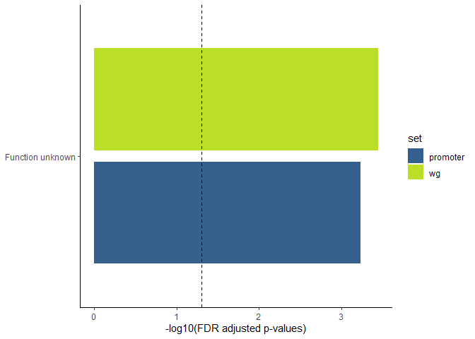

Functional enrichment
================
Rylee Hackley

``` r
# BiocManager::install(c("GenomicRanges","rtracklayer", "ChIPseeker", "IRanges"))
library(tidyverse)
library(readxl)
library(GenomicRanges)
library(IRanges)
library(rtracklayer)
library(viridis)

# Calculate statistical information about the cogs represented in the list of genes using the function below.
# Cogtest: three inputs to this function:
# 1) list of gene names from the cluster (namelist)
# 2) COG file
# 3) p-value cutoff
# 4) method for multiple testing correction
cogtest <- function(namelist, cogfile, pvalue, method = "fdr", cutoff = 5) {
  cogs <- subset(cogfile, is.element(cogfile$locus_tag, unique(namelist$locus_tag)) == TRUE)
  clust <- table(cogs$funclass_name)
  resm <- matrix(0, length(clust), 4) # create 0 matrix
  res <- data.frame(resm) # make 0 df
  rownames(res) <- names(clust)
  colnames(res) <- c("probability", "expect", "count", "p_adjust")
  all <- table(cogfile$funclass_name)
  for (i in 1:length(clust)) { # calc expected frequencies and pval by hypergeo and append to DF
    res[i, 1] <- phyper(clust[i], all[i], sum(all) - all[i], nrow(cogs), lower.tail = F)
    res[i, 2] <- all[i] * (nrow(cogs) / sum(all))
    res[i, 3] <- clust[i]
  }
  # multiple testing correction:
  res$p_adjust <- signif(p.adjust(res$probability, method = method), digits = 4)
  res$probability <- signif(res$probability, digits = 4)

  fin <- subset(res, p_adjust <= pvalue & count >= cutoff)
  fin <- cbind("COG" = rownames(fin), fin, stringsAsFactors = F)
  row.names(fin) <- NULL
  return(fin)
}

# Note: the COGcategory name must be entered in quotes and add a space to the end of the category name of interest, e.g. 'transport '

## Use the following function to look at the genes in your cluster associated with a particular COG
cogset <- function(namelist, cogfile, COGcategory) {
  subset(cogfile, is.element(cogfile$locus_tag, namelist$locus_tag) & is.element(cogfile$funclass_name, COGcategory) == TRUE)
}
```

``` r
hvo.cogs <- read.delim("00_genome_files/arcogs-14-18.hvo.txt", sep = "\t")

# peaks
consensus.peaks <- read_xlsx("04a_peak_annotation/04a_genelists.xlsx", sheet = 2) %>%
  distinct(locus_tag, .keep_all = TRUE)

# motifs
all.motif <- read_csv("05b_motif_annotation/05b_XTREME_motifs_wg_annotated.csv")
peak.motif <- read_csv("05b_motif_annotation/05b_peak_motif.csv")
```

HYPERGEO TESTS

``` r
# compare motifs (background model)
cogtest(all.motif, hvo.cogs, 1, cutoff = 5) -> motif

# use only motifs in promoter regions
all.motif %>% filter(type == "promoter") -> motif.pro
cogtest(motif.pro, hvo.cogs, 1, cutoff = 5) -> pro.motif

# peaks with motifs
cogtest(peak.motif, hvo.cogs, 1, cutoff = 3) -> pk.motif
```

``` r
motif$set <- rep("wg", nrow(motif))
pro.motif$set <- rep("promoter", nrow(pro.motif))
pk.motif$set <- rep("peaks", nrow(pk.motif))

rbind(motif, pro.motif, pk.motif) %>%
  filter(p_adjust < 0.1) %>%
  ggplot(., aes(y = COG, x = -log10(p_adjust), group = set, fill = set)) +
  geom_col(aes(group = set), position = position_dodge2(width = 0.9, preserve = "single")) +
  geom_vline(xintercept = 1.30103, linetype = "dashed") +
  labs(x = "-log10(FDR adjusted p-values)", y = NULL) +
  scale_fill_viridis(option = "D", begin = 0.3, end = 0.9, discrete = T) +
  theme_classic()
```

<!-- -->

``` r
cogset(all.motif, hvo.cogs, "Function unknown") %>% dplyr::select(c(1, 11, 12))
```

    ##        locus_tag Gene                        Annotation_arCOG
    ## 32   HVO_RS03980    -        Uncharacterized membrane protein
    ## 1399 HVO_RS17385    - Uncharacterized protein, DUF4397 family
    ## 1768 HVO_RS02020    -                 Uncharacterized protein
    ## 2304 HVO_RS08990    -                 Uncharacterized protein
    ## 3215 HVO_RS20405    -        Uncharacterized membrane protein
    ## 3260 HVO_RS13535    -                     Zinc finger protein
    ## 3649 HVO_RS20335    -                 Uncharacterized protein
    ## 3720 HVO_RS03285    -        Uncharacterized membrane protein

``` r
cogset(all.motif, hvo.cogs, "Transcription") %>% dplyr::select(c(1, 11, 12))
```

    ##        locus_tag Gene
    ## 135  HVO_RS04600 CspC
    ## 387  HVO_RS01350    -
    ## 1627 HVO_RS02855 HxlR
    ## 1711 HVO_RS03610 ArsR
    ##                                                                                 Annotation_arCOG
    ## 135                                                              Cold shock protein, CspA family
    ## 387  Transcriptional regulator, implicated in bacteriocin system regulation, contains HTH domain
    ## 1627                                          DNA-binding transcriptional regulator, HxlR family
    ## 1711                                Transcriptional regulator containing HTH domain, ArsR family

``` r
# consensus peaks
(cogtest(consensus.peaks, hvo.cogs, 0.05, cutoff = 1) -> all.peak)
```

    ##                                     COG probability     expect count  p_adjust
    ## 1      General function prediction only   3.700e-03 0.34315789     2 4.934e-03
    ## 2 Replication, recombination and repair   9.599e-04 0.04842105     1 1.920e-03
    ## 3                         Transcription   2.975e-07 0.18315789     4 1.190e-06

``` r
cogset(consensus.peaks, hvo.cogs, "Function unknown") %>% dplyr::select(c(1, 11, 12))
```

    ##        locus_tag Gene                 Annotation_arCOG
    ## 3637 HVO_RS19410    - Uncharacterized membrane protein

``` r
cogset(consensus.peaks, hvo.cogs, "Inorganic ion transport and metabolism") %>% dplyr::select(c(1, 11, 12))
```

    ## [1] locus_tag        Gene             Annotation_arCOG
    ## <0 rows> (or 0-length row.names)

``` r
cogset(consensus.peaks, hvo.cogs, "Carbohydrate transport and metabolism") %>% dplyr::select(c(1, 11, 12))
```

    ## [1] locus_tag        Gene             Annotation_arCOG
    ## <0 rows> (or 0-length row.names)

``` r
cogset(motif.pro, hvo.cogs, "Amino acid transport and metabolism") %>% dplyr::select(c(1, 11, 12))
```

    ##        locus_tag Gene                           Annotation_arCOG
    ## 2657 HVO_RS07005 AmpS   Leucyl aminopeptidase (aminopeptidase T)
    ## 3321 HVO_RS04235 PepP                     Xaa-Pro aminopeptidase
    ## 3671 HVO_RS19545 DadA Glycine/D-amino acid oxidase (deaminating)

can see if function abundance correlates with peak size…. need to
convert cog categories into ranked number by their abundance….

``` r
a <- consensus.peaks[, c(1, 9)]
b <- hvo.cogs[, c(1, 8, 10, 11, 18)]
c <- as.data.frame(cogtest(consensus.peaks, hvo.cogs, pvalue = 1, cutoff = 1))
c$funclass_name <- c$COG
left_join(a, b) -> d
```

    ## Joining with `by = join_by(locus_tag)`

``` r
left_join(d, c[-1]) -> tmp
```

    ## Joining with `by = join_by(funclass_name)`

create output file:

``` r
# consensus peaks
cogtest(consensus.peaks, hvo.cogs, 1, cutoff = 3) %>%
  mutate(
    logp = -log(p_adjust),
    cat = rep("tbsP_consensus", nrow(.)),
    direction = rep(NA, nrow(.))
  ) -> a

write_csv(a, "06_functional_enrichment/tbsP_ChIP_fxnal_categories.csv")
```
