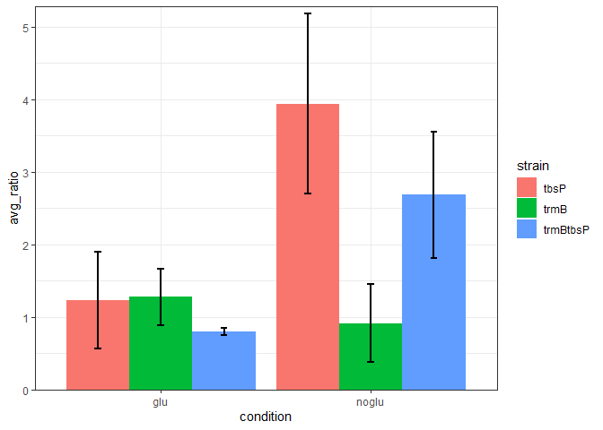
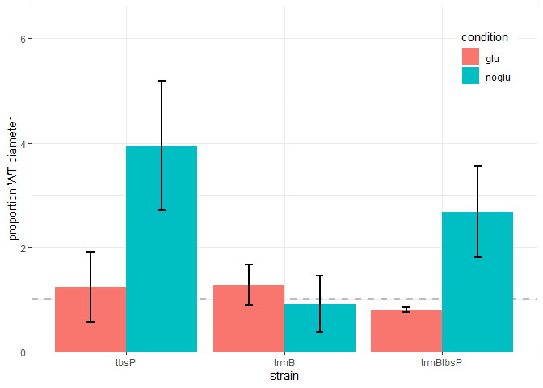
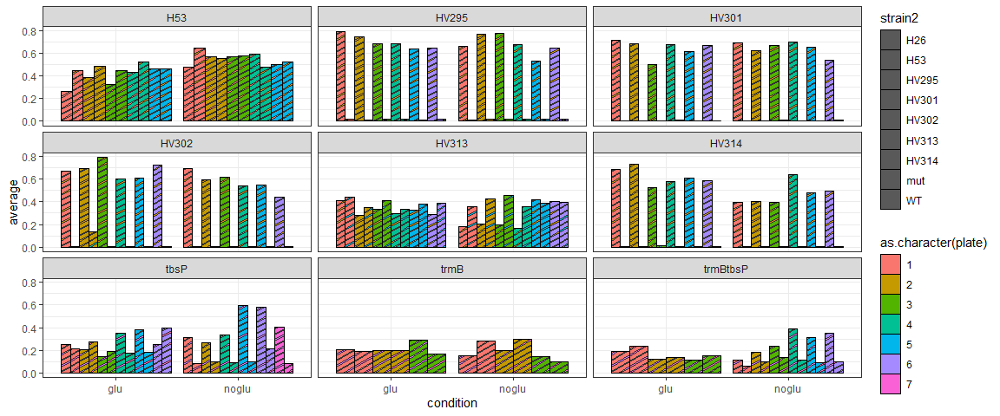

R Notebook
================
Rylee Hackley & Amy K. Schmid

``` r
library(tidyverse)
library(ggpattern)
library(ggpubr)

in2 <- read_csv("imageJ_measurements.csv")
in2$strain2 <- str_replace_all(in2$strain, c("trmBtbsP" = "mut", "tbsP" = "mut", "trmB" = "mut"))
in2
```

    ## # A tibble: 588 × 11
    ##    date      filename    condition plate WT    strain template_colony area_label
    ##    <chr>     <chr>       <chr>     <dbl> <chr> <chr>            <dbl> <chr>     
    ##  1 8/26/2022 dd1glu_ana… trmBtbsP…     1 H26   trmBt…               1 2         
    ##  2 8/26/2022 dd1glu_ana… trmBtbsP…     1 H26   trmBt…               2 1         
    ##  3 8/26/2022 dd1glu_ana… trmBtbsP…     1 H26   trmBt…               3 5         
    ##  4 8/26/2022 dd1glu_ana… trmBtbsP…     1 H26   WT                   1 3         
    ##  5 8/26/2022 dd1glu_ana… trmBtbsP…     1 H26   WT                   2 6         
    ##  6 8/26/2022 dd1glu_ana… trmBtbsP…     1 H26   WT                   3 4         
    ##  7 8/26/2022 dd1noglu_a… trmBtbsP…     1 H26   trmBt…               1 2         
    ##  8 8/26/2022 dd1noglu_a… trmBtbsP…     1 H26   trmBt…               2 1         
    ##  9 8/26/2022 dd1noglu_a… trmBtbsP…     1 H26   trmBt…               3 5         
    ## 10 8/26/2022 dd1noglu_a… trmBtbsP…     1 H26   WT                   1 4         
    ## # ℹ 578 more rows
    ## # ℹ 3 more variables: area_in <dbl>, notes <chr>, strain2 <chr>

``` r
in2 %>%
  group_by(filename, plate, condition, strain2) %>%
  summarise(average = mean(area_in)) %>%
  filter(condition != "tbsP+noglu" | plate != 3) %>%
  group_by(filename, plate, condition) %>%
  summarise(ratio = average[strain2 == "mut"] / average[strain2 == "WT"]) %>%
  group_by(condition) %>%
  summarise(
    avg_ratio = mean(ratio),
    sd_ratio = sd(ratio)
  ) %>%
  separate(condition, c("strain", "condition")) -> tmp2

ggplot(data = tmp2, aes(y = avg_ratio, x = condition, fill = strain)) +
  geom_bar(stat = "identity", position = "dodge") +
  geom_errorbar(aes(ymin = avg_ratio - sd_ratio, ymax = avg_ratio + sd_ratio),
    width = .1, size = 1, position = position_dodge(.9)
  ) +
  scale_y_continuous(expand = expansion(mult = c(0, 0.02))) +
  theme_bw()
```

<!-- -->

``` r
ggplot(data = tmp2, aes(y = avg_ratio, x = strain, fill = condition)) +
  geom_hline(yintercept = 1, color = "grey", linetype = "dashed", size = 1) +
  geom_bar(stat = "identity", position = "dodge") +
  geom_errorbar(aes(ymin = avg_ratio - sd_ratio, ymax = avg_ratio + sd_ratio),
    width = .1, size = 1, position = position_dodge(.9)
  ) +
  ylab("proportion WT diameter") +
  scale_y_continuous(
    expand = expansion(mult = c(0, 0.02)),
    limits = c(0, 6.5)
  ) +
  theme_bw() +
  theme(legend.position = c(.9, .85))
```

<!-- -->
there are relatively few differences between the strains and WT when
glucose is added to the media. Even trmB-glu cells are motile.largest
motility difference in tbsP-glu, suggesting that tbsP represses motility
in -glu conditions. Double deletion phenocopies.

look at outliers

``` r
in2 %>%
  group_by(filename, plate, condition, strain2) %>%
  summarise(average = mean(area_in)) %>%
  filter(condition != "tbsP+noglu" | plate != 3) %>%
  separate(condition, c("strain", "condition")) -> tmp3

tmp3 %>%
  ggplot(., ) +
  geom_col_pattern(aes(y = average, x = condition, fill = as.character(plate), pattern_fill = strain2),
    stat = "identity", position = "dodge",
    colour  = "black"
  ) +
  facet_wrap(~strain) +
  theme_bw()
```

<!-- -->
tbsP+glu plate 1 trmB+glu and noglu plate 3 trmBtbsP+glu plate 1
tbsP+noglu plate 1

``` r
in2 %>%
  group_by(filename, plate, condition, strain2) %>%
  summarise(average = mean(area_in)) %>%
  filter(condition != "tbsP+noglu" | plate != 3) %>%
  group_by(filename, plate, condition) %>%
  summarise(ratio = average[strain2 == "mut"] / average[strain2 == "WT"]) -> rats

t.test(filter(rats, condition == "tbsP+glu")$ratio, filter(rats, condition == "tbsP+noglu")$ratio)
```

    ## 
    ##  Welch Two Sample t-test
    ## 
    ## data:  filter(rats, condition == "tbsP+glu")$ratio and filter(rats, condition == "tbsP+noglu")$ratio
    ## t = -4.7188, df = 7.6503, p-value = 0.001699
    ## alternative hypothesis: true difference in means is not equal to 0
    ## 95 percent confidence interval:
    ##  -4.041409 -1.373835
    ## sample estimates:
    ## mean of x mean of y 
    ##  1.235170  3.942792

``` r
t.test(filter(rats, condition == "trmBtbsP+glu")$ratio, filter(rats, condition == "trmBtbsP+noglu")$ratio)
```

    ## 
    ##  Welch Two Sample t-test
    ## 
    ## data:  filter(rats, condition == "trmBtbsP+glu")$ratio and filter(rats, condition == "trmBtbsP+noglu")$ratio
    ## t = -5.2601, df = 5.0566, p-value = 0.00319
    ## alternative hypothesis: true difference in means is not equal to 0
    ## 95 percent confidence interval:
    ##  -2.796087 -0.964494
    ## sample estimates:
    ## mean of x mean of y 
    ##  0.805309  2.685600

``` r
t.test(filter(rats, condition == "trmB+glu")$ratio, filter(rats, condition == "trmB+noglu")$ratio)
```

    ## 
    ##  Welch Two Sample t-test
    ## 
    ## data:  filter(rats, condition == "trmB+glu")$ratio and filter(rats, condition == "trmB+noglu")$ratio
    ## t = 0.95148, df = 3.6321, p-value = 0.4003
    ## alternative hypothesis: true difference in means is not equal to 0
    ## 95 percent confidence interval:
    ##  -0.7446347  1.4752548
    ## sample estimates:
    ## mean of x mean of y 
    ## 1.2825679 0.9172579

tbsP and trmBtbsP are sig different between plus and minus glucose

# Make final figure for the manuscript

``` r
strain.colors <- c(trmB = "#35B779", trmBtbsP = "#A6A560", tbsP = "#E79A51")
condition.colors <- c(glu = "grey80", noglu = "white")

in2 %>%
  group_by(filename, plate, condition, strain2) %>%
  summarise(average = mean(area_in)) %>%
  filter(condition != "tbsP+noglu" | plate != 3) %>%
  group_by(filename, plate, condition) %>%
  summarise(ratio = average[strain2 == "mut"] / average[strain2 == "WT"]) %>%
  group_by(condition) %>%
  summarise(
    avg_ratio = mean(ratio),
    sd_ratio = sd(ratio)
  ) %>%
  separate(condition, c("strain", "condition")) -> tmp2

pdf("motility.graph.pdf", width = 4, height = 4)

ggplot(data = tmp2, aes(y = avg_ratio, x = strain, fill = condition, color = strain)) +
  geom_hline(yintercept = 1, color = "grey", linetype = "dashed", size = 1) +
  geom_bar(stat = "identity", position = "dodge", size = 1.5) +
  geom_errorbar(aes(ymin = avg_ratio - sd_ratio, ymax = avg_ratio + sd_ratio),
    width = .1, size = 1, position = position_dodge(.9)
  ) +
  ylab("proportion WT diameter") +
  scale_y_continuous(
    expand = expansion(mult = c(0, 0.02)),
    limits = c(0, 6.5)
  ) +
  theme_bw() +
  theme(legend.position = c(.9, .85)) +
  scale_color_manual(values = strain.colors) +
  scale_fill_manual(values = condition.colors)

dev.off()
```

    ## png 
    ##   2
